# Projects and dependencies analysis

This document provides a comprehensive overview of the projects and their dependencies in the context of upgrading to .NETCoreApp,Version=v10.0.

## Table of Contents

- [Executive Summary](#executive-Summary)
  - [Highlevel Metrics](#highlevel-metrics)
  - [Projects Compatibility](#projects-compatibility)
  - [Package Compatibility](#package-compatibility)
  - [API Compatibility](#api-compatibility)
- [Aggregate NuGet packages details](#aggregate-nuget-packages-details)
- [Top API Migration Challenges](#top-api-migration-challenges)
  - [Technologies and Features](#technologies-and-features)
  - [Most Frequent API Issues](#most-frequent-api-issues)
- [Projects Relationship Graph](#projects-relationship-graph)
- [Project Details](#project-details)

  - [docs\docs-dummy.csproj](#docsdocs-dummycsproj)
  - [src\foundation\nuget\src\Dummy-PDFsharp.NuGet-wpf\Dummy-PDFsharp.NuGet-wpf.csproj](#srcfoundationnugetsrcdummy-pdfsharpnuget-wpfdummy-pdfsharpnuget-wpfcsproj)
  - [src\foundation\nuget\src\MigraDoc.NuGet\MigraDoc.NuGet.csproj](#srcfoundationnugetsrcmigradocnugetmigradocnugetcsproj)
  - [src\foundation\nuget\src\MigraDoc.NuGet-gdi\MigraDoc.NuGet-gdi.csproj](#srcfoundationnugetsrcmigradocnuget-gdimigradocnuget-gdicsproj)
  - [src\foundation\nuget\src\MigraDoc.NuGet-wpf\MigraDoc.NuGet-wpf.csproj](#srcfoundationnugetsrcmigradocnuget-wpfmigradocnuget-wpfcsproj)
  - [src\foundation\nuget\src\PDFsharp.NuGet\PDFsharp.NuGet.csproj](#srcfoundationnugetsrcpdfsharpnugetpdfsharpnugetcsproj)
  - [src\foundation\nuget\src\PDFsharp.NuGet-gdi\PDFsharp.NuGet-gdi.csproj](#srcfoundationnugetsrcpdfsharpnuget-gdipdfsharpnuget-gdicsproj)
  - [src\foundation\nuget\src\PDFsharp.NuGet-wpf\PDFsharp.NuGet-wpf.csproj](#srcfoundationnugetsrcpdfsharpnuget-wpfpdfsharpnuget-wpfcsproj)
  - [src\foundation\src\MigraDoc\features\MigraDoc.Features\MigraDoc.Features.csproj](#srcfoundationsrcmigradocfeaturesmigradocfeaturesmigradocfeaturescsproj)
  - [src\foundation\src\MigraDoc\src\MigraDoc.DocumentObjectModel\MigraDoc.DocumentObjectModel.csproj](#srcfoundationsrcmigradocsrcmigradocdocumentobjectmodelmigradocdocumentobjectmodelcsproj)
  - [src\foundation\src\MigraDoc\src\MigraDoc.Rendering\MigraDoc.Rendering.csproj](#srcfoundationsrcmigradocsrcmigradocrenderingmigradocrenderingcsproj)
  - [src\foundation\src\MigraDoc\src\MigraDoc.Rendering-gdi\MigraDoc.Rendering-gdi.csproj](#srcfoundationsrcmigradocsrcmigradocrendering-gdimigradocrendering-gdicsproj)
  - [src\foundation\src\MigraDoc\src\MigraDoc.Rendering-wpf\MigraDoc.Rendering-wpf.csproj](#srcfoundationsrcmigradocsrcmigradocrendering-wpfmigradocrendering-wpfcsproj)
  - [src\foundation\src\MigraDoc\src\MigraDoc.RtfRendering\MigraDoc.RtfRendering.csproj](#srcfoundationsrcmigradocsrcmigradocrtfrenderingmigradocrtfrenderingcsproj)
  - [src\foundation\src\MigraDoc\src\MigraDoc.RtfRendering-gdi\MigraDoc.RtfRendering-gdi.csproj](#srcfoundationsrcmigradocsrcmigradocrtfrendering-gdimigradocrtfrendering-gdicsproj)
  - [src\foundation\src\MigraDoc\src\MigraDoc.RtfRendering-wpf\MigraDoc.RtfRendering-wpf.csproj](#srcfoundationsrcmigradocsrcmigradocrtfrendering-wpfmigradocrtfrendering-wpfcsproj)
  - [src\foundation\src\MigraDoc\tests\MigraDoc.DocumentObjectModel.Tests\MigraDoc.DocumentObjectModel.Tests.csproj](#srcfoundationsrcmigradoctestsmigradocdocumentobjectmodeltestsmigradocdocumentobjectmodeltestscsproj)
  - [src\foundation\src\MigraDoc\tests\MigraDoc.GBE-Runner\MigraDoc.GBE-Runner.csproj](#srcfoundationsrcmigradoctestsmigradocgbe-runnermigradocgbe-runnercsproj)
  - [src\foundation\src\MigraDoc\tests\MigraDoc.GrammarByExample\MigraDoc.GrammarByExample.csproj](#srcfoundationsrcmigradoctestsmigradocgrammarbyexamplemigradocgrammarbyexamplecsproj)
  - [src\foundation\src\MigraDoc\tests\MigraDoc.GrammarByExample-GDI\MigraDoc.GrammarByExample-GDI.csproj](#srcfoundationsrcmigradoctestsmigradocgrammarbyexample-gdimigradocgrammarbyexample-gdicsproj)
  - [src\foundation\src\MigraDoc\tests\MigraDoc.GrammarByExample-WPF\MigraDoc.GrammarByExample-WPF.csproj](#srcfoundationsrcmigradoctestsmigradocgrammarbyexample-wpfmigradocgrammarbyexample-wpfcsproj)
  - [src\foundation\src\MigraDoc\tests\MigraDoc.Tests\MigraDoc.Tests.csproj](#srcfoundationsrcmigradoctestsmigradoctestsmigradoctestscsproj)
  - [src\foundation\src\MigraDoc\tests\MigraDoc.Tests-gdi\MigraDoc.Tests-gdi.csproj](#srcfoundationsrcmigradoctestsmigradoctests-gdimigradoctests-gdicsproj)
  - [src\foundation\src\MigraDoc\tests\MigraDoc.Tests-wpf\MigraDoc.Tests-wpf.csproj](#srcfoundationsrcmigradoctestsmigradoctests-wpfmigradoctests-wpfcsproj)
  - [src\foundation\src\PDFsharp\features\PdfSharp.Features.Runner\PdfSharp.Features.Runner.csproj](#srcfoundationsrcpdfsharpfeaturespdfsharpfeaturesrunnerpdfsharpfeaturesrunnercsproj)
  - [src\foundation\src\PDFsharp\features\PDFsharp.Features.Runner-gdi\PDFsharp.Features.Runner-gdi.csproj](#srcfoundationsrcpdfsharpfeaturespdfsharpfeaturesrunner-gdipdfsharpfeaturesrunner-gdicsproj)
  - [src\foundation\src\PDFsharp\features\PDFsharp.Features.Runner-wpf\PDFsharp.Features.Runner-wpf.csproj](#srcfoundationsrcpdfsharpfeaturespdfsharpfeaturesrunner-wpfpdfsharpfeaturesrunner-wpfcsproj)
  - [src\foundation\src\PDFsharp\features\PdfSharp.Features\PdfSharp.Features.csproj](#srcfoundationsrcpdfsharpfeaturespdfsharpfeaturespdfsharpfeaturescsproj)
  - [src\foundation\src\PDFsharp\features\PDFsharp.Features-gdi\PDFsharp.Features-gdi.csproj](#srcfoundationsrcpdfsharpfeaturespdfsharpfeatures-gdipdfsharpfeatures-gdicsproj)
  - [src\foundation\src\PDFsharp\features\PDFsharp.Features-wpf\PDFsharp.Features-wpf.csproj](#srcfoundationsrcpdfsharpfeaturespdfsharpfeatures-wpfpdfsharpfeatures-wpfcsproj)
  - [src\foundation\src\PDFsharp\src\PdfSharp.BarCodes\PdfSharp.BarCodes.csproj](#srcfoundationsrcpdfsharpsrcpdfsharpbarcodespdfsharpbarcodescsproj)
  - [src\foundation\src\PDFsharp\src\PdfSharp.BarCodes-gdi\PdfSharp.BarCodes-gdi.csproj](#srcfoundationsrcpdfsharpsrcpdfsharpbarcodes-gdipdfsharpbarcodes-gdicsproj)
  - [src\foundation\src\PDFsharp\src\PdfSharp.BarCodes-wpf\PdfSharp.BarCodes-wpf.csproj](#srcfoundationsrcpdfsharpsrcpdfsharpbarcodes-wpfpdfsharpbarcodes-wpfcsproj)
  - [src\foundation\src\PDFsharp\src\PdfSharp.Charting\PdfSharp.Charting.csproj](#srcfoundationsrcpdfsharpsrcpdfsharpchartingpdfsharpchartingcsproj)
  - [src\foundation\src\PDFsharp\src\PdfSharp.Charting-gdi\PdfSharp.Charting-gdi.csproj](#srcfoundationsrcpdfsharpsrcpdfsharpcharting-gdipdfsharpcharting-gdicsproj)
  - [src\foundation\src\PDFsharp\src\PdfSharp.Charting-wpf\PdfSharp.Charting-wpf.csproj](#srcfoundationsrcpdfsharpsrcpdfsharpcharting-wpfpdfsharpcharting-wpfcsproj)
  - [src\foundation\src\PDFsharp\src\PdfSharp.Cryptography\PdfSharp.Cryptography.csproj](#srcfoundationsrcpdfsharpsrcpdfsharpcryptographypdfsharpcryptographycsproj)
  - [src\foundation\src\PDFsharp\src\PdfSharp\PdfSharp.csproj](#srcfoundationsrcpdfsharpsrcpdfsharppdfsharpcsproj)
  - [src\foundation\src\PDFsharp\src\PdfSharp-gdi\PdfSharp-gdi.csproj](#srcfoundationsrcpdfsharpsrcpdfsharp-gdipdfsharp-gdicsproj)
  - [src\foundation\src\PDFsharp\src\PdfSharp-wpf\PdfSharp-wpf.csproj](#srcfoundationsrcpdfsharpsrcpdfsharp-wpfpdfsharp-wpfcsproj)
  - [src\foundation\src\PDFsharp\tests\PdfSharp.Tests\PdfSharp.Tests.csproj](#srcfoundationsrcpdfsharptestspdfsharptestspdfsharptestscsproj)
  - [src\foundation\src\PDFsharp\tests\PdfSharp.Tests-gdi\PdfSharp.Tests-gdi.csproj](#srcfoundationsrcpdfsharptestspdfsharptests-gdipdfsharptests-gdicsproj)
  - [src\foundation\src\PDFsharp\tests\PdfSharp.tests-wpf\PdfSharp.tests-wpf.csproj](#srcfoundationsrcpdfsharptestspdfsharptests-wpfpdfsharptests-wpfcsproj)
  - [src\foundation\src\shared\src\PdfSharp.Fonts\PdfSharp.Fonts.csproj](#srcfoundationsrcsharedsrcpdfsharpfontspdfsharpfontscsproj)
  - [src\foundation\src\shared\src\PdfSharp.Quality\PdfSharp.Quality.csproj](#srcfoundationsrcsharedsrcpdfsharpqualitypdfsharpqualitycsproj)
  - [src\foundation\src\shared\src\PdfSharp.Quality-gdi\PdfSharp.Quality-gdi.csproj](#srcfoundationsrcsharedsrcpdfsharpquality-gdipdfsharpquality-gdicsproj)
  - [src\foundation\src\shared\src\PdfSharp.Quality-wpf\PdfSharp.Quality-wpf.csproj](#srcfoundationsrcsharedsrcpdfsharpquality-wpfpdfsharpquality-wpfcsproj)
  - [src\foundation\src\shared\src\PdfSharp.Shared\PdfSharp.Shared.csproj](#srcfoundationsrcsharedsrcpdfsharpsharedpdfsharpsharedcsproj)
  - [src\foundation\src\shared\src\PdfSharp.Snippets\PdfSharp.Snippets.csproj](#srcfoundationsrcsharedsrcpdfsharpsnippetspdfsharpsnippetscsproj)
  - [src\foundation\src\shared\src\PdfSharp.Snippets-gdi\PdfSharp.Snippets-gdi.csproj](#srcfoundationsrcsharedsrcpdfsharpsnippets-gdipdfsharpsnippets-gdicsproj)
  - [src\foundation\src\shared\src\PdfSharp.Snippets-wpf\PdfSharp.Snippets-wpf.csproj](#srcfoundationsrcsharedsrcpdfsharpsnippets-wpfpdfsharpsnippets-wpfcsproj)
  - [src\foundation\src\shared\src\PdfSharp.System\PdfSharp.System.csproj](#srcfoundationsrcsharedsrcpdfsharpsystempdfsharpsystemcsproj)
  - [src\foundation\src\shared\src\PdfSharp.Testing\PdfSharp.Testing.csproj](#srcfoundationsrcsharedsrcpdfsharptestingpdfsharptestingcsproj)
  - [src\foundation\src\shared\src\PdfSharp.Testing-gdi\PdfSharp.Testing-gdi.csproj](#srcfoundationsrcsharedsrcpdfsharptesting-gdipdfsharptesting-gdicsproj)
  - [src\foundation\src\shared\src\PdfSharp.Testing-wpf\PdfSharp.Testing-wpf.csproj](#srcfoundationsrcsharedsrcpdfsharptesting-wpfpdfsharptesting-wpfcsproj)
  - [src\foundation\src\shared\src\PdfSharp.WPFonts\PdfSharp.WPFonts.csproj](#srcfoundationsrcsharedsrcpdfsharpwpfontspdfsharpwpfontscsproj)
  - [src\foundation\src\shared\testapps\PdfSharp.Fonts.TestApp\PdfSharp.Fonts.TestApp.csproj](#srcfoundationsrcsharedtestappspdfsharpfontstestapppdfsharpfontstestappcsproj)
  - [src\foundation\src\shared\testapps\Shared.TestApp\Shared.TestApp.csproj](#srcfoundationsrcsharedtestappssharedtestappsharedtestappcsproj)
  - [src\foundation\src\shared\tests\PdfSharp.Fonts.Test\PdfSharp.Fonts.Test.csproj](#srcfoundationsrcsharedtestspdfsharpfontstestpdfsharpfontstestcsproj)
  - [src\foundation\src\shared\tests\Shared.Tests\Shared.Tests.csproj](#srcfoundationsrcsharedtestssharedtestssharedtestscsproj)
  - [src\samples\src\MigraDoc\src\HelloWorld\HelloWorld,MigraDoc.csproj](#srcsamplessrcmigradocsrchelloworldhelloworld,migradoccsproj)
  - [src\samples\src\MigraDoc\src\HelloWorld-gdi\HelloWorld,MigraDoc-gdi.csproj](#srcsamplessrcmigradocsrchelloworld-gdihelloworld,migradoc-gdicsproj)
  - [src\samples\src\MigraDoc\src\HelloWorld-wpf\HelloWorld,MigraDoc-wpf.csproj](#srcsamplessrcmigradocsrchelloworld-wpfhelloworld,migradoc-wpfcsproj)
  - [src\samples\src\PDFsharp\src\HelloWorld\HelloWorld,PDFsharp.csproj](#srcsamplessrcpdfsharpsrchelloworldhelloworld,pdfsharpcsproj)
  - [src\samples\src\PDFsharp\src\HelloWorld-gdi\HelloWorld-gdi,PDFsharp.csproj](#srcsamplessrcpdfsharpsrchelloworld-gdihelloworld-gdi,pdfsharpcsproj)
  - [src\samples\src\PDFsharp\src\HelloWorld-wpf\HelloWorld-wpf,PDFsharp.csproj](#srcsamplessrcpdfsharpsrchelloworld-wpfhelloworld-wpf,pdfsharpcsproj)
  - [src\tools\src\CopyAsLink\CopyAsLink.csproj](#srctoolssrccopyaslinkcopyaslinkcsproj)
  - [src\tools\src\NRT-Tests\NRT-Tests.csproj](#srctoolssrcnrt-testsnrt-testscsproj)
  - [src\tools\src\PdfFileViewer\PdfFileViewer.csproj](#srctoolssrcpdffileviewerpdffileviewercsproj)
  - [src\tools\src\PdfSharp.TestHelper\PdfSharp.TestHelper.csproj](#srctoolssrcpdfsharptesthelperpdfsharptesthelpercsproj)
  - [src\tools\src\PdfSharp.TestHelper-gdi\PdfSharp.TestHelper-gdi.csproj](#srctoolssrcpdfsharptesthelper-gdipdfsharptesthelper-gdicsproj)
  - [src\tools\src\PdfSharp.TestHelper-wpf\PdfSharp.TestHelper-wpf.csproj](#srctoolssrcpdfsharptesthelper-wpfpdfsharptesthelper-wpfcsproj)


## Executive Summary

### Highlevel Metrics

| Metric | Count | Status |
| :--- | :---: | :--- |
| Total Projects | 72 | All require upgrade |
| Total NuGet Packages | 13 | 5 need upgrade |
| Total Code Files | 2715 |  |
| Total Code Files with Incidents | 72 |  |
| Total Lines of Code | 503596 |  |
| Total Number of Issues | 109 |  |
| Estimated LOC to modify | 0+ | at least 0.0% of codebase |

### Projects Compatibility

| Project | Target Framework | Difficulty | Package Issues | API Issues | Est. LOC Impact | Description |
| :--- | :---: | :---: | :---: | :---: | :---: | :--- |
| [docs\docs-dummy.csproj](#docsdocs-dummycsproj) | net8.0 | 🟢 Low | 0 | 0 |  | ClassLibrary, Sdk Style = True |
| [src\foundation\nuget\src\Dummy-PDFsharp.NuGet-wpf\Dummy-PDFsharp.NuGet-wpf.csproj](#srcfoundationnugetsrcdummy-pdfsharpnuget-wpfdummy-pdfsharpnuget-wpfcsproj) | net8.0-windows;net462 | 🟢 Low | 0 | 0 |  | ClassLibrary, Sdk Style = True |
| [src\foundation\nuget\src\MigraDoc.NuGet\MigraDoc.NuGet.csproj](#srcfoundationnugetsrcmigradocnugetmigradocnugetcsproj) | net8.0;net9.0;net10.0;netstandard2.0 | 🟢 Low | 0 | 0 |  | ClassLibrary, Sdk Style = True |
| [src\foundation\nuget\src\MigraDoc.NuGet-gdi\MigraDoc.NuGet-gdi.csproj](#srcfoundationnugetsrcmigradocnuget-gdimigradocnuget-gdicsproj) | net8.0-windows;net9.0-windows;net10.0-windows;net462 | 🟢 Low | 0 | 0 |  | ClassLibrary, Sdk Style = True |
| [src\foundation\nuget\src\MigraDoc.NuGet-wpf\MigraDoc.NuGet-wpf.csproj](#srcfoundationnugetsrcmigradocnuget-wpfmigradocnuget-wpfcsproj) | net8.0-windows;net9.0-windows;net10.0-windows;net462 | 🟢 Low | 0 | 0 |  | ClassLibrary, Sdk Style = True |
| [src\foundation\nuget\src\PDFsharp.NuGet\PDFsharp.NuGet.csproj](#srcfoundationnugetsrcpdfsharpnugetpdfsharpnugetcsproj) | net8.0;net9.0;net10.0;netstandard2.0 | 🟢 Low | 0 | 0 |  | ClassLibrary, Sdk Style = True |
| [src\foundation\nuget\src\PDFsharp.NuGet-gdi\PDFsharp.NuGet-gdi.csproj](#srcfoundationnugetsrcpdfsharpnuget-gdipdfsharpnuget-gdicsproj) | net8.0-windows;net9.0-windows;net10.0-windows;net462 | 🟢 Low | 0 | 0 |  | ClassLibrary, Sdk Style = True |
| [src\foundation\nuget\src\PDFsharp.NuGet-wpf\PDFsharp.NuGet-wpf.csproj](#srcfoundationnugetsrcpdfsharpnuget-wpfpdfsharpnuget-wpfcsproj) | net8.0-windows;net9.0-windows;net10.0-windows;net462 | 🟢 Low | 0 | 0 |  | ClassLibrary, Sdk Style = True |
| [src\foundation\src\MigraDoc\features\MigraDoc.Features\MigraDoc.Features.csproj](#srcfoundationsrcmigradocfeaturesmigradocfeaturesmigradocfeaturescsproj) | net8.0 | 🟢 Low | 0 | 0 |  | DotNetCoreApp, Sdk Style = True |
| [src\foundation\src\MigraDoc\src\MigraDoc.DocumentObjectModel\MigraDoc.DocumentObjectModel.csproj](#srcfoundationsrcmigradocsrcmigradocdocumentobjectmodelmigradocdocumentobjectmodelcsproj) | net8.0;net9.0;net10.0;net462;netstandard2.0 | 🟢 Low | 0 | 0 |  | ClassLibrary, Sdk Style = True |
| [src\foundation\src\MigraDoc\src\MigraDoc.Rendering\MigraDoc.Rendering.csproj](#srcfoundationsrcmigradocsrcmigradocrenderingmigradocrenderingcsproj) | net8.0;net9.0;net10.0;netstandard2.0 | 🟢 Low | 0 | 0 |  | ClassLibrary, Sdk Style = True |
| [src\foundation\src\MigraDoc\src\MigraDoc.Rendering-gdi\MigraDoc.Rendering-gdi.csproj](#srcfoundationsrcmigradocsrcmigradocrendering-gdimigradocrendering-gdicsproj) | net8.0-windows;net9.0-windows;net10.0-windows;net462 | 🟢 Low | 0 | 0 |  | ClassLibrary, Sdk Style = True |
| [src\foundation\src\MigraDoc\src\MigraDoc.Rendering-wpf\MigraDoc.Rendering-wpf.csproj](#srcfoundationsrcmigradocsrcmigradocrendering-wpfmigradocrendering-wpfcsproj) | net8.0-windows;net9.0-windows;net10.0-windows;net462 | 🟢 Low | 0 | 0 |  | Wpf, Sdk Style = True |
| [src\foundation\src\MigraDoc\src\MigraDoc.RtfRendering\MigraDoc.RtfRendering.csproj](#srcfoundationsrcmigradocsrcmigradocrtfrenderingmigradocrtfrenderingcsproj) | net8.0;net9.0;net10.0;netstandard2.0 | 🟢 Low | 0 | 0 |  | ClassLibrary, Sdk Style = True |
| [src\foundation\src\MigraDoc\src\MigraDoc.RtfRendering-gdi\MigraDoc.RtfRendering-gdi.csproj](#srcfoundationsrcmigradocsrcmigradocrtfrendering-gdimigradocrtfrendering-gdicsproj) | net8.0-windows;net9.0-windows;net10.0-windows;net462 | 🟢 Low | 0 | 0 |  | ClassLibrary, Sdk Style = True |
| [src\foundation\src\MigraDoc\src\MigraDoc.RtfRendering-wpf\MigraDoc.RtfRendering-wpf.csproj](#srcfoundationsrcmigradocsrcmigradocrtfrendering-wpfmigradocrtfrendering-wpfcsproj) | net8.0-windows;net9.0-windows;net10.0-windows;net462 | 🟢 Low | 0 | 0 |  | ClassLibrary, Sdk Style = True |
| [src\foundation\src\MigraDoc\tests\MigraDoc.DocumentObjectModel.Tests\MigraDoc.DocumentObjectModel.Tests.csproj](#srcfoundationsrcmigradoctestsmigradocdocumentobjectmodeltestsmigradocdocumentobjectmodeltestscsproj) | net8.0;net9.0;net10.0;net462 | 🟢 Low | 1 | 0 |  | DotNetCoreApp, Sdk Style = True |
| [src\foundation\src\MigraDoc\tests\MigraDoc.GBE-Runner\MigraDoc.GBE-Runner.csproj](#srcfoundationsrcmigradoctestsmigradocgbe-runnermigradocgbe-runnercsproj) | net8.0;net9.0;net10.0;net462 | 🟢 Low | 1 | 0 |  | DotNetCoreApp, Sdk Style = True |
| [src\foundation\src\MigraDoc\tests\MigraDoc.GrammarByExample\MigraDoc.GrammarByExample.csproj](#srcfoundationsrcmigradoctestsmigradocgrammarbyexamplemigradocgrammarbyexamplecsproj) | net8.0;net9.0;net10.0;net462 | 🟢 Low | 1 | 0 |  | DotNetCoreApp, Sdk Style = True |
| [src\foundation\src\MigraDoc\tests\MigraDoc.GrammarByExample-GDI\MigraDoc.GrammarByExample-GDI.csproj](#srcfoundationsrcmigradoctestsmigradocgrammarbyexample-gdimigradocgrammarbyexample-gdicsproj) | net8.0-windows;net9.0-windows;net10.0-windows;net462 | 🟢 Low | 1 | 0 |  | DotNetCoreApp, Sdk Style = True |
| [src\foundation\src\MigraDoc\tests\MigraDoc.GrammarByExample-WPF\MigraDoc.GrammarByExample-WPF.csproj](#srcfoundationsrcmigradoctestsmigradocgrammarbyexample-wpfmigradocgrammarbyexample-wpfcsproj) | net8.0-windows;net9.0-windows;net10.0-windows;net462 | 🟢 Low | 1 | 0 |  | Wpf, Sdk Style = True |
| [src\foundation\src\MigraDoc\tests\MigraDoc.Tests\MigraDoc.Tests.csproj](#srcfoundationsrcmigradoctestsmigradoctestsmigradoctestscsproj) | net8.0;net9.0;net10.0;net462 | 🟢 Low | 2 | 0 |  | DotNetCoreApp, Sdk Style = True |
| [src\foundation\src\MigraDoc\tests\MigraDoc.Tests-gdi\MigraDoc.Tests-gdi.csproj](#srcfoundationsrcmigradoctestsmigradoctests-gdimigradoctests-gdicsproj) | net8.0-windows;net9.0-windows;net10.0-windows;net462 | 🟢 Low | 2 | 0 |  | DotNetCoreApp, Sdk Style = True |
| [src\foundation\src\MigraDoc\tests\MigraDoc.Tests-wpf\MigraDoc.Tests-wpf.csproj](#srcfoundationsrcmigradoctestsmigradoctests-wpfmigradoctests-wpfcsproj) | net8.0-windows;net9.0-windows;net10.0-windows;net462 | 🟢 Low | 2 | 0 |  | Wpf, Sdk Style = True |
| [src\foundation\src\PDFsharp\features\PdfSharp.Features.Runner\PdfSharp.Features.Runner.csproj](#srcfoundationsrcpdfsharpfeaturespdfsharpfeaturesrunnerpdfsharpfeaturesrunnercsproj) | net8.0;net462 | 🟢 Low | 0 | 0 |  | DotNetCoreApp, Sdk Style = True |
| [src\foundation\src\PDFsharp\features\PDFsharp.Features.Runner-gdi\PDFsharp.Features.Runner-gdi.csproj](#srcfoundationsrcpdfsharpfeaturespdfsharpfeaturesrunner-gdipdfsharpfeaturesrunner-gdicsproj) | net8.0-windows;net462 | 🟢 Low | 0 | 0 |  | DotNetCoreApp, Sdk Style = True |
| [src\foundation\src\PDFsharp\features\PDFsharp.Features.Runner-wpf\PDFsharp.Features.Runner-wpf.csproj](#srcfoundationsrcpdfsharpfeaturespdfsharpfeaturesrunner-wpfpdfsharpfeaturesrunner-wpfcsproj) | net8.0-windows;net462 | 🟢 Low | 0 | 0 |  | Wpf, Sdk Style = True |
| [src\foundation\src\PDFsharp\features\PdfSharp.Features\PdfSharp.Features.csproj](#srcfoundationsrcpdfsharpfeaturespdfsharpfeaturespdfsharpfeaturescsproj) | net8.0;netstandard2.0 | 🟢 Low | 1 | 0 |  | ClassLibrary, Sdk Style = True |
| [src\foundation\src\PDFsharp\features\PDFsharp.Features-gdi\PDFsharp.Features-gdi.csproj](#srcfoundationsrcpdfsharpfeaturespdfsharpfeatures-gdipdfsharpfeatures-gdicsproj) | net8.0-windows;net462 | 🟢 Low | 1 | 0 |  | ClassLibrary, Sdk Style = True |
| [src\foundation\src\PDFsharp\features\PDFsharp.Features-wpf\PDFsharp.Features-wpf.csproj](#srcfoundationsrcpdfsharpfeaturespdfsharpfeatures-wpfpdfsharpfeatures-wpfcsproj) | net8.0-windows;net462 | 🟢 Low | 1 | 0 |  | Wpf, Sdk Style = True |
| [src\foundation\src\PDFsharp\src\PdfSharp.BarCodes\PdfSharp.BarCodes.csproj](#srcfoundationsrcpdfsharpsrcpdfsharpbarcodespdfsharpbarcodescsproj) | net8.0;net9.0;net10.0;netstandard2.0 | 🟢 Low | 1 | 0 |  | ClassLibrary, Sdk Style = True |
| [src\foundation\src\PDFsharp\src\PdfSharp.BarCodes-gdi\PdfSharp.BarCodes-gdi.csproj](#srcfoundationsrcpdfsharpsrcpdfsharpbarcodes-gdipdfsharpbarcodes-gdicsproj) | net8.0-windows;net9.0-windows;net10.0-windows;net462 | 🟢 Low | 1 | 0 |  | ClassLibrary, Sdk Style = True |
| [src\foundation\src\PDFsharp\src\PdfSharp.BarCodes-wpf\PdfSharp.BarCodes-wpf.csproj](#srcfoundationsrcpdfsharpsrcpdfsharpbarcodes-wpfpdfsharpbarcodes-wpfcsproj) | net8.0-windows;net9.0-windows;net10.0-windows;net462 | 🟢 Low | 1 | 0 |  | Wpf, Sdk Style = True |
| [src\foundation\src\PDFsharp\src\PdfSharp.Charting\PdfSharp.Charting.csproj](#srcfoundationsrcpdfsharpsrcpdfsharpchartingpdfsharpchartingcsproj) | net8.0;net9.0;net10.0;netstandard2.0 | 🟢 Low | 0 | 0 |  | ClassLibrary, Sdk Style = True |
| [src\foundation\src\PDFsharp\src\PdfSharp.Charting-gdi\PdfSharp.Charting-gdi.csproj](#srcfoundationsrcpdfsharpsrcpdfsharpcharting-gdipdfsharpcharting-gdicsproj) | net8.0-windows;net9.0-windows;net10.0-windows;net462 | 🟢 Low | 0 | 0 |  | ClassLibrary, Sdk Style = True |
| [src\foundation\src\PDFsharp\src\PdfSharp.Charting-wpf\PdfSharp.Charting-wpf.csproj](#srcfoundationsrcpdfsharpsrcpdfsharpcharting-wpfpdfsharpcharting-wpfcsproj) | net8.0-windows;net9.0-windows;net10.0-windows;net462 | 🟢 Low | 0 | 0 |  | Wpf, Sdk Style = True |
| [src\foundation\src\PDFsharp\src\PdfSharp.Cryptography\PdfSharp.Cryptography.csproj](#srcfoundationsrcpdfsharpsrcpdfsharpcryptographypdfsharpcryptographycsproj) | net8.0;net9.0;net10.0;netstandard2.0 | 🟢 Low | 2 | 0 |  | ClassLibrary, Sdk Style = True |
| [src\foundation\src\PDFsharp\src\PdfSharp\PdfSharp.csproj](#srcfoundationsrcpdfsharpsrcpdfsharppdfsharpcsproj) | net8.0;net9.0;net10.0;netstandard2.0 | 🟢 Low | 0 | 0 |  | ClassLibrary, Sdk Style = True |
| [src\foundation\src\PDFsharp\src\PdfSharp-gdi\PdfSharp-gdi.csproj](#srcfoundationsrcpdfsharpsrcpdfsharp-gdipdfsharp-gdicsproj) | net8.0-windows;net9.0-windows;net10.0-windows;net462 | 🟢 Low | 1 | 0 |  | ClassLibrary, Sdk Style = True |
| [src\foundation\src\PDFsharp\src\PdfSharp-wpf\PdfSharp-wpf.csproj](#srcfoundationsrcpdfsharpsrcpdfsharp-wpfpdfsharp-wpfcsproj) | net8.0-windows;net9.0-windows;net10.0-windows;net462 | 🟢 Low | 0 | 0 |  | Wpf, Sdk Style = True |
| [src\foundation\src\PDFsharp\tests\PdfSharp.Tests\PdfSharp.Tests.csproj](#srcfoundationsrcpdfsharptestspdfsharptestspdfsharptestscsproj) | net8.0;net9.0;net10.0;net462 | 🟢 Low | 1 | 0 |  | DotNetCoreApp, Sdk Style = True |
| [src\foundation\src\PDFsharp\tests\PdfSharp.Tests-gdi\PdfSharp.Tests-gdi.csproj](#srcfoundationsrcpdfsharptestspdfsharptests-gdipdfsharptests-gdicsproj) | net8.0-windows;net9.0-windows;net10.0-windows;net462 | 🟢 Low | 1 | 0 |  | DotNetCoreApp, Sdk Style = True |
| [src\foundation\src\PDFsharp\tests\PdfSharp.tests-wpf\PdfSharp.tests-wpf.csproj](#srcfoundationsrcpdfsharptestspdfsharptests-wpfpdfsharptests-wpfcsproj) | net8.0-windows;net9.0-windows;net10.0-windows;net462 | 🟢 Low | 1 | 0 |  | Wpf, Sdk Style = True |
| [src\foundation\src\shared\src\PdfSharp.Fonts\PdfSharp.Fonts.csproj](#srcfoundationsrcsharedsrcpdfsharpfontspdfsharpfontscsproj) | net8.0;net9.0;net10.0;netstandard2.0 | 🟢 Low | 1 | 0 |  | ClassLibrary, Sdk Style = True |
| [src\foundation\src\shared\src\PdfSharp.Quality\PdfSharp.Quality.csproj](#srcfoundationsrcsharedsrcpdfsharpqualitypdfsharpqualitycsproj) | net8.0;net9.0;net10.0;netstandard2.0 | 🟢 Low | 0 | 0 |  | ClassLibrary, Sdk Style = True |
| [src\foundation\src\shared\src\PdfSharp.Quality-gdi\PdfSharp.Quality-gdi.csproj](#srcfoundationsrcsharedsrcpdfsharpquality-gdipdfsharpquality-gdicsproj) | net8.0-windows;net9.0-windows;net10.0-windows;net462 | 🟢 Low | 0 | 0 |  | ClassLibrary, Sdk Style = True |
| [src\foundation\src\shared\src\PdfSharp.Quality-wpf\PdfSharp.Quality-wpf.csproj](#srcfoundationsrcsharedsrcpdfsharpquality-wpfpdfsharpquality-wpfcsproj) | net8.0-windows;net9.0-windows;net10.0-windows;net462 | 🟢 Low | 0 | 0 |  | Wpf, Sdk Style = True |
| [src\foundation\src\shared\src\PdfSharp.Shared\PdfSharp.Shared.csproj](#srcfoundationsrcsharedsrcpdfsharpsharedpdfsharpsharedcsproj) | net8.0;net9.0;net10.0;netstandard2.0 | 🟢 Low | 1 | 0 |  | ClassLibrary, Sdk Style = True |
| [src\foundation\src\shared\src\PdfSharp.Snippets\PdfSharp.Snippets.csproj](#srcfoundationsrcsharedsrcpdfsharpsnippetspdfsharpsnippetscsproj) | net8.0;net9.0;net10.0;netstandard2.0 | 🟢 Low | 1 | 0 |  | ClassLibrary, Sdk Style = True |
| [src\foundation\src\shared\src\PdfSharp.Snippets-gdi\PdfSharp.Snippets-gdi.csproj](#srcfoundationsrcsharedsrcpdfsharpsnippets-gdipdfsharpsnippets-gdicsproj) | net8.0-windows;net9.0-windows;net10.0-windows;net462 | 🟢 Low | 1 | 0 |  | ClassLibrary, Sdk Style = True |
| [src\foundation\src\shared\src\PdfSharp.Snippets-wpf\PdfSharp.Snippets-wpf.csproj](#srcfoundationsrcsharedsrcpdfsharpsnippets-wpfpdfsharpsnippets-wpfcsproj) | net8.0-windows;net9.0-windows;net10.0-windows;net462 | 🟢 Low | 1 | 0 |  | Wpf, Sdk Style = True |
| [src\foundation\src\shared\src\PdfSharp.System\PdfSharp.System.csproj](#srcfoundationsrcsharedsrcpdfsharpsystempdfsharpsystemcsproj) | net8.0;net9.0;net10.0;netstandard2.0 | 🟢 Low | 1 | 0 |  | ClassLibrary, Sdk Style = True |
| [src\foundation\src\shared\src\PdfSharp.Testing\PdfSharp.Testing.csproj](#srcfoundationsrcsharedsrcpdfsharptestingpdfsharptestingcsproj) | net8.0;net9.0;net10.0;netstandard2.0 | 🟢 Low | 1 | 0 |  | ClassLibrary, Sdk Style = True |
| [src\foundation\src\shared\src\PdfSharp.Testing-gdi\PdfSharp.Testing-gdi.csproj](#srcfoundationsrcsharedsrcpdfsharptesting-gdipdfsharptesting-gdicsproj) | net8.0-windows;net9.0-windows;net10.0-windows;net462 | 🟢 Low | 0 | 0 |  | ClassLibrary, Sdk Style = True |
| [src\foundation\src\shared\src\PdfSharp.Testing-wpf\PdfSharp.Testing-wpf.csproj](#srcfoundationsrcsharedsrcpdfsharptesting-wpfpdfsharptesting-wpfcsproj) | net8.0-windows;net9.0-windows;net10.0-windows;net462 | 🟢 Low | 0 | 0 |  | ClassLibrary, Sdk Style = True |
| [src\foundation\src\shared\src\PdfSharp.WPFonts\PdfSharp.WPFonts.csproj](#srcfoundationsrcsharedsrcpdfsharpwpfontspdfsharpwpfontscsproj) | net8.0;net9.0;net10.0;netstandard2.0 | 🟢 Low | 0 | 0 |  | ClassLibrary, Sdk Style = True |
| [src\foundation\src\shared\testapps\PdfSharp.Fonts.TestApp\PdfSharp.Fonts.TestApp.csproj](#srcfoundationsrcsharedtestappspdfsharpfontstestapppdfsharpfontstestappcsproj) | net8.0;net9.0;net10.0;net462 | 🟢 Low | 1 | 0 |  | DotNetCoreApp, Sdk Style = True |
| [src\foundation\src\shared\testapps\Shared.TestApp\Shared.TestApp.csproj](#srcfoundationsrcsharedtestappssharedtestappsharedtestappcsproj) | net8.0;net9.0;net10.0;net462 | 🟢 Low | 1 | 0 |  | DotNetCoreApp, Sdk Style = True |
| [src\foundation\src\shared\tests\PdfSharp.Fonts.Test\PdfSharp.Fonts.Test.csproj](#srcfoundationsrcsharedtestspdfsharpfontstestpdfsharpfontstestcsproj) | net8.0;net462 | 🟢 Low | 1 | 0 |  | DotNetCoreApp, Sdk Style = True |
| [src\foundation\src\shared\tests\Shared.Tests\Shared.Tests.csproj](#srcfoundationsrcsharedtestssharedtestssharedtestscsproj) | net8.0;net462 | 🟢 Low | 1 | 0 |  | DotNetCoreApp, Sdk Style = True |
| [src\samples\src\MigraDoc\src\HelloWorld\HelloWorld,MigraDoc.csproj](#srcsamplessrcmigradocsrchelloworldhelloworld,migradoccsproj) | net8.0;net462 | 🟢 Low | 0 | 0 |  | DotNetCoreApp, Sdk Style = True |
| [src\samples\src\MigraDoc\src\HelloWorld-gdi\HelloWorld,MigraDoc-gdi.csproj](#srcsamplessrcmigradocsrchelloworld-gdihelloworld,migradoc-gdicsproj) | net8.0-windows;net462 | 🟢 Low | 0 | 0 |  | DotNetCoreApp, Sdk Style = True |
| [src\samples\src\MigraDoc\src\HelloWorld-wpf\HelloWorld,MigraDoc-wpf.csproj](#srcsamplessrcmigradocsrchelloworld-wpfhelloworld,migradoc-wpfcsproj) | net8.0-windows;net462 | 🟢 Low | 0 | 0 |  | Wpf, Sdk Style = True |
| [src\samples\src\PDFsharp\src\HelloWorld\HelloWorld,PDFsharp.csproj](#srcsamplessrcpdfsharpsrchelloworldhelloworld,pdfsharpcsproj) | net8.0;net462 | 🟢 Low | 1 | 0 |  | DotNetCoreApp, Sdk Style = True |
| [src\samples\src\PDFsharp\src\HelloWorld-gdi\HelloWorld-gdi,PDFsharp.csproj](#srcsamplessrcpdfsharpsrchelloworld-gdihelloworld-gdi,pdfsharpcsproj) | net8.0-windows;net462 | 🟢 Low | 1 | 0 |  | DotNetCoreApp, Sdk Style = True |
| [src\samples\src\PDFsharp\src\HelloWorld-wpf\HelloWorld-wpf,PDFsharp.csproj](#srcsamplessrcpdfsharpsrchelloworld-wpfhelloworld-wpf,pdfsharpcsproj) | net8.0-windows;net462 | 🟢 Low | 1 | 0 |  | Wpf, Sdk Style = True |
| [src\tools\src\CopyAsLink\CopyAsLink.csproj](#srctoolssrccopyaslinkcopyaslinkcsproj) | net8.0-windows | 🟢 Low | 0 | 0 |  | DotNetCoreApp, Sdk Style = True |
| [src\tools\src\NRT-Tests\NRT-Tests.csproj](#srctoolssrcnrt-testsnrt-testscsproj) | net8.0 | 🟢 Low | 0 | 0 |  | DotNetCoreApp, Sdk Style = True |
| [src\tools\src\PdfFileViewer\PdfFileViewer.csproj](#srctoolssrcpdffileviewerpdffileviewercsproj) | net8.0 | 🟢 Low | 0 | 0 |  | DotNetCoreApp, Sdk Style = True |
| [src\tools\src\PdfSharp.TestHelper\PdfSharp.TestHelper.csproj](#srctoolssrcpdfsharptesthelperpdfsharptesthelpercsproj) | net8.0;netstandard2.0 | 🟢 Low | 0 | 0 |  | ClassLibrary, Sdk Style = True |
| [src\tools\src\PdfSharp.TestHelper-gdi\PdfSharp.TestHelper-gdi.csproj](#srctoolssrcpdfsharptesthelper-gdipdfsharptesthelper-gdicsproj) | net8.0-windows;net462 | 🟢 Low | 0 | 0 |  | ClassLibrary, Sdk Style = True |
| [src\tools\src\PdfSharp.TestHelper-wpf\PdfSharp.TestHelper-wpf.csproj](#srctoolssrcpdfsharptesthelper-wpfpdfsharptesthelper-wpfcsproj) | net8.0-windows;net462 | 🟢 Low | 0 | 0 |  | Wpf, Sdk Style = True |

### Package Compatibility

| Status | Count | Percentage |
| :--- | :---: | :---: |
| ✅ Compatible | 8 | 61.5% |
| ⚠️ Incompatible | 1 | 7.7% |
| 🔄 Upgrade Recommended | 4 | 30.8% |
| ***Total NuGet Packages*** | ***13*** | ***100%*** |

### API Compatibility

| Category | Count | Impact |
| :--- | :---: | :--- |
| 🔴 Binary Incompatible | 0 | High - Require code changes |
| 🟡 Source Incompatible | 0 | Medium - Needs re-compilation and potential conflicting API error fixing |
| 🔵 Behavioral change | 0 | Low - Behavioral changes that may require testing at runtime |
| ✅ Compatible | 0 |  |
| ***Total APIs Analyzed*** | ***0*** |  |

## Aggregate NuGet packages details

| Package | Current Version | Suggested Version | Projects | Description |
| :--- | :---: | :---: | :--- | :--- |
| BouncyCastle.Cryptography | 2.5.0 |  | [PdfSharp.Snippets.csproj](#srcfoundationsrcsharedsrcpdfsharpsnippetspdfsharpsnippetscsproj)<br/>[PdfSharp.Snippets-gdi.csproj](#srcfoundationsrcsharedsrcpdfsharpsnippets-gdipdfsharpsnippets-gdicsproj)<br/>[PdfSharp.Snippets-wpf.csproj](#srcfoundationsrcsharedsrcpdfsharpsnippets-wpfpdfsharpsnippets-wpfcsproj)<br/>[PdfSharp.Tests.csproj](#srcfoundationsrcpdfsharptestspdfsharptestspdfsharptestscsproj)<br/>[PdfSharp.Tests-gdi.csproj](#srcfoundationsrcpdfsharptestspdfsharptests-gdipdfsharptests-gdicsproj)<br/>[PdfSharp.tests-wpf.csproj](#srcfoundationsrcpdfsharptestspdfsharptests-wpfpdfsharptests-wpfcsproj) | ✅Compatible |
| FluentAssertions | 6.12.2 |  | [MigraDoc.DocumentObjectModel.Tests.csproj](#srcfoundationsrcmigradoctestsmigradocdocumentobjectmodeltestsmigradocdocumentobjectmodeltestscsproj)<br/>[MigraDoc.GBE-Runner.csproj](#srcfoundationsrcmigradoctestsmigradocgbe-runnermigradocgbe-runnercsproj)<br/>[MigraDoc.GrammarByExample.csproj](#srcfoundationsrcmigradoctestsmigradocgrammarbyexamplemigradocgrammarbyexamplecsproj)<br/>[MigraDoc.GrammarByExample-GDI.csproj](#srcfoundationsrcmigradoctestsmigradocgrammarbyexample-gdimigradocgrammarbyexample-gdicsproj)<br/>[MigraDoc.GrammarByExample-WPF.csproj](#srcfoundationsrcmigradoctestsmigradocgrammarbyexample-wpfmigradocgrammarbyexample-wpfcsproj)<br/>[MigraDoc.Tests.csproj](#srcfoundationsrcmigradoctestsmigradoctestsmigradoctestscsproj)<br/>[MigraDoc.Tests-gdi.csproj](#srcfoundationsrcmigradoctestsmigradoctests-gdimigradoctests-gdicsproj)<br/>[MigraDoc.Tests-wpf.csproj](#srcfoundationsrcmigradoctestsmigradoctests-wpfmigradoctests-wpfcsproj)<br/>[PdfSharp.Fonts.Test.csproj](#srcfoundationsrcsharedtestspdfsharpfontstestpdfsharpfontstestcsproj)<br/>[PdfSharp.Tests.csproj](#srcfoundationsrcpdfsharptestspdfsharptestspdfsharptestscsproj)<br/>[PdfSharp.Tests-gdi.csproj](#srcfoundationsrcpdfsharptestspdfsharptests-gdipdfsharptests-gdicsproj)<br/>[PdfSharp.tests-wpf.csproj](#srcfoundationsrcpdfsharptestspdfsharptests-wpfpdfsharptests-wpfcsproj)<br/>[Shared.Tests.csproj](#srcfoundationsrcsharedtestssharedtestssharedtestscsproj) | ✅Compatible |
| GitVersion.MsBuild | 5.12.0 |  | [CopyAsLink.csproj](#srctoolssrccopyaslinkcopyaslinkcsproj)<br/>[Dummy-PDFsharp.NuGet-wpf.csproj](#srcfoundationnugetsrcdummy-pdfsharpnuget-wpfdummy-pdfsharpnuget-wpfcsproj)<br/>[HelloWorld,MigraDoc.csproj](#srcsamplessrcmigradocsrchelloworldhelloworld,migradoccsproj)<br/>[HelloWorld,MigraDoc-gdi.csproj](#srcsamplessrcmigradocsrchelloworld-gdihelloworld,migradoc-gdicsproj)<br/>[HelloWorld,MigraDoc-wpf.csproj](#srcsamplessrcmigradocsrchelloworld-wpfhelloworld,migradoc-wpfcsproj)<br/>[HelloWorld,PDFsharp.csproj](#srcsamplessrcpdfsharpsrchelloworldhelloworld,pdfsharpcsproj)<br/>[HelloWorld-gdi,PDFsharp.csproj](#srcsamplessrcpdfsharpsrchelloworld-gdihelloworld-gdi,pdfsharpcsproj)<br/>[HelloWorld-wpf,PDFsharp.csproj](#srcsamplessrcpdfsharpsrchelloworld-wpfhelloworld-wpf,pdfsharpcsproj)<br/>[MigraDoc.DocumentObjectModel.csproj](#srcfoundationsrcmigradocsrcmigradocdocumentobjectmodelmigradocdocumentobjectmodelcsproj)<br/>[MigraDoc.DocumentObjectModel.Tests.csproj](#srcfoundationsrcmigradoctestsmigradocdocumentobjectmodeltestsmigradocdocumentobjectmodeltestscsproj)<br/>[MigraDoc.Features.csproj](#srcfoundationsrcmigradocfeaturesmigradocfeaturesmigradocfeaturescsproj)<br/>[MigraDoc.GBE-Runner.csproj](#srcfoundationsrcmigradoctestsmigradocgbe-runnermigradocgbe-runnercsproj)<br/>[MigraDoc.GrammarByExample.csproj](#srcfoundationsrcmigradoctestsmigradocgrammarbyexamplemigradocgrammarbyexamplecsproj)<br/>[MigraDoc.GrammarByExample-GDI.csproj](#srcfoundationsrcmigradoctestsmigradocgrammarbyexample-gdimigradocgrammarbyexample-gdicsproj)<br/>[MigraDoc.GrammarByExample-WPF.csproj](#srcfoundationsrcmigradoctestsmigradocgrammarbyexample-wpfmigradocgrammarbyexample-wpfcsproj)<br/>[MigraDoc.NuGet.csproj](#srcfoundationnugetsrcmigradocnugetmigradocnugetcsproj)<br/>[MigraDoc.NuGet-gdi.csproj](#srcfoundationnugetsrcmigradocnuget-gdimigradocnuget-gdicsproj)<br/>[MigraDoc.NuGet-wpf.csproj](#srcfoundationnugetsrcmigradocnuget-wpfmigradocnuget-wpfcsproj)<br/>[MigraDoc.Rendering.csproj](#srcfoundationsrcmigradocsrcmigradocrenderingmigradocrenderingcsproj)<br/>[MigraDoc.Rendering-gdi.csproj](#srcfoundationsrcmigradocsrcmigradocrendering-gdimigradocrendering-gdicsproj)<br/>[MigraDoc.Rendering-wpf.csproj](#srcfoundationsrcmigradocsrcmigradocrendering-wpfmigradocrendering-wpfcsproj)<br/>[MigraDoc.RtfRendering.csproj](#srcfoundationsrcmigradocsrcmigradocrtfrenderingmigradocrtfrenderingcsproj)<br/>[MigraDoc.RtfRendering-gdi.csproj](#srcfoundationsrcmigradocsrcmigradocrtfrendering-gdimigradocrtfrendering-gdicsproj)<br/>[MigraDoc.RtfRendering-wpf.csproj](#srcfoundationsrcmigradocsrcmigradocrtfrendering-wpfmigradocrtfrendering-wpfcsproj)<br/>[MigraDoc.Tests.csproj](#srcfoundationsrcmigradoctestsmigradoctestsmigradoctestscsproj)<br/>[MigraDoc.Tests-gdi.csproj](#srcfoundationsrcmigradoctestsmigradoctests-gdimigradoctests-gdicsproj)<br/>[MigraDoc.Tests-wpf.csproj](#srcfoundationsrcmigradoctestsmigradoctests-wpfmigradoctests-wpfcsproj)<br/>[NRT-Tests.csproj](#srctoolssrcnrt-testsnrt-testscsproj)<br/>[PdfFileViewer.csproj](#srctoolssrcpdffileviewerpdffileviewercsproj)<br/>[PdfSharp.BarCodes.csproj](#srcfoundationsrcpdfsharpsrcpdfsharpbarcodespdfsharpbarcodescsproj)<br/>[PdfSharp.BarCodes-gdi.csproj](#srcfoundationsrcpdfsharpsrcpdfsharpbarcodes-gdipdfsharpbarcodes-gdicsproj)<br/>[PdfSharp.BarCodes-wpf.csproj](#srcfoundationsrcpdfsharpsrcpdfsharpbarcodes-wpfpdfsharpbarcodes-wpfcsproj)<br/>[PdfSharp.Charting.csproj](#srcfoundationsrcpdfsharpsrcpdfsharpchartingpdfsharpchartingcsproj)<br/>[PdfSharp.Charting-gdi.csproj](#srcfoundationsrcpdfsharpsrcpdfsharpcharting-gdipdfsharpcharting-gdicsproj)<br/>[PdfSharp.Charting-wpf.csproj](#srcfoundationsrcpdfsharpsrcpdfsharpcharting-wpfpdfsharpcharting-wpfcsproj)<br/>[PdfSharp.Cryptography.csproj](#srcfoundationsrcpdfsharpsrcpdfsharpcryptographypdfsharpcryptographycsproj)<br/>[PdfSharp.csproj](#srcfoundationsrcpdfsharpsrcpdfsharppdfsharpcsproj)<br/>[PdfSharp.Features.csproj](#srcfoundationsrcpdfsharpfeaturespdfsharpfeaturespdfsharpfeaturescsproj)<br/>[PdfSharp.Features.Runner.csproj](#srcfoundationsrcpdfsharpfeaturespdfsharpfeaturesrunnerpdfsharpfeaturesrunnercsproj)<br/>[PDFsharp.Features.Runner-gdi.csproj](#srcfoundationsrcpdfsharpfeaturespdfsharpfeaturesrunner-gdipdfsharpfeaturesrunner-gdicsproj)<br/>[PDFsharp.Features.Runner-wpf.csproj](#srcfoundationsrcpdfsharpfeaturespdfsharpfeaturesrunner-wpfpdfsharpfeaturesrunner-wpfcsproj)<br/>[PDFsharp.Features-gdi.csproj](#srcfoundationsrcpdfsharpfeaturespdfsharpfeatures-gdipdfsharpfeatures-gdicsproj)<br/>[PDFsharp.Features-wpf.csproj](#srcfoundationsrcpdfsharpfeaturespdfsharpfeatures-wpfpdfsharpfeatures-wpfcsproj)<br/>[PdfSharp.Fonts.csproj](#srcfoundationsrcsharedsrcpdfsharpfontspdfsharpfontscsproj)<br/>[PdfSharp.Fonts.Test.csproj](#srcfoundationsrcsharedtestspdfsharpfontstestpdfsharpfontstestcsproj)<br/>[PdfSharp.Fonts.TestApp.csproj](#srcfoundationsrcsharedtestappspdfsharpfontstestapppdfsharpfontstestappcsproj)<br/>[PDFsharp.NuGet.csproj](#srcfoundationnugetsrcpdfsharpnugetpdfsharpnugetcsproj)<br/>[PDFsharp.NuGet-gdi.csproj](#srcfoundationnugetsrcpdfsharpnuget-gdipdfsharpnuget-gdicsproj)<br/>[PDFsharp.NuGet-wpf.csproj](#srcfoundationnugetsrcpdfsharpnuget-wpfpdfsharpnuget-wpfcsproj)<br/>[PdfSharp.Quality.csproj](#srcfoundationsrcsharedsrcpdfsharpqualitypdfsharpqualitycsproj)<br/>[PdfSharp.Quality-gdi.csproj](#srcfoundationsrcsharedsrcpdfsharpquality-gdipdfsharpquality-gdicsproj)<br/>[PdfSharp.Quality-wpf.csproj](#srcfoundationsrcsharedsrcpdfsharpquality-wpfpdfsharpquality-wpfcsproj)<br/>[PdfSharp.Shared.csproj](#srcfoundationsrcsharedsrcpdfsharpsharedpdfsharpsharedcsproj)<br/>[PdfSharp.Snippets.csproj](#srcfoundationsrcsharedsrcpdfsharpsnippetspdfsharpsnippetscsproj)<br/>[PdfSharp.Snippets-gdi.csproj](#srcfoundationsrcsharedsrcpdfsharpsnippets-gdipdfsharpsnippets-gdicsproj)<br/>[PdfSharp.Snippets-wpf.csproj](#srcfoundationsrcsharedsrcpdfsharpsnippets-wpfpdfsharpsnippets-wpfcsproj)<br/>[PdfSharp.System.csproj](#srcfoundationsrcsharedsrcpdfsharpsystempdfsharpsystemcsproj)<br/>[PdfSharp.TestHelper.csproj](#srctoolssrcpdfsharptesthelperpdfsharptesthelpercsproj)<br/>[PdfSharp.TestHelper-gdi.csproj](#srctoolssrcpdfsharptesthelper-gdipdfsharptesthelper-gdicsproj)<br/>[PdfSharp.TestHelper-wpf.csproj](#srctoolssrcpdfsharptesthelper-wpfpdfsharptesthelper-wpfcsproj)<br/>[PdfSharp.Testing.csproj](#srcfoundationsrcsharedsrcpdfsharptestingpdfsharptestingcsproj)<br/>[PdfSharp.Testing-gdi.csproj](#srcfoundationsrcsharedsrcpdfsharptesting-gdipdfsharptesting-gdicsproj)<br/>[PdfSharp.Testing-wpf.csproj](#srcfoundationsrcsharedsrcpdfsharptesting-wpfpdfsharptesting-wpfcsproj)<br/>[PdfSharp.Tests.csproj](#srcfoundationsrcpdfsharptestspdfsharptestspdfsharptestscsproj)<br/>[PdfSharp.Tests-gdi.csproj](#srcfoundationsrcpdfsharptestspdfsharptests-gdipdfsharptests-gdicsproj)<br/>[PdfSharp.tests-wpf.csproj](#srcfoundationsrcpdfsharptestspdfsharptests-wpfpdfsharptests-wpfcsproj)<br/>[PdfSharp.WPFonts.csproj](#srcfoundationsrcsharedsrcpdfsharpwpfontspdfsharpwpfontscsproj)<br/>[PdfSharp-gdi.csproj](#srcfoundationsrcpdfsharpsrcpdfsharp-gdipdfsharp-gdicsproj)<br/>[PdfSharp-wpf.csproj](#srcfoundationsrcpdfsharpsrcpdfsharp-wpfpdfsharp-wpfcsproj)<br/>[Shared.TestApp.csproj](#srcfoundationsrcsharedtestappssharedtestappsharedtestappcsproj)<br/>[Shared.Tests.csproj](#srcfoundationsrcsharedtestssharedtestssharedtestscsproj) | ✅Compatible |
| Microsoft.Extensions.Logging.Abstractions | 8.0.3 | 10.0.2 | [PdfSharp.BarCodes.csproj](#srcfoundationsrcpdfsharpsrcpdfsharpbarcodespdfsharpbarcodescsproj)<br/>[PdfSharp.BarCodes-gdi.csproj](#srcfoundationsrcpdfsharpsrcpdfsharpbarcodes-gdipdfsharpbarcodes-gdicsproj)<br/>[PdfSharp.BarCodes-wpf.csproj](#srcfoundationsrcpdfsharpsrcpdfsharpbarcodes-wpfpdfsharpbarcodes-wpfcsproj)<br/>[PdfSharp.Cryptography.csproj](#srcfoundationsrcpdfsharpsrcpdfsharpcryptographypdfsharpcryptographycsproj)<br/>[PdfSharp.Fonts.csproj](#srcfoundationsrcsharedsrcpdfsharpfontspdfsharpfontscsproj)<br/>[PdfSharp.Shared.csproj](#srcfoundationsrcsharedsrcpdfsharpsharedpdfsharpsharedcsproj)<br/>[PdfSharp.System.csproj](#srcfoundationsrcsharedsrcpdfsharpsystempdfsharpsystemcsproj)<br/>[PdfSharp.Testing.csproj](#srcfoundationsrcsharedsrcpdfsharptestingpdfsharptestingcsproj) | NuGet package upgrade is recommended |
| Microsoft.Extensions.Logging.Console | 8.0.1 | 10.0.2 | [HelloWorld,PDFsharp.csproj](#srcsamplessrcpdfsharpsrchelloworldhelloworld,pdfsharpcsproj)<br/>[HelloWorld-gdi,PDFsharp.csproj](#srcsamplessrcpdfsharpsrchelloworld-gdihelloworld-gdi,pdfsharpcsproj)<br/>[HelloWorld-wpf,PDFsharp.csproj](#srcsamplessrcpdfsharpsrchelloworld-wpfhelloworld-wpf,pdfsharpcsproj)<br/>[MigraDoc.Tests.csproj](#srcfoundationsrcmigradoctestsmigradoctestsmigradoctestscsproj)<br/>[MigraDoc.Tests-gdi.csproj](#srcfoundationsrcmigradoctestsmigradoctests-gdimigradoctests-gdicsproj)<br/>[MigraDoc.Tests-wpf.csproj](#srcfoundationsrcmigradoctestsmigradoctests-wpfmigradoctests-wpfcsproj)<br/>[PdfSharp.Features.csproj](#srcfoundationsrcpdfsharpfeaturespdfsharpfeaturespdfsharpfeaturescsproj)<br/>[PDFsharp.Features-gdi.csproj](#srcfoundationsrcpdfsharpfeaturespdfsharpfeatures-gdipdfsharpfeatures-gdicsproj)<br/>[PDFsharp.Features-wpf.csproj](#srcfoundationsrcpdfsharpfeaturespdfsharpfeatures-wpfpdfsharpfeatures-wpfcsproj)<br/>[PdfSharp.Fonts.TestApp.csproj](#srcfoundationsrcsharedtestappspdfsharpfontstestapppdfsharpfontstestappcsproj)<br/>[Shared.TestApp.csproj](#srcfoundationsrcsharedtestappssharedtestappsharedtestappcsproj) | NuGet package upgrade is recommended |
| Microsoft.NET.Test.Sdk | 17.12.0 |  | [MigraDoc.DocumentObjectModel.Tests.csproj](#srcfoundationsrcmigradoctestsmigradocdocumentobjectmodeltestsmigradocdocumentobjectmodeltestscsproj)<br/>[MigraDoc.GBE-Runner.csproj](#srcfoundationsrcmigradoctestsmigradocgbe-runnermigradocgbe-runnercsproj)<br/>[MigraDoc.GrammarByExample.csproj](#srcfoundationsrcmigradoctestsmigradocgrammarbyexamplemigradocgrammarbyexamplecsproj)<br/>[MigraDoc.GrammarByExample-GDI.csproj](#srcfoundationsrcmigradoctestsmigradocgrammarbyexample-gdimigradocgrammarbyexample-gdicsproj)<br/>[MigraDoc.GrammarByExample-WPF.csproj](#srcfoundationsrcmigradoctestsmigradocgrammarbyexample-wpfmigradocgrammarbyexample-wpfcsproj)<br/>[MigraDoc.Tests.csproj](#srcfoundationsrcmigradoctestsmigradoctestsmigradoctestscsproj)<br/>[MigraDoc.Tests-gdi.csproj](#srcfoundationsrcmigradoctestsmigradoctests-gdimigradoctests-gdicsproj)<br/>[MigraDoc.Tests-wpf.csproj](#srcfoundationsrcmigradoctestsmigradoctests-wpfmigradoctests-wpfcsproj)<br/>[PdfSharp.Fonts.Test.csproj](#srcfoundationsrcsharedtestspdfsharpfontstestpdfsharpfontstestcsproj)<br/>[PdfSharp.Tests.csproj](#srcfoundationsrcpdfsharptestspdfsharptestspdfsharptestscsproj)<br/>[PdfSharp.Tests-gdi.csproj](#srcfoundationsrcpdfsharptestspdfsharptests-gdipdfsharptests-gdicsproj)<br/>[PdfSharp.tests-wpf.csproj](#srcfoundationsrcpdfsharptestspdfsharptests-wpfpdfsharptests-wpfcsproj)<br/>[Shared.Tests.csproj](#srcfoundationsrcsharedtestssharedtestssharedtestscsproj) | ✅Compatible |
| System.Resources.Extensions | 8.0.0 | 10.0.2 | [PdfSharp-gdi.csproj](#srcfoundationsrcpdfsharpsrcpdfsharp-gdipdfsharp-gdicsproj) | NuGet package upgrade is recommended |
| System.Security.Cryptography.Pkcs | 8.0.1 | 10.0.2 | [PdfSharp.Cryptography.csproj](#srcfoundationsrcpdfsharpsrcpdfsharpcryptographypdfsharpcryptographycsproj)<br/>[PdfSharp.Snippets.csproj](#srcfoundationsrcsharedsrcpdfsharpsnippetspdfsharpsnippetscsproj)<br/>[PdfSharp.Snippets-gdi.csproj](#srcfoundationsrcsharedsrcpdfsharpsnippets-gdipdfsharpsnippets-gdicsproj)<br/>[PdfSharp.Snippets-wpf.csproj](#srcfoundationsrcsharedsrcpdfsharpsnippets-wpfpdfsharpsnippets-wpfcsproj) | NuGet package upgrade is recommended |
| Xunit.Core | 2.9.3 |  | [MigraDoc.DocumentObjectModel.Tests.csproj](#srcfoundationsrcmigradoctestsmigradocdocumentobjectmodeltestsmigradocdocumentobjectmodeltestscsproj)<br/>[MigraDoc.GBE-Runner.csproj](#srcfoundationsrcmigradoctestsmigradocgbe-runnermigradocgbe-runnercsproj)<br/>[MigraDoc.GrammarByExample.csproj](#srcfoundationsrcmigradoctestsmigradocgrammarbyexamplemigradocgrammarbyexamplecsproj)<br/>[MigraDoc.GrammarByExample-GDI.csproj](#srcfoundationsrcmigradoctestsmigradocgrammarbyexample-gdimigradocgrammarbyexample-gdicsproj)<br/>[MigraDoc.GrammarByExample-WPF.csproj](#srcfoundationsrcmigradoctestsmigradocgrammarbyexample-wpfmigradocgrammarbyexample-wpfcsproj)<br/>[MigraDoc.Tests.csproj](#srcfoundationsrcmigradoctestsmigradoctestsmigradoctestscsproj)<br/>[MigraDoc.Tests-gdi.csproj](#srcfoundationsrcmigradoctestsmigradoctests-gdimigradoctests-gdicsproj)<br/>[MigraDoc.Tests-wpf.csproj](#srcfoundationsrcmigradoctestsmigradoctests-wpfmigradoctests-wpfcsproj)<br/>[PdfSharp.Fonts.Test.csproj](#srcfoundationsrcsharedtestspdfsharpfontstestpdfsharpfontstestcsproj)<br/>[PdfSharp.Tests.csproj](#srcfoundationsrcpdfsharptestspdfsharptestspdfsharptestscsproj)<br/>[PdfSharp.Tests-gdi.csproj](#srcfoundationsrcpdfsharptestspdfsharptests-gdipdfsharptests-gdicsproj)<br/>[PdfSharp.tests-wpf.csproj](#srcfoundationsrcpdfsharptestspdfsharptests-wpfpdfsharptests-wpfcsproj)<br/>[Shared.Tests.csproj](#srcfoundationsrcsharedtestssharedtestssharedtestscsproj) | ⚠️NuGet package is deprecated |
| Xunit.Priority | 1.1.6 |  | [MigraDoc.DocumentObjectModel.Tests.csproj](#srcfoundationsrcmigradoctestsmigradocdocumentobjectmodeltestsmigradocdocumentobjectmodeltestscsproj)<br/>[MigraDoc.GBE-Runner.csproj](#srcfoundationsrcmigradoctestsmigradocgbe-runnermigradocgbe-runnercsproj)<br/>[MigraDoc.GrammarByExample.csproj](#srcfoundationsrcmigradoctestsmigradocgrammarbyexamplemigradocgrammarbyexamplecsproj)<br/>[MigraDoc.GrammarByExample-GDI.csproj](#srcfoundationsrcmigradoctestsmigradocgrammarbyexample-gdimigradocgrammarbyexample-gdicsproj)<br/>[MigraDoc.GrammarByExample-WPF.csproj](#srcfoundationsrcmigradoctestsmigradocgrammarbyexample-wpfmigradocgrammarbyexample-wpfcsproj)<br/>[MigraDoc.Tests.csproj](#srcfoundationsrcmigradoctestsmigradoctestsmigradoctestscsproj)<br/>[MigraDoc.Tests-gdi.csproj](#srcfoundationsrcmigradoctestsmigradoctests-gdimigradoctests-gdicsproj)<br/>[MigraDoc.Tests-wpf.csproj](#srcfoundationsrcmigradoctestsmigradoctests-wpfmigradoctests-wpfcsproj)<br/>[PdfSharp.Fonts.Test.csproj](#srcfoundationsrcsharedtestspdfsharpfontstestpdfsharpfontstestcsproj)<br/>[PdfSharp.Tests.csproj](#srcfoundationsrcpdfsharptestspdfsharptestspdfsharptestscsproj)<br/>[PdfSharp.Tests-gdi.csproj](#srcfoundationsrcpdfsharptestspdfsharptests-gdipdfsharptests-gdicsproj)<br/>[PdfSharp.tests-wpf.csproj](#srcfoundationsrcpdfsharptestspdfsharptests-wpfpdfsharptests-wpfcsproj)<br/>[Shared.Tests.csproj](#srcfoundationsrcsharedtestssharedtestssharedtestscsproj) | ✅Compatible |
| xunit.runner.visualstudio | 2.8.2 |  | [MigraDoc.DocumentObjectModel.Tests.csproj](#srcfoundationsrcmigradoctestsmigradocdocumentobjectmodeltestsmigradocdocumentobjectmodeltestscsproj)<br/>[MigraDoc.GBE-Runner.csproj](#srcfoundationsrcmigradoctestsmigradocgbe-runnermigradocgbe-runnercsproj)<br/>[MigraDoc.GrammarByExample.csproj](#srcfoundationsrcmigradoctestsmigradocgrammarbyexamplemigradocgrammarbyexamplecsproj)<br/>[MigraDoc.GrammarByExample-GDI.csproj](#srcfoundationsrcmigradoctestsmigradocgrammarbyexample-gdimigradocgrammarbyexample-gdicsproj)<br/>[MigraDoc.GrammarByExample-WPF.csproj](#srcfoundationsrcmigradoctestsmigradocgrammarbyexample-wpfmigradocgrammarbyexample-wpfcsproj)<br/>[MigraDoc.Tests.csproj](#srcfoundationsrcmigradoctestsmigradoctestsmigradoctestscsproj)<br/>[MigraDoc.Tests-gdi.csproj](#srcfoundationsrcmigradoctestsmigradoctests-gdimigradoctests-gdicsproj)<br/>[MigraDoc.Tests-wpf.csproj](#srcfoundationsrcmigradoctestsmigradoctests-wpfmigradoctests-wpfcsproj)<br/>[PdfSharp.Fonts.Test.csproj](#srcfoundationsrcsharedtestspdfsharpfontstestpdfsharpfontstestcsproj)<br/>[PdfSharp.Tests.csproj](#srcfoundationsrcpdfsharptestspdfsharptestspdfsharptestscsproj)<br/>[PdfSharp.Tests-gdi.csproj](#srcfoundationsrcpdfsharptestspdfsharptests-gdipdfsharptests-gdicsproj)<br/>[PdfSharp.tests-wpf.csproj](#srcfoundationsrcpdfsharptestspdfsharptests-wpfpdfsharptests-wpfcsproj)<br/>[Shared.Tests.csproj](#srcfoundationsrcsharedtestssharedtestssharedtestscsproj) | ✅Compatible |
| Xunit.SkippableFact | 1.5.23 |  | [MigraDoc.GBE-Runner.csproj](#srcfoundationsrcmigradoctestsmigradocgbe-runnermigradocgbe-runnercsproj)<br/>[MigraDoc.GrammarByExample.csproj](#srcfoundationsrcmigradoctestsmigradocgrammarbyexamplemigradocgrammarbyexamplecsproj)<br/>[MigraDoc.GrammarByExample-GDI.csproj](#srcfoundationsrcmigradoctestsmigradocgrammarbyexample-gdimigradocgrammarbyexample-gdicsproj)<br/>[MigraDoc.GrammarByExample-WPF.csproj](#srcfoundationsrcmigradoctestsmigradocgrammarbyexample-wpfmigradocgrammarbyexample-wpfcsproj)<br/>[MigraDoc.Tests.csproj](#srcfoundationsrcmigradoctestsmigradoctestsmigradoctestscsproj)<br/>[MigraDoc.Tests-gdi.csproj](#srcfoundationsrcmigradoctestsmigradoctests-gdimigradoctests-gdicsproj)<br/>[MigraDoc.Tests-wpf.csproj](#srcfoundationsrcmigradoctestsmigradoctests-wpfmigradoctests-wpfcsproj)<br/>[PdfSharp.Tests.csproj](#srcfoundationsrcpdfsharptestspdfsharptestspdfsharptestscsproj)<br/>[PdfSharp.Tests-gdi.csproj](#srcfoundationsrcpdfsharptestspdfsharptests-gdipdfsharptests-gdicsproj)<br/>[PdfSharp.tests-wpf.csproj](#srcfoundationsrcpdfsharptestspdfsharptests-wpfpdfsharptests-wpfcsproj) | ✅Compatible |
| XunitXml.TestLogger | 4.1.0 |  | [MigraDoc.DocumentObjectModel.Tests.csproj](#srcfoundationsrcmigradoctestsmigradocdocumentobjectmodeltestsmigradocdocumentobjectmodeltestscsproj)<br/>[MigraDoc.GBE-Runner.csproj](#srcfoundationsrcmigradoctestsmigradocgbe-runnermigradocgbe-runnercsproj)<br/>[MigraDoc.GrammarByExample.csproj](#srcfoundationsrcmigradoctestsmigradocgrammarbyexamplemigradocgrammarbyexamplecsproj)<br/>[MigraDoc.GrammarByExample-GDI.csproj](#srcfoundationsrcmigradoctestsmigradocgrammarbyexample-gdimigradocgrammarbyexample-gdicsproj)<br/>[MigraDoc.GrammarByExample-WPF.csproj](#srcfoundationsrcmigradoctestsmigradocgrammarbyexample-wpfmigradocgrammarbyexample-wpfcsproj)<br/>[MigraDoc.Tests.csproj](#srcfoundationsrcmigradoctestsmigradoctestsmigradoctestscsproj)<br/>[MigraDoc.Tests-gdi.csproj](#srcfoundationsrcmigradoctestsmigradoctests-gdimigradoctests-gdicsproj)<br/>[MigraDoc.Tests-wpf.csproj](#srcfoundationsrcmigradoctestsmigradoctests-wpfmigradoctests-wpfcsproj)<br/>[PdfSharp.Fonts.Test.csproj](#srcfoundationsrcsharedtestspdfsharpfontstestpdfsharpfontstestcsproj)<br/>[PdfSharp.Tests.csproj](#srcfoundationsrcpdfsharptestspdfsharptestspdfsharptestscsproj)<br/>[PdfSharp.Tests-gdi.csproj](#srcfoundationsrcpdfsharptestspdfsharptests-gdipdfsharptests-gdicsproj)<br/>[PdfSharp.tests-wpf.csproj](#srcfoundationsrcpdfsharptestspdfsharptests-wpfpdfsharptests-wpfcsproj)<br/>[Shared.Tests.csproj](#srcfoundationsrcsharedtestssharedtestssharedtestscsproj) | ✅Compatible |

## Top API Migration Challenges

### Technologies and Features

| Technology | Issues | Percentage | Migration Path |
| :--- | :---: | :---: | :--- |

### Most Frequent API Issues

| API | Count | Percentage | Category |
| :--- | :---: | :---: | :--- |

## Projects Relationship Graph

Legend:
📦 SDK-style project
⚙️ Classic project

```mermaid
flowchart LR
    P1["<b>📦&nbsp;PdfSharp.Tests.csproj</b><br/><small>net8.0;net9.0;net10.0;net462</small>"]
    P2["<b>📦&nbsp;PdfSharp.TestHelper.csproj</b><br/><small>net8.0;netstandard2.0</small>"]
    P3["<b>📦&nbsp;MigraDoc.Tests.csproj</b><br/><small>net8.0;net9.0;net10.0;net462</small>"]
    P4["<b>📦&nbsp;HelloWorld,PDFsharp.csproj</b><br/><small>net8.0;net462</small>"]
    P5["<b>📦&nbsp;PdfSharp.csproj</b><br/><small>net8.0;net9.0;net10.0;netstandard2.0</small>"]
    P6["<b>📦&nbsp;PdfSharp.Charting.csproj</b><br/><small>net8.0;net9.0;net10.0;netstandard2.0</small>"]
    P7["<b>📦&nbsp;MigraDoc.DocumentObjectModel.csproj</b><br/><small>net8.0;net9.0;net10.0;net462;netstandard2.0</small>"]
    P8["<b>📦&nbsp;MigraDoc.Rendering.csproj</b><br/><small>net8.0;net9.0;net10.0;netstandard2.0</small>"]
    P9["<b>📦&nbsp;PdfSharp.Quality.csproj</b><br/><small>net8.0;net9.0;net10.0;netstandard2.0</small>"]
    P10["<b>📦&nbsp;PdfSharp.Snippets.csproj</b><br/><small>net8.0;net9.0;net10.0;netstandard2.0</small>"]
    P11["<b>📦&nbsp;PdfSharp.WPFonts.csproj</b><br/><small>net8.0;net9.0;net10.0;netstandard2.0</small>"]
    P12["<b>📦&nbsp;MigraDoc.Features.csproj</b><br/><small>net8.0</small>"]
    P13["<b>📦&nbsp;PdfSharp.Features.csproj</b><br/><small>net8.0;netstandard2.0</small>"]
    P14["<b>📦&nbsp;PdfSharp-wpf.csproj</b><br/><small>net8.0-windows;net9.0-windows;net10.0-windows;net462</small>"]
    P15["<b>📦&nbsp;PdfSharp-gdi.csproj</b><br/><small>net8.0-windows;net9.0-windows;net10.0-windows;net462</small>"]
    P16["<b>📦&nbsp;MigraDoc.Rendering-wpf.csproj</b><br/><small>net8.0-windows;net9.0-windows;net10.0-windows;net462</small>"]
    P17["<b>📦&nbsp;PdfSharp.Quality-wpf.csproj</b><br/><small>net8.0-windows;net9.0-windows;net10.0-windows;net462</small>"]
    P18["<b>📦&nbsp;PdfSharp.Quality-gdi.csproj</b><br/><small>net8.0-windows;net9.0-windows;net10.0-windows;net462</small>"]
    P19["<b>📦&nbsp;PdfSharp.Snippets-wpf.csproj</b><br/><small>net8.0-windows;net9.0-windows;net10.0-windows;net462</small>"]
    P20["<b>📦&nbsp;PdfSharp.Snippets-gdi.csproj</b><br/><small>net8.0-windows;net9.0-windows;net10.0-windows;net462</small>"]
    P21["<b>📦&nbsp;PDFsharp.Features-wpf.csproj</b><br/><small>net8.0-windows;net462</small>"]
    P22["<b>📦&nbsp;PDFsharp.Features-gdi.csproj</b><br/><small>net8.0-windows;net462</small>"]
    P23["<b>📦&nbsp;PdfSharp.Charting-wpf.csproj</b><br/><small>net8.0-windows;net9.0-windows;net10.0-windows;net462</small>"]
    P24["<b>📦&nbsp;PdfSharp.Charting-gdi.csproj</b><br/><small>net8.0-windows;net9.0-windows;net10.0-windows;net462</small>"]
    P25["<b>📦&nbsp;HelloWorld,MigraDoc.csproj</b><br/><small>net8.0;net462</small>"]
    P26["<b>📦&nbsp;NRT-Tests.csproj</b><br/><small>net8.0</small>"]
    P27["<b>📦&nbsp;HelloWorld-wpf,PDFsharp.csproj</b><br/><small>net8.0-windows;net462</small>"]
    P28["<b>📦&nbsp;HelloWorld,MigraDoc-wpf.csproj</b><br/><small>net8.0-windows;net462</small>"]
    P29["<b>📦&nbsp;HelloWorld-gdi,PDFsharp.csproj</b><br/><small>net8.0-windows;net462</small>"]
    P30["<b>📦&nbsp;MigraDoc.Rendering-gdi.csproj</b><br/><small>net8.0-windows;net9.0-windows;net10.0-windows;net462</small>"]
    P31["<b>📦&nbsp;HelloWorld,MigraDoc-gdi.csproj</b><br/><small>net8.0-windows;net462</small>"]
    P32["<b>📦&nbsp;MigraDoc.DocumentObjectModel.Tests.csproj</b><br/><small>net8.0;net9.0;net10.0;net462</small>"]
    P33["<b>📦&nbsp;PdfSharp.System.csproj</b><br/><small>net8.0;net9.0;net10.0;netstandard2.0</small>"]
    P34["<b>📦&nbsp;MigraDoc.Tests-wpf.csproj</b><br/><small>net8.0-windows;net9.0-windows;net10.0-windows;net462</small>"]
    P35["<b>📦&nbsp;MigraDoc.Tests-gdi.csproj</b><br/><small>net8.0-windows;net9.0-windows;net10.0-windows;net462</small>"]
    P36["<b>📦&nbsp;MigraDoc.GrammarByExample.csproj</b><br/><small>net8.0;net9.0;net10.0;net462</small>"]
    P37["<b>📦&nbsp;MigraDoc.GrammarByExample-WPF.csproj</b><br/><small>net8.0-windows;net9.0-windows;net10.0-windows;net462</small>"]
    P38["<b>📦&nbsp;MigraDoc.GrammarByExample-GDI.csproj</b><br/><small>net8.0-windows;net9.0-windows;net10.0-windows;net462</small>"]
    P39["<b>📦&nbsp;MigraDoc.GBE-Runner.csproj</b><br/><small>net8.0;net9.0;net10.0;net462</small>"]
    P40["<b>📦&nbsp;MigraDoc.RtfRendering.csproj</b><br/><small>net8.0;net9.0;net10.0;netstandard2.0</small>"]
    P41["<b>📦&nbsp;MigraDoc.RtfRendering-wpf.csproj</b><br/><small>net8.0-windows;net9.0-windows;net10.0-windows;net462</small>"]
    P42["<b>📦&nbsp;MigraDoc.RtfRendering-gdi.csproj</b><br/><small>net8.0-windows;net9.0-windows;net10.0-windows;net462</small>"]
    P43["<b>📦&nbsp;PDFsharp.NuGet.csproj</b><br/><small>net8.0;net9.0;net10.0;netstandard2.0</small>"]
    P44["<b>📦&nbsp;Dummy-PDFsharp.NuGet-wpf.csproj</b><br/><small>net8.0-windows;net462</small>"]
    P45["<b>📦&nbsp;PDFsharp.NuGet-gdi.csproj</b><br/><small>net8.0-windows;net9.0-windows;net10.0-windows;net462</small>"]
    P46["<b>📦&nbsp;MigraDoc.NuGet-wpf.csproj</b><br/><small>net8.0-windows;net9.0-windows;net10.0-windows;net462</small>"]
    P47["<b>📦&nbsp;MigraDoc.NuGet.csproj</b><br/><small>net8.0;net9.0;net10.0;netstandard2.0</small>"]
    P48["<b>📦&nbsp;MigraDoc.NuGet-gdi.csproj</b><br/><small>net8.0-windows;net9.0-windows;net10.0-windows;net462</small>"]
    P49["<b>📦&nbsp;PDFsharp.NuGet-wpf.csproj</b><br/><small>net8.0-windows;net9.0-windows;net10.0-windows;net462</small>"]
    P50["<b>📦&nbsp;Shared.TestApp.csproj</b><br/><small>net8.0;net9.0;net10.0;net462</small>"]
    P51["<b>📦&nbsp;Shared.Tests.csproj</b><br/><small>net8.0;net462</small>"]
    P52["<b>📦&nbsp;PdfSharp.Features.Runner.csproj</b><br/><small>net8.0;net462</small>"]
    P53["<b>📦&nbsp;PDFsharp.Features.Runner-gdi.csproj</b><br/><small>net8.0-windows;net462</small>"]
    P54["<b>📦&nbsp;PDFsharp.Features.Runner-wpf.csproj</b><br/><small>net8.0-windows;net462</small>"]
    P55["<b>📦&nbsp;PdfSharp.Tests-gdi.csproj</b><br/><small>net8.0-windows;net9.0-windows;net10.0-windows;net462</small>"]
    P56["<b>📦&nbsp;PdfSharp.tests-wpf.csproj</b><br/><small>net8.0-windows;net9.0-windows;net10.0-windows;net462</small>"]
    P57["<b>📦&nbsp;PdfFileViewer.csproj</b><br/><small>net8.0</small>"]
    P58["<b>📦&nbsp;PdfSharp.TestHelper-gdi.csproj</b><br/><small>net8.0-windows;net462</small>"]
    P59["<b>📦&nbsp;PdfSharp.TestHelper-wpf.csproj</b><br/><small>net8.0-windows;net462</small>"]
    P60["<b>📦&nbsp;PdfSharp.Fonts.csproj</b><br/><small>net8.0;net9.0;net10.0;netstandard2.0</small>"]
    P61["<b>📦&nbsp;PdfSharp.Fonts.TestApp.csproj</b><br/><small>net8.0;net9.0;net10.0;net462</small>"]
    P62["<b>📦&nbsp;PdfSharp.Fonts.Test.csproj</b><br/><small>net8.0;net462</small>"]
    P63["<b>📦&nbsp;PdfSharp.Testing.csproj</b><br/><small>net8.0;net9.0;net10.0;netstandard2.0</small>"]
    P64["<b>📦&nbsp;PdfSharp.Testing-gdi.csproj</b><br/><small>net8.0-windows;net9.0-windows;net10.0-windows;net462</small>"]
    P65["<b>📦&nbsp;PdfSharp.Testing-wpf.csproj</b><br/><small>net8.0-windows;net9.0-windows;net10.0-windows;net462</small>"]
    P66["<b>📦&nbsp;CopyAsLink.csproj</b><br/><small>net8.0-windows</small>"]
    P67["<b>📦&nbsp;PdfSharp.Shared.csproj</b><br/><small>net8.0;net9.0;net10.0;netstandard2.0</small>"]
    P68["<b>📦&nbsp;PdfSharp.BarCodes-gdi.csproj</b><br/><small>net8.0-windows;net9.0-windows;net10.0-windows;net462</small>"]
    P69["<b>📦&nbsp;PdfSharp.BarCodes-wpf.csproj</b><br/><small>net8.0-windows;net9.0-windows;net10.0-windows;net462</small>"]
    P70["<b>📦&nbsp;PdfSharp.BarCodes.csproj</b><br/><small>net8.0;net9.0;net10.0;netstandard2.0</small>"]
    P71["<b>📦&nbsp;docs-dummy.csproj</b><br/><small>net8.0</small>"]
    P72["<b>📦&nbsp;PdfSharp.Cryptography.csproj</b><br/><small>net8.0;net9.0;net10.0;netstandard2.0</small>"]
    P1 --> P72
    P1 --> P10
    P1 --> P5
    P1 --> P67
    P1 --> P6
    P1 --> P2
    P1 --> P63
    P1 --> P33
    P2 --> P67
    P2 --> P9
    P2 --> P5
    P2 --> P33
    P3 --> P6
    P3 --> P5
    P3 --> P8
    P3 --> P10
    P3 --> P40
    P3 --> P67
    P3 --> P2
    P3 --> P7
    P3 --> P72
    P3 --> P63
    P3 --> P33
    P4 --> P5
    P4 --> P9
    P5 --> P67
    P5 --> P33
    P6 --> P5
    P6 --> P33
    P7 --> P67
    P7 --> P33
    P8 --> P6
    P8 --> P5
    P8 --> P67
    P8 --> P7
    P8 --> P33
    P9 --> P11
    P9 --> P33
    P9 --> P67
    P9 --> P5
    P10 --> P11
    P10 --> P33
    P10 --> P6
    P10 --> P67
    P10 --> P5
    P10 --> P9
    P13 --> P10
    P13 --> P5
    P13 --> P6
    P13 --> P2
    P13 --> P9
    P14 --> P67
    P14 --> P33
    P15 --> P67
    P15 --> P33
    P16 --> P23
    P16 --> P67
    P16 --> P7
    P16 --> P14
    P16 --> P33
    P17 --> P11
    P17 --> P33
    P17 --> P67
    P17 --> P14
    P18 --> P11
    P18 --> P33
    P18 --> P67
    P18 --> P15
    P19 --> P11
    P19 --> P33
    P19 --> P67
    P19 --> P17
    P19 --> P14
    P20 --> P11
    P20 --> P33
    P20 --> P67
    P20 --> P15
    P20 --> P18
    P21 --> P59
    P21 --> P11
    P21 --> P14
    P21 --> P17
    P21 --> P19
    P22 --> P58
    P22 --> P18
    P22 --> P11
    P22 --> P20
    P22 --> P15
    P23 --> P67
    P23 --> P14
    P23 --> P33
    P24 --> P67
    P24 --> P15
    P24 --> P33
    P25 --> P7
    P25 --> P8
    P25 --> P10
    P27 --> P17
    P27 --> P14
    P28 --> P7
    P28 --> P19
    P28 --> P16
    P29 --> P18
    P29 --> P15
    P30 --> P24
    P30 --> P67
    P30 --> P7
    P30 --> P15
    P30 --> P33
    P31 --> P7
    P31 --> P20
    P31 --> P30
    P32 --> P6
    P32 --> P5
    P32 --> P8
    P32 --> P10
    P32 --> P2
    P32 --> P7
    P32 --> P63
    P33 --> P67
    P34 --> P16
    P34 --> P23
    P34 --> P59
    P34 --> P41
    P34 --> P67
    P34 --> P65
    P34 --> P7
    P34 --> P72
    P34 --> P14
    P34 --> P33
    P34 --> P19
    P35 --> P30
    P35 --> P58
    P35 --> P42
    P35 --> P24
    P35 --> P20
    P35 --> P64
    P35 --> P67
    P35 --> P7
    P35 --> P72
    P35 --> P15
    P35 --> P33
    P36 --> P8
    P36 --> P10
    P36 --> P2
    P36 --> P7
    P36 --> P63
    P37 --> P16
    P37 --> P59
    P37 --> P7
    P37 --> P19
    P38 --> P30
    P38 --> P58
    P38 --> P20
    P38 --> P7
    P39 --> P5
    P39 --> P8
    P39 --> P10
    P39 --> P2
    P39 --> P7
    P39 --> P63
    P40 --> P6
    P40 --> P5
    P40 --> P67
    P40 --> P7
    P40 --> P33
    P41 --> P23
    P41 --> P16
    P41 --> P67
    P41 --> P7
    P41 --> P14
    P41 --> P33
    P42 --> P30
    P42 --> P24
    P42 --> P67
    P42 --> P7
    P42 --> P15
    P42 --> P33
    P43 --> P6
    P43 --> P5
    P43 --> P70
    P43 --> P9
    P43 --> P33
    P43 --> P10
    P43 --> P11
    P43 --> P72
    P44 --> P33
    P44 --> P19
    P44 --> P17
    P44 --> P14
    P44 --> P11
    P44 --> P23
    P45 --> P68
    P45 --> P15
    P45 --> P18
    P45 --> P24
    P45 --> P33
    P45 --> P20
    P45 --> P11
    P45 --> P72
    P46 --> P7
    P46 --> P33
    P46 --> P19
    P46 --> P17
    P46 --> P14
    P46 --> P16
    P46 --> P41
    P46 --> P11
    P46 --> P23
    P47 --> P6
    P47 --> P5
    P47 --> P7
    P47 --> P9
    P47 --> P33
    P47 --> P10
    P47 --> P40
    P47 --> P8
    P47 --> P11
    P48 --> P30
    P48 --> P15
    P48 --> P18
    P48 --> P24
    P48 --> P7
    P48 --> P33
    P48 --> P20
    P48 --> P42
    P48 --> P11
    P49 --> P33
    P49 --> P19
    P49 --> P17
    P49 --> P14
    P49 --> P11
    P49 --> P23
    P49 --> P72
    P49 --> P69
    P50 --> P6
    P50 --> P5
    P50 --> P10
    P50 --> P9
    P51 --> P6
    P51 --> P5
    P51 --> P10
    P51 --> P63
    P51 --> P2
    P51 --> P33
    P51 --> P67
    P52 --> P13
    P53 --> P22
    P54 --> P21
    P55 --> P58
    P55 --> P72
    P55 --> P20
    P55 --> P64
    P55 --> P67
    P55 --> P24
    P55 --> P15
    P55 --> P33
    P56 --> P72
    P56 --> P59
    P56 --> P14
    P56 --> P23
    P56 --> P67
    P56 --> P65
    P56 --> P33
    P56 --> P19
    P57 --> P9
    P58 --> P67
    P58 --> P18
    P58 --> P15
    P58 --> P33
    P59 --> P14
    P59 --> P17
    P59 --> P67
    P59 --> P33
    P60 --> P33
    P61 --> P60
    P61 --> P9
    P61 --> P33
    P62 --> P60
    P62 --> P9
    P62 --> P33
    P63 --> P11
    P63 --> P33
    P63 --> P67
    P63 --> P5
    P63 --> P9
    P64 --> P33
    P64 --> P67
    P64 --> P15
    P64 --> P18
    P65 --> P33
    P65 --> P67
    P65 --> P17
    P65 --> P14
    P68 --> P67
    P68 --> P15
    P68 --> P33
    P69 --> P67
    P69 --> P14
    P69 --> P33
    P70 --> P67
    P70 --> P5
    P70 --> P33
    P72 --> P67
    P72 --> P33
    click P1 "#srcfoundationsrcpdfsharptestspdfsharptestspdfsharptestscsproj"
    click P2 "#srctoolssrcpdfsharptesthelperpdfsharptesthelpercsproj"
    click P3 "#srcfoundationsrcmigradoctestsmigradoctestsmigradoctestscsproj"
    click P4 "#srcsamplessrcpdfsharpsrchelloworldhelloworld,pdfsharpcsproj"
    click P5 "#srcfoundationsrcpdfsharpsrcpdfsharppdfsharpcsproj"
    click P6 "#srcfoundationsrcpdfsharpsrcpdfsharpchartingpdfsharpchartingcsproj"
    click P7 "#srcfoundationsrcmigradocsrcmigradocdocumentobjectmodelmigradocdocumentobjectmodelcsproj"
    click P8 "#srcfoundationsrcmigradocsrcmigradocrenderingmigradocrenderingcsproj"
    click P9 "#srcfoundationsrcsharedsrcpdfsharpqualitypdfsharpqualitycsproj"
    click P10 "#srcfoundationsrcsharedsrcpdfsharpsnippetspdfsharpsnippetscsproj"
    click P11 "#srcfoundationsrcsharedsrcpdfsharpwpfontspdfsharpwpfontscsproj"
    click P12 "#srcfoundationsrcmigradocfeaturesmigradocfeaturesmigradocfeaturescsproj"
    click P13 "#srcfoundationsrcpdfsharpfeaturespdfsharpfeaturespdfsharpfeaturescsproj"
    click P14 "#srcfoundationsrcpdfsharpsrcpdfsharp-wpfpdfsharp-wpfcsproj"
    click P15 "#srcfoundationsrcpdfsharpsrcpdfsharp-gdipdfsharp-gdicsproj"
    click P16 "#srcfoundationsrcmigradocsrcmigradocrendering-wpfmigradocrendering-wpfcsproj"
    click P17 "#srcfoundationsrcsharedsrcpdfsharpquality-wpfpdfsharpquality-wpfcsproj"
    click P18 "#srcfoundationsrcsharedsrcpdfsharpquality-gdipdfsharpquality-gdicsproj"
    click P19 "#srcfoundationsrcsharedsrcpdfsharpsnippets-wpfpdfsharpsnippets-wpfcsproj"
    click P20 "#srcfoundationsrcsharedsrcpdfsharpsnippets-gdipdfsharpsnippets-gdicsproj"
    click P21 "#srcfoundationsrcpdfsharpfeaturespdfsharpfeatures-wpfpdfsharpfeatures-wpfcsproj"
    click P22 "#srcfoundationsrcpdfsharpfeaturespdfsharpfeatures-gdipdfsharpfeatures-gdicsproj"
    click P23 "#srcfoundationsrcpdfsharpsrcpdfsharpcharting-wpfpdfsharpcharting-wpfcsproj"
    click P24 "#srcfoundationsrcpdfsharpsrcpdfsharpcharting-gdipdfsharpcharting-gdicsproj"
    click P25 "#srcsamplessrcmigradocsrchelloworldhelloworld,migradoccsproj"
    click P26 "#srctoolssrcnrt-testsnrt-testscsproj"
    click P27 "#srcsamplessrcpdfsharpsrchelloworld-wpfhelloworld-wpf,pdfsharpcsproj"
    click P28 "#srcsamplessrcmigradocsrchelloworld-wpfhelloworld,migradoc-wpfcsproj"
    click P29 "#srcsamplessrcpdfsharpsrchelloworld-gdihelloworld-gdi,pdfsharpcsproj"
    click P30 "#srcfoundationsrcmigradocsrcmigradocrendering-gdimigradocrendering-gdicsproj"
    click P31 "#srcsamplessrcmigradocsrchelloworld-gdihelloworld,migradoc-gdicsproj"
    click P32 "#srcfoundationsrcmigradoctestsmigradocdocumentobjectmodeltestsmigradocdocumentobjectmodeltestscsproj"
    click P33 "#srcfoundationsrcsharedsrcpdfsharpsystempdfsharpsystemcsproj"
    click P34 "#srcfoundationsrcmigradoctestsmigradoctests-wpfmigradoctests-wpfcsproj"
    click P35 "#srcfoundationsrcmigradoctestsmigradoctests-gdimigradoctests-gdicsproj"
    click P36 "#srcfoundationsrcmigradoctestsmigradocgrammarbyexamplemigradocgrammarbyexamplecsproj"
    click P37 "#srcfoundationsrcmigradoctestsmigradocgrammarbyexample-wpfmigradocgrammarbyexample-wpfcsproj"
    click P38 "#srcfoundationsrcmigradoctestsmigradocgrammarbyexample-gdimigradocgrammarbyexample-gdicsproj"
    click P39 "#srcfoundationsrcmigradoctestsmigradocgbe-runnermigradocgbe-runnercsproj"
    click P40 "#srcfoundationsrcmigradocsrcmigradocrtfrenderingmigradocrtfrenderingcsproj"
    click P41 "#srcfoundationsrcmigradocsrcmigradocrtfrendering-wpfmigradocrtfrendering-wpfcsproj"
    click P42 "#srcfoundationsrcmigradocsrcmigradocrtfrendering-gdimigradocrtfrendering-gdicsproj"
    click P43 "#srcfoundationnugetsrcpdfsharpnugetpdfsharpnugetcsproj"
    click P44 "#srcfoundationnugetsrcdummy-pdfsharpnuget-wpfdummy-pdfsharpnuget-wpfcsproj"
    click P45 "#srcfoundationnugetsrcpdfsharpnuget-gdipdfsharpnuget-gdicsproj"
    click P46 "#srcfoundationnugetsrcmigradocnuget-wpfmigradocnuget-wpfcsproj"
    click P47 "#srcfoundationnugetsrcmigradocnugetmigradocnugetcsproj"
    click P48 "#srcfoundationnugetsrcmigradocnuget-gdimigradocnuget-gdicsproj"
    click P49 "#srcfoundationnugetsrcpdfsharpnuget-wpfpdfsharpnuget-wpfcsproj"
    click P50 "#srcfoundationsrcsharedtestappssharedtestappsharedtestappcsproj"
    click P51 "#srcfoundationsrcsharedtestssharedtestssharedtestscsproj"
    click P52 "#srcfoundationsrcpdfsharpfeaturespdfsharpfeaturesrunnerpdfsharpfeaturesrunnercsproj"
    click P53 "#srcfoundationsrcpdfsharpfeaturespdfsharpfeaturesrunner-gdipdfsharpfeaturesrunner-gdicsproj"
    click P54 "#srcfoundationsrcpdfsharpfeaturespdfsharpfeaturesrunner-wpfpdfsharpfeaturesrunner-wpfcsproj"
    click P55 "#srcfoundationsrcpdfsharptestspdfsharptests-gdipdfsharptests-gdicsproj"
    click P56 "#srcfoundationsrcpdfsharptestspdfsharptests-wpfpdfsharptests-wpfcsproj"
    click P57 "#srctoolssrcpdffileviewerpdffileviewercsproj"
    click P58 "#srctoolssrcpdfsharptesthelper-gdipdfsharptesthelper-gdicsproj"
    click P59 "#srctoolssrcpdfsharptesthelper-wpfpdfsharptesthelper-wpfcsproj"
    click P60 "#srcfoundationsrcsharedsrcpdfsharpfontspdfsharpfontscsproj"
    click P61 "#srcfoundationsrcsharedtestappspdfsharpfontstestapppdfsharpfontstestappcsproj"
    click P62 "#srcfoundationsrcsharedtestspdfsharpfontstestpdfsharpfontstestcsproj"
    click P63 "#srcfoundationsrcsharedsrcpdfsharptestingpdfsharptestingcsproj"
    click P64 "#srcfoundationsrcsharedsrcpdfsharptesting-gdipdfsharptesting-gdicsproj"
    click P65 "#srcfoundationsrcsharedsrcpdfsharptesting-wpfpdfsharptesting-wpfcsproj"
    click P66 "#srctoolssrccopyaslinkcopyaslinkcsproj"
    click P67 "#srcfoundationsrcsharedsrcpdfsharpsharedpdfsharpsharedcsproj"
    click P68 "#srcfoundationsrcpdfsharpsrcpdfsharpbarcodes-gdipdfsharpbarcodes-gdicsproj"
    click P69 "#srcfoundationsrcpdfsharpsrcpdfsharpbarcodes-wpfpdfsharpbarcodes-wpfcsproj"
    click P70 "#srcfoundationsrcpdfsharpsrcpdfsharpbarcodespdfsharpbarcodescsproj"
    click P71 "#docsdocs-dummycsproj"
    click P72 "#srcfoundationsrcpdfsharpsrcpdfsharpcryptographypdfsharpcryptographycsproj"

```

## Project Details

<a id="docsdocs-dummycsproj"></a>
### docs\docs-dummy.csproj

#### Project Info

- **Current Target Framework:** net8.0
- **Proposed Target Framework:** net10.0
- **SDK-style**: True
- **Project Kind:** ClassLibrary
- **Dependencies**: 0
- **Dependants**: 0
- **Number of Files**: 0
- **Number of Files with Incidents**: 1
- **Lines of Code**: 0
- **Estimated LOC to modify**: 0+ (at least 0.0% of the project)

#### Dependency Graph

Legend:
📦 SDK-style project
⚙️ Classic project

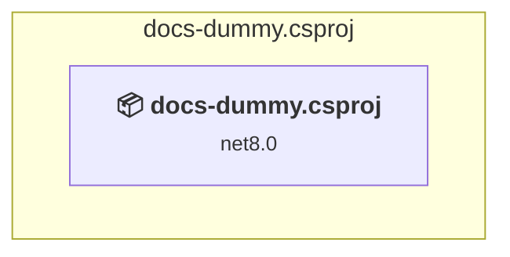

### API Compatibility

| Category | Count | Impact |
| :--- | :---: | :--- |
| 🔴 Binary Incompatible | 0 | High - Require code changes |
| 🟡 Source Incompatible | 0 | Medium - Needs re-compilation and potential conflicting API error fixing |
| 🔵 Behavioral change | 0 | Low - Behavioral changes that may require testing at runtime |
| ✅ Compatible | 0 |  |
| ***Total APIs Analyzed*** | ***0*** |  |

<a id="srcfoundationnugetsrcdummy-pdfsharpnuget-wpfdummy-pdfsharpnuget-wpfcsproj"></a>
### src\foundation\nuget\src\Dummy-PDFsharp.NuGet-wpf\Dummy-PDFsharp.NuGet-wpf.csproj

#### Project Info

- **Current Target Framework:** net8.0-windows;net462
- **Proposed Target Framework:** net8.0-windows;net462;net10.0--windows;net10.0
- **SDK-style**: True
- **Project Kind:** ClassLibrary
- **Dependencies**: 6
- **Dependants**: 0
- **Number of Files**: 0
- **Number of Files with Incidents**: 1
- **Lines of Code**: 0
- **Estimated LOC to modify**: 0+ (at least 0.0% of the project)

#### Dependency Graph

Legend:
📦 SDK-style project
⚙️ Classic project

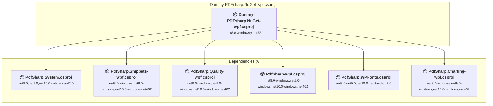

### API Compatibility

| Category | Count | Impact |
| :--- | :---: | :--- |
| 🔴 Binary Incompatible | 0 | High - Require code changes |
| 🟡 Source Incompatible | 0 | Medium - Needs re-compilation and potential conflicting API error fixing |
| 🔵 Behavioral change | 0 | Low - Behavioral changes that may require testing at runtime |
| ✅ Compatible | 0 |  |
| ***Total APIs Analyzed*** | ***0*** |  |

<a id="srcfoundationnugetsrcmigradocnugetmigradocnugetcsproj"></a>
### src\foundation\nuget\src\MigraDoc.NuGet\MigraDoc.NuGet.csproj

#### Project Info

- **Current Target Framework:** net8.0;net9.0;net10.0;netstandard2.0
- **Proposed Target Framework:** net8.0;net9.0;net10.0;netstandard2.0;net10.0
- **SDK-style**: True
- **Project Kind:** ClassLibrary
- **Dependencies**: 9
- **Dependants**: 0
- **Number of Files**: 0
- **Number of Files with Incidents**: 1
- **Lines of Code**: 0
- **Estimated LOC to modify**: 0+ (at least 0.0% of the project)

#### Dependency Graph

Legend:
📦 SDK-style project
⚙️ Classic project

```mermaid
flowchart TB
    subgraph current["MigraDoc.NuGet.csproj"]
        MAIN["<b>📦&nbsp;MigraDoc.NuGet.csproj</b><br/><small>net8.0;net9.0;net10.0;netstandard2.0</small>"]
        click MAIN "#srcfoundationnugetsrcmigradocnugetmigradocnugetcsproj"
    end
    subgraph downstream["Dependencies (9"]
        P6["<b>📦&nbsp;PdfSharp.Charting.csproj</b><br/><small>net8.0;net9.0;net10.0;netstandard2.0</small>"]
        P5["<b>📦&nbsp;PdfSharp.csproj</b><br/><small>net8.0;net9.0;net10.0;netstandard2.0</small>"]
        P7["<b>📦&nbsp;MigraDoc.DocumentObjectModel.csproj</b><br/><small>net8.0;net9.0;net10.0;net462;netstandard2.0</small>"]
        P9["<b>📦&nbsp;PdfSharp.Quality.csproj</b><br/><small>net8.0;net9.0;net10.0;netstandard2.0</small>"]
        P33["<b>📦&nbsp;PdfSharp.System.csproj</b><br/><small>net8.0;net9.0;net10.0;netstandard2.0</small>"]
        P10["<b>📦&nbsp;PdfSharp.Snippets.csproj</b><br/><small>net8.0;net9.0;net10.0;netstandard2.0</small>"]
        P40["<b>📦&nbsp;MigraDoc.RtfRendering.csproj</b><br/><small>net8.0;net9.0;net10.0;netstandard2.0</small>"]
        P8["<b>📦&nbsp;MigraDoc.Rendering.csproj</b><br/><small>net8.0;net9.0;net10.0;netstandard2.0</small>"]
        P11["<b>📦&nbsp;PdfSharp.WPFonts.csproj</b><br/><small>net8.0;net9.0;net10.0;netstandard2.0</small>"]
        click P6 "#srcfoundationsrcpdfsharpsrcpdfsharpchartingpdfsharpchartingcsproj"
        click P5 "#srcfoundationsrcpdfsharpsrcpdfsharppdfsharpcsproj"
        click P7 "#srcfoundationsrcmigradocsrcmigradocdocumentobjectmodelmigradocdocumentobjectmodelcsproj"
        click P9 "#srcfoundationsrcsharedsrcpdfsharpqualitypdfsharpqualitycsproj"
        click P33 "#srcfoundationsrcsharedsrcpdfsharpsystempdfsharpsystemcsproj"
        click P10 "#srcfoundationsrcsharedsrcpdfsharpsnippetspdfsharpsnippetscsproj"
        click P40 "#srcfoundationsrcmigradocsrcmigradocrtfrenderingmigradocrtfrenderingcsproj"
        click P8 "#srcfoundationsrcmigradocsrcmigradocrenderingmigradocrenderingcsproj"
        click P11 "#srcfoundationsrcsharedsrcpdfsharpwpfontspdfsharpwpfontscsproj"
    end
    MAIN --> P6
    MAIN --> P5
    MAIN --> P7
    MAIN --> P9
    MAIN --> P33
    MAIN --> P10
    MAIN --> P40
    MAIN --> P8
    MAIN --> P11

```

### API Compatibility

| Category | Count | Impact |
| :--- | :---: | :--- |
| 🔴 Binary Incompatible | 0 | High - Require code changes |
| 🟡 Source Incompatible | 0 | Medium - Needs re-compilation and potential conflicting API error fixing |
| 🔵 Behavioral change | 0 | Low - Behavioral changes that may require testing at runtime |
| ✅ Compatible | 0 |  |
| ***Total APIs Analyzed*** | ***0*** |  |

<a id="srcfoundationnugetsrcmigradocnuget-gdimigradocnuget-gdicsproj"></a>
### src\foundation\nuget\src\MigraDoc.NuGet-gdi\MigraDoc.NuGet-gdi.csproj

#### Project Info

- **Current Target Framework:** net8.0-windows;net9.0-windows;net10.0-windows;net462
- **Proposed Target Framework:** net8.0-windows;net9.0-windows;net10.0-windows;net462;net10.0--windows;net10.0
- **SDK-style**: True
- **Project Kind:** ClassLibrary
- **Dependencies**: 9
- **Dependants**: 0
- **Number of Files**: 0
- **Number of Files with Incidents**: 1
- **Lines of Code**: 0
- **Estimated LOC to modify**: 0+ (at least 0.0% of the project)

#### Dependency Graph

Legend:
📦 SDK-style project
⚙️ Classic project

```mermaid
flowchart TB
    subgraph current["MigraDoc.NuGet-gdi.csproj"]
        MAIN["<b>📦&nbsp;MigraDoc.NuGet-gdi.csproj</b><br/><small>net8.0-windows;net9.0-windows;net10.0-windows;net462</small>"]
        click MAIN "#srcfoundationnugetsrcmigradocnuget-gdimigradocnuget-gdicsproj"
    end
    subgraph downstream["Dependencies (9"]
        P30["<b>📦&nbsp;MigraDoc.Rendering-gdi.csproj</b><br/><small>net8.0-windows;net9.0-windows;net10.0-windows;net462</small>"]
        P15["<b>📦&nbsp;PdfSharp-gdi.csproj</b><br/><small>net8.0-windows;net9.0-windows;net10.0-windows;net462</small>"]
        P18["<b>📦&nbsp;PdfSharp.Quality-gdi.csproj</b><br/><small>net8.0-windows;net9.0-windows;net10.0-windows;net462</small>"]
        P24["<b>📦&nbsp;PdfSharp.Charting-gdi.csproj</b><br/><small>net8.0-windows;net9.0-windows;net10.0-windows;net462</small>"]
        P7["<b>📦&nbsp;MigraDoc.DocumentObjectModel.csproj</b><br/><small>net8.0;net9.0;net10.0;net462;netstandard2.0</small>"]
        P33["<b>📦&nbsp;PdfSharp.System.csproj</b><br/><small>net8.0;net9.0;net10.0;netstandard2.0</small>"]
        P20["<b>📦&nbsp;PdfSharp.Snippets-gdi.csproj</b><br/><small>net8.0-windows;net9.0-windows;net10.0-windows;net462</small>"]
        P42["<b>📦&nbsp;MigraDoc.RtfRendering-gdi.csproj</b><br/><small>net8.0-windows;net9.0-windows;net10.0-windows;net462</small>"]
        P11["<b>📦&nbsp;PdfSharp.WPFonts.csproj</b><br/><small>net8.0;net9.0;net10.0;netstandard2.0</small>"]
        click P30 "#srcfoundationsrcmigradocsrcmigradocrendering-gdimigradocrendering-gdicsproj"
        click P15 "#srcfoundationsrcpdfsharpsrcpdfsharp-gdipdfsharp-gdicsproj"
        click P18 "#srcfoundationsrcsharedsrcpdfsharpquality-gdipdfsharpquality-gdicsproj"
        click P24 "#srcfoundationsrcpdfsharpsrcpdfsharpcharting-gdipdfsharpcharting-gdicsproj"
        click P7 "#srcfoundationsrcmigradocsrcmigradocdocumentobjectmodelmigradocdocumentobjectmodelcsproj"
        click P33 "#srcfoundationsrcsharedsrcpdfsharpsystempdfsharpsystemcsproj"
        click P20 "#srcfoundationsrcsharedsrcpdfsharpsnippets-gdipdfsharpsnippets-gdicsproj"
        click P42 "#srcfoundationsrcmigradocsrcmigradocrtfrendering-gdimigradocrtfrendering-gdicsproj"
        click P11 "#srcfoundationsrcsharedsrcpdfsharpwpfontspdfsharpwpfontscsproj"
    end
    MAIN --> P30
    MAIN --> P15
    MAIN --> P18
    MAIN --> P24
    MAIN --> P7
    MAIN --> P33
    MAIN --> P20
    MAIN --> P42
    MAIN --> P11

```

### API Compatibility

| Category | Count | Impact |
| :--- | :---: | :--- |
| 🔴 Binary Incompatible | 0 | High - Require code changes |
| 🟡 Source Incompatible | 0 | Medium - Needs re-compilation and potential conflicting API error fixing |
| 🔵 Behavioral change | 0 | Low - Behavioral changes that may require testing at runtime |
| ✅ Compatible | 0 |  |
| ***Total APIs Analyzed*** | ***0*** |  |

<a id="srcfoundationnugetsrcmigradocnuget-wpfmigradocnuget-wpfcsproj"></a>
### src\foundation\nuget\src\MigraDoc.NuGet-wpf\MigraDoc.NuGet-wpf.csproj

#### Project Info

- **Current Target Framework:** net8.0-windows;net9.0-windows;net10.0-windows;net462
- **Proposed Target Framework:** net8.0-windows;net9.0-windows;net10.0-windows;net462;net10.0--windows;net10.0
- **SDK-style**: True
- **Project Kind:** ClassLibrary
- **Dependencies**: 9
- **Dependants**: 0
- **Number of Files**: 0
- **Number of Files with Incidents**: 1
- **Lines of Code**: 0
- **Estimated LOC to modify**: 0+ (at least 0.0% of the project)

#### Dependency Graph

Legend:
📦 SDK-style project
⚙️ Classic project

```mermaid
flowchart TB
    subgraph current["MigraDoc.NuGet-wpf.csproj"]
        MAIN["<b>📦&nbsp;MigraDoc.NuGet-wpf.csproj</b><br/><small>net8.0-windows;net9.0-windows;net10.0-windows;net462</small>"]
        click MAIN "#srcfoundationnugetsrcmigradocnuget-wpfmigradocnuget-wpfcsproj"
    end
    subgraph downstream["Dependencies (9"]
        P7["<b>📦&nbsp;MigraDoc.DocumentObjectModel.csproj</b><br/><small>net8.0;net9.0;net10.0;net462;netstandard2.0</small>"]
        P33["<b>📦&nbsp;PdfSharp.System.csproj</b><br/><small>net8.0;net9.0;net10.0;netstandard2.0</small>"]
        P19["<b>📦&nbsp;PdfSharp.Snippets-wpf.csproj</b><br/><small>net8.0-windows;net9.0-windows;net10.0-windows;net462</small>"]
        P17["<b>📦&nbsp;PdfSharp.Quality-wpf.csproj</b><br/><small>net8.0-windows;net9.0-windows;net10.0-windows;net462</small>"]
        P14["<b>📦&nbsp;PdfSharp-wpf.csproj</b><br/><small>net8.0-windows;net9.0-windows;net10.0-windows;net462</small>"]
        P16["<b>📦&nbsp;MigraDoc.Rendering-wpf.csproj</b><br/><small>net8.0-windows;net9.0-windows;net10.0-windows;net462</small>"]
        P41["<b>📦&nbsp;MigraDoc.RtfRendering-wpf.csproj</b><br/><small>net8.0-windows;net9.0-windows;net10.0-windows;net462</small>"]
        P11["<b>📦&nbsp;PdfSharp.WPFonts.csproj</b><br/><small>net8.0;net9.0;net10.0;netstandard2.0</small>"]
        P23["<b>📦&nbsp;PdfSharp.Charting-wpf.csproj</b><br/><small>net8.0-windows;net9.0-windows;net10.0-windows;net462</small>"]
        click P7 "#srcfoundationsrcmigradocsrcmigradocdocumentobjectmodelmigradocdocumentobjectmodelcsproj"
        click P33 "#srcfoundationsrcsharedsrcpdfsharpsystempdfsharpsystemcsproj"
        click P19 "#srcfoundationsrcsharedsrcpdfsharpsnippets-wpfpdfsharpsnippets-wpfcsproj"
        click P17 "#srcfoundationsrcsharedsrcpdfsharpquality-wpfpdfsharpquality-wpfcsproj"
        click P14 "#srcfoundationsrcpdfsharpsrcpdfsharp-wpfpdfsharp-wpfcsproj"
        click P16 "#srcfoundationsrcmigradocsrcmigradocrendering-wpfmigradocrendering-wpfcsproj"
        click P41 "#srcfoundationsrcmigradocsrcmigradocrtfrendering-wpfmigradocrtfrendering-wpfcsproj"
        click P11 "#srcfoundationsrcsharedsrcpdfsharpwpfontspdfsharpwpfontscsproj"
        click P23 "#srcfoundationsrcpdfsharpsrcpdfsharpcharting-wpfpdfsharpcharting-wpfcsproj"
    end
    MAIN --> P7
    MAIN --> P33
    MAIN --> P19
    MAIN --> P17
    MAIN --> P14
    MAIN --> P16
    MAIN --> P41
    MAIN --> P11
    MAIN --> P23

```

### API Compatibility

| Category | Count | Impact |
| :--- | :---: | :--- |
| 🔴 Binary Incompatible | 0 | High - Require code changes |
| 🟡 Source Incompatible | 0 | Medium - Needs re-compilation and potential conflicting API error fixing |
| 🔵 Behavioral change | 0 | Low - Behavioral changes that may require testing at runtime |
| ✅ Compatible | 0 |  |
| ***Total APIs Analyzed*** | ***0*** |  |

<a id="srcfoundationnugetsrcpdfsharpnugetpdfsharpnugetcsproj"></a>
### src\foundation\nuget\src\PDFsharp.NuGet\PDFsharp.NuGet.csproj

#### Project Info

- **Current Target Framework:** net8.0;net9.0;net10.0;netstandard2.0
- **Proposed Target Framework:** net8.0;net9.0;net10.0;netstandard2.0;net10.0
- **SDK-style**: True
- **Project Kind:** ClassLibrary
- **Dependencies**: 8
- **Dependants**: 0
- **Number of Files**: 0
- **Number of Files with Incidents**: 1
- **Lines of Code**: 0
- **Estimated LOC to modify**: 0+ (at least 0.0% of the project)

#### Dependency Graph

Legend:
📦 SDK-style project
⚙️ Classic project

```mermaid
flowchart TB
    subgraph current["PDFsharp.NuGet.csproj"]
        MAIN["<b>📦&nbsp;PDFsharp.NuGet.csproj</b><br/><small>net8.0;net9.0;net10.0;netstandard2.0</small>"]
        click MAIN "#srcfoundationnugetsrcpdfsharpnugetpdfsharpnugetcsproj"
    end
    subgraph downstream["Dependencies (8"]
        P6["<b>📦&nbsp;PdfSharp.Charting.csproj</b><br/><small>net8.0;net9.0;net10.0;netstandard2.0</small>"]
        P5["<b>📦&nbsp;PdfSharp.csproj</b><br/><small>net8.0;net9.0;net10.0;netstandard2.0</small>"]
        P70["<b>📦&nbsp;PdfSharp.BarCodes.csproj</b><br/><small>net8.0;net9.0;net10.0;netstandard2.0</small>"]
        P9["<b>📦&nbsp;PdfSharp.Quality.csproj</b><br/><small>net8.0;net9.0;net10.0;netstandard2.0</small>"]
        P33["<b>📦&nbsp;PdfSharp.System.csproj</b><br/><small>net8.0;net9.0;net10.0;netstandard2.0</small>"]
        P10["<b>📦&nbsp;PdfSharp.Snippets.csproj</b><br/><small>net8.0;net9.0;net10.0;netstandard2.0</small>"]
        P11["<b>📦&nbsp;PdfSharp.WPFonts.csproj</b><br/><small>net8.0;net9.0;net10.0;netstandard2.0</small>"]
        P72["<b>📦&nbsp;PdfSharp.Cryptography.csproj</b><br/><small>net8.0;net9.0;net10.0;netstandard2.0</small>"]
        click P6 "#srcfoundationsrcpdfsharpsrcpdfsharpchartingpdfsharpchartingcsproj"
        click P5 "#srcfoundationsrcpdfsharpsrcpdfsharppdfsharpcsproj"
        click P70 "#srcfoundationsrcpdfsharpsrcpdfsharpbarcodespdfsharpbarcodescsproj"
        click P9 "#srcfoundationsrcsharedsrcpdfsharpqualitypdfsharpqualitycsproj"
        click P33 "#srcfoundationsrcsharedsrcpdfsharpsystempdfsharpsystemcsproj"
        click P10 "#srcfoundationsrcsharedsrcpdfsharpsnippetspdfsharpsnippetscsproj"
        click P11 "#srcfoundationsrcsharedsrcpdfsharpwpfontspdfsharpwpfontscsproj"
        click P72 "#srcfoundationsrcpdfsharpsrcpdfsharpcryptographypdfsharpcryptographycsproj"
    end
    MAIN --> P6
    MAIN --> P5
    MAIN --> P70
    MAIN --> P9
    MAIN --> P33
    MAIN --> P10
    MAIN --> P11
    MAIN --> P72

```

### API Compatibility

| Category | Count | Impact |
| :--- | :---: | :--- |
| 🔴 Binary Incompatible | 0 | High - Require code changes |
| 🟡 Source Incompatible | 0 | Medium - Needs re-compilation and potential conflicting API error fixing |
| 🔵 Behavioral change | 0 | Low - Behavioral changes that may require testing at runtime |
| ✅ Compatible | 0 |  |
| ***Total APIs Analyzed*** | ***0*** |  |

<a id="srcfoundationnugetsrcpdfsharpnuget-gdipdfsharpnuget-gdicsproj"></a>
### src\foundation\nuget\src\PDFsharp.NuGet-gdi\PDFsharp.NuGet-gdi.csproj

#### Project Info

- **Current Target Framework:** net8.0-windows;net9.0-windows;net10.0-windows;net462
- **Proposed Target Framework:** net8.0-windows;net9.0-windows;net10.0-windows;net462;net10.0--windows;net10.0
- **SDK-style**: True
- **Project Kind:** ClassLibrary
- **Dependencies**: 8
- **Dependants**: 0
- **Number of Files**: 0
- **Number of Files with Incidents**: 1
- **Lines of Code**: 0
- **Estimated LOC to modify**: 0+ (at least 0.0% of the project)

#### Dependency Graph

Legend:
📦 SDK-style project
⚙️ Classic project

```mermaid
flowchart TB
    subgraph current["PDFsharp.NuGet-gdi.csproj"]
        MAIN["<b>📦&nbsp;PDFsharp.NuGet-gdi.csproj</b><br/><small>net8.0-windows;net9.0-windows;net10.0-windows;net462</small>"]
        click MAIN "#srcfoundationnugetsrcpdfsharpnuget-gdipdfsharpnuget-gdicsproj"
    end
    subgraph downstream["Dependencies (8"]
        P68["<b>📦&nbsp;PdfSharp.BarCodes-gdi.csproj</b><br/><small>net8.0-windows;net9.0-windows;net10.0-windows;net462</small>"]
        P15["<b>📦&nbsp;PdfSharp-gdi.csproj</b><br/><small>net8.0-windows;net9.0-windows;net10.0-windows;net462</small>"]
        P18["<b>📦&nbsp;PdfSharp.Quality-gdi.csproj</b><br/><small>net8.0-windows;net9.0-windows;net10.0-windows;net462</small>"]
        P24["<b>📦&nbsp;PdfSharp.Charting-gdi.csproj</b><br/><small>net8.0-windows;net9.0-windows;net10.0-windows;net462</small>"]
        P33["<b>📦&nbsp;PdfSharp.System.csproj</b><br/><small>net8.0;net9.0;net10.0;netstandard2.0</small>"]
        P20["<b>📦&nbsp;PdfSharp.Snippets-gdi.csproj</b><br/><small>net8.0-windows;net9.0-windows;net10.0-windows;net462</small>"]
        P11["<b>📦&nbsp;PdfSharp.WPFonts.csproj</b><br/><small>net8.0;net9.0;net10.0;netstandard2.0</small>"]
        P72["<b>📦&nbsp;PdfSharp.Cryptography.csproj</b><br/><small>net8.0;net9.0;net10.0;netstandard2.0</small>"]
        click P68 "#srcfoundationsrcpdfsharpsrcpdfsharpbarcodes-gdipdfsharpbarcodes-gdicsproj"
        click P15 "#srcfoundationsrcpdfsharpsrcpdfsharp-gdipdfsharp-gdicsproj"
        click P18 "#srcfoundationsrcsharedsrcpdfsharpquality-gdipdfsharpquality-gdicsproj"
        click P24 "#srcfoundationsrcpdfsharpsrcpdfsharpcharting-gdipdfsharpcharting-gdicsproj"
        click P33 "#srcfoundationsrcsharedsrcpdfsharpsystempdfsharpsystemcsproj"
        click P20 "#srcfoundationsrcsharedsrcpdfsharpsnippets-gdipdfsharpsnippets-gdicsproj"
        click P11 "#srcfoundationsrcsharedsrcpdfsharpwpfontspdfsharpwpfontscsproj"
        click P72 "#srcfoundationsrcpdfsharpsrcpdfsharpcryptographypdfsharpcryptographycsproj"
    end
    MAIN --> P68
    MAIN --> P15
    MAIN --> P18
    MAIN --> P24
    MAIN --> P33
    MAIN --> P20
    MAIN --> P11
    MAIN --> P72

```

### API Compatibility

| Category | Count | Impact |
| :--- | :---: | :--- |
| 🔴 Binary Incompatible | 0 | High - Require code changes |
| 🟡 Source Incompatible | 0 | Medium - Needs re-compilation and potential conflicting API error fixing |
| 🔵 Behavioral change | 0 | Low - Behavioral changes that may require testing at runtime |
| ✅ Compatible | 0 |  |
| ***Total APIs Analyzed*** | ***0*** |  |

<a id="srcfoundationnugetsrcpdfsharpnuget-wpfpdfsharpnuget-wpfcsproj"></a>
### src\foundation\nuget\src\PDFsharp.NuGet-wpf\PDFsharp.NuGet-wpf.csproj

#### Project Info

- **Current Target Framework:** net8.0-windows;net9.0-windows;net10.0-windows;net462
- **Proposed Target Framework:** net8.0-windows;net9.0-windows;net10.0-windows;net462;net10.0--windows;net10.0
- **SDK-style**: True
- **Project Kind:** ClassLibrary
- **Dependencies**: 8
- **Dependants**: 0
- **Number of Files**: 0
- **Number of Files with Incidents**: 1
- **Lines of Code**: 0
- **Estimated LOC to modify**: 0+ (at least 0.0% of the project)

#### Dependency Graph

Legend:
📦 SDK-style project
⚙️ Classic project

```mermaid
flowchart TB
    subgraph current["PDFsharp.NuGet-wpf.csproj"]
        MAIN["<b>📦&nbsp;PDFsharp.NuGet-wpf.csproj</b><br/><small>net8.0-windows;net9.0-windows;net10.0-windows;net462</small>"]
        click MAIN "#srcfoundationnugetsrcpdfsharpnuget-wpfpdfsharpnuget-wpfcsproj"
    end
    subgraph downstream["Dependencies (8"]
        P33["<b>📦&nbsp;PdfSharp.System.csproj</b><br/><small>net8.0;net9.0;net10.0;netstandard2.0</small>"]
        P19["<b>📦&nbsp;PdfSharp.Snippets-wpf.csproj</b><br/><small>net8.0-windows;net9.0-windows;net10.0-windows;net462</small>"]
        P17["<b>📦&nbsp;PdfSharp.Quality-wpf.csproj</b><br/><small>net8.0-windows;net9.0-windows;net10.0-windows;net462</small>"]
        P14["<b>📦&nbsp;PdfSharp-wpf.csproj</b><br/><small>net8.0-windows;net9.0-windows;net10.0-windows;net462</small>"]
        P11["<b>📦&nbsp;PdfSharp.WPFonts.csproj</b><br/><small>net8.0;net9.0;net10.0;netstandard2.0</small>"]
        P23["<b>📦&nbsp;PdfSharp.Charting-wpf.csproj</b><br/><small>net8.0-windows;net9.0-windows;net10.0-windows;net462</small>"]
        P72["<b>📦&nbsp;PdfSharp.Cryptography.csproj</b><br/><small>net8.0;net9.0;net10.0;netstandard2.0</small>"]
        P69["<b>📦&nbsp;PdfSharp.BarCodes-wpf.csproj</b><br/><small>net8.0-windows;net9.0-windows;net10.0-windows;net462</small>"]
        click P33 "#srcfoundationsrcsharedsrcpdfsharpsystempdfsharpsystemcsproj"
        click P19 "#srcfoundationsrcsharedsrcpdfsharpsnippets-wpfpdfsharpsnippets-wpfcsproj"
        click P17 "#srcfoundationsrcsharedsrcpdfsharpquality-wpfpdfsharpquality-wpfcsproj"
        click P14 "#srcfoundationsrcpdfsharpsrcpdfsharp-wpfpdfsharp-wpfcsproj"
        click P11 "#srcfoundationsrcsharedsrcpdfsharpwpfontspdfsharpwpfontscsproj"
        click P23 "#srcfoundationsrcpdfsharpsrcpdfsharpcharting-wpfpdfsharpcharting-wpfcsproj"
        click P72 "#srcfoundationsrcpdfsharpsrcpdfsharpcryptographypdfsharpcryptographycsproj"
        click P69 "#srcfoundationsrcpdfsharpsrcpdfsharpbarcodes-wpfpdfsharpbarcodes-wpfcsproj"
    end
    MAIN --> P33
    MAIN --> P19
    MAIN --> P17
    MAIN --> P14
    MAIN --> P11
    MAIN --> P23
    MAIN --> P72
    MAIN --> P69

```

### API Compatibility

| Category | Count | Impact |
| :--- | :---: | :--- |
| 🔴 Binary Incompatible | 0 | High - Require code changes |
| 🟡 Source Incompatible | 0 | Medium - Needs re-compilation and potential conflicting API error fixing |
| 🔵 Behavioral change | 0 | Low - Behavioral changes that may require testing at runtime |
| ✅ Compatible | 0 |  |
| ***Total APIs Analyzed*** | ***0*** |  |

<a id="srcfoundationsrcmigradocfeaturesmigradocfeaturesmigradocfeaturescsproj"></a>
### src\foundation\src\MigraDoc\features\MigraDoc.Features\MigraDoc.Features.csproj

#### Project Info

- **Current Target Framework:** net8.0
- **Proposed Target Framework:** net10.0
- **SDK-style**: True
- **Project Kind:** DotNetCoreApp
- **Dependencies**: 0
- **Dependants**: 0
- **Number of Files**: 1
- **Number of Files with Incidents**: 1
- **Lines of Code**: 15
- **Estimated LOC to modify**: 0+ (at least 0.0% of the project)

#### Dependency Graph

Legend:
📦 SDK-style project
⚙️ Classic project

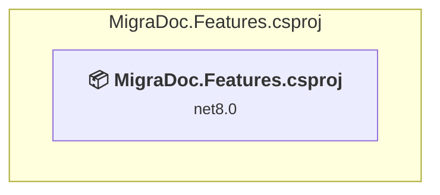

### API Compatibility

| Category | Count | Impact |
| :--- | :---: | :--- |
| 🔴 Binary Incompatible | 0 | High - Require code changes |
| 🟡 Source Incompatible | 0 | Medium - Needs re-compilation and potential conflicting API error fixing |
| 🔵 Behavioral change | 0 | Low - Behavioral changes that may require testing at runtime |
| ✅ Compatible | 0 |  |
| ***Total APIs Analyzed*** | ***0*** |  |

<a id="srcfoundationsrcmigradocsrcmigradocdocumentobjectmodelmigradocdocumentobjectmodelcsproj"></a>
### src\foundation\src\MigraDoc\src\MigraDoc.DocumentObjectModel\MigraDoc.DocumentObjectModel.csproj

#### Project Info

- **Current Target Framework:** net8.0;net9.0;net10.0;net462;netstandard2.0
- **Proposed Target Framework:** net8.0;net9.0;net10.0;net462;netstandard2.0;net10.0
- **SDK-style**: True
- **Project Kind:** ClassLibrary
- **Dependencies**: 2
- **Dependants**: 20
- **Number of Files**: 175
- **Number of Files with Incidents**: 1
- **Lines of Code**: 33871
- **Estimated LOC to modify**: 0+ (at least 0.0% of the project)

#### Dependency Graph

Legend:
📦 SDK-style project
⚙️ Classic project

```mermaid
flowchart TB
    subgraph upstream["Dependants (20)"]
        P3["<b>📦&nbsp;MigraDoc.Tests.csproj</b><br/><small>net8.0;net9.0;net10.0;net462</small>"]
        P8["<b>📦&nbsp;MigraDoc.Rendering.csproj</b><br/><small>net8.0;net9.0;net10.0;netstandard2.0</small>"]
        P16["<b>📦&nbsp;MigraDoc.Rendering-wpf.csproj</b><br/><small>net8.0-windows;net9.0-windows;net10.0-windows;net462</small>"]
        P25["<b>📦&nbsp;HelloWorld,MigraDoc.csproj</b><br/><small>net8.0;net462</small>"]
        P28["<b>📦&nbsp;HelloWorld,MigraDoc-wpf.csproj</b><br/><small>net8.0-windows;net462</small>"]
        P30["<b>📦&nbsp;MigraDoc.Rendering-gdi.csproj</b><br/><small>net8.0-windows;net9.0-windows;net10.0-windows;net462</small>"]
        P31["<b>📦&nbsp;HelloWorld,MigraDoc-gdi.csproj</b><br/><small>net8.0-windows;net462</small>"]
        P32["<b>📦&nbsp;MigraDoc.DocumentObjectModel.Tests.csproj</b><br/><small>net8.0;net9.0;net10.0;net462</small>"]
        P34["<b>📦&nbsp;MigraDoc.Tests-wpf.csproj</b><br/><small>net8.0-windows;net9.0-windows;net10.0-windows;net462</small>"]
        P35["<b>📦&nbsp;MigraDoc.Tests-gdi.csproj</b><br/><small>net8.0-windows;net9.0-windows;net10.0-windows;net462</small>"]
        P36["<b>📦&nbsp;MigraDoc.GrammarByExample.csproj</b><br/><small>net8.0;net9.0;net10.0;net462</small>"]
        P37["<b>📦&nbsp;MigraDoc.GrammarByExample-WPF.csproj</b><br/><small>net8.0-windows;net9.0-windows;net10.0-windows;net462</small>"]
        P38["<b>📦&nbsp;MigraDoc.GrammarByExample-GDI.csproj</b><br/><small>net8.0-windows;net9.0-windows;net10.0-windows;net462</small>"]
        P39["<b>📦&nbsp;MigraDoc.GBE-Runner.csproj</b><br/><small>net8.0;net9.0;net10.0;net462</small>"]
        P40["<b>📦&nbsp;MigraDoc.RtfRendering.csproj</b><br/><small>net8.0;net9.0;net10.0;netstandard2.0</small>"]
        P41["<b>📦&nbsp;MigraDoc.RtfRendering-wpf.csproj</b><br/><small>net8.0-windows;net9.0-windows;net10.0-windows;net462</small>"]
        P42["<b>📦&nbsp;MigraDoc.RtfRendering-gdi.csproj</b><br/><small>net8.0-windows;net9.0-windows;net10.0-windows;net462</small>"]
        P46["<b>📦&nbsp;MigraDoc.NuGet-wpf.csproj</b><br/><small>net8.0-windows;net9.0-windows;net10.0-windows;net462</small>"]
        P47["<b>📦&nbsp;MigraDoc.NuGet.csproj</b><br/><small>net8.0;net9.0;net10.0;netstandard2.0</small>"]
        P48["<b>📦&nbsp;MigraDoc.NuGet-gdi.csproj</b><br/><small>net8.0-windows;net9.0-windows;net10.0-windows;net462</small>"]
        click P3 "#srcfoundationsrcmigradoctestsmigradoctestsmigradoctestscsproj"
        click P8 "#srcfoundationsrcmigradocsrcmigradocrenderingmigradocrenderingcsproj"
        click P16 "#srcfoundationsrcmigradocsrcmigradocrendering-wpfmigradocrendering-wpfcsproj"
        click P25 "#srcsamplessrcmigradocsrchelloworldhelloworld,migradoccsproj"
        click P28 "#srcsamplessrcmigradocsrchelloworld-wpfhelloworld,migradoc-wpfcsproj"
        click P30 "#srcfoundationsrcmigradocsrcmigradocrendering-gdimigradocrendering-gdicsproj"
        click P31 "#srcsamplessrcmigradocsrchelloworld-gdihelloworld,migradoc-gdicsproj"
        click P32 "#srcfoundationsrcmigradoctestsmigradocdocumentobjectmodeltestsmigradocdocumentobjectmodeltestscsproj"
        click P34 "#srcfoundationsrcmigradoctestsmigradoctests-wpfmigradoctests-wpfcsproj"
        click P35 "#srcfoundationsrcmigradoctestsmigradoctests-gdimigradoctests-gdicsproj"
        click P36 "#srcfoundationsrcmigradoctestsmigradocgrammarbyexamplemigradocgrammarbyexamplecsproj"
        click P37 "#srcfoundationsrcmigradoctestsmigradocgrammarbyexample-wpfmigradocgrammarbyexample-wpfcsproj"
        click P38 "#srcfoundationsrcmigradoctestsmigradocgrammarbyexample-gdimigradocgrammarbyexample-gdicsproj"
        click P39 "#srcfoundationsrcmigradoctestsmigradocgbe-runnermigradocgbe-runnercsproj"
        click P40 "#srcfoundationsrcmigradocsrcmigradocrtfrenderingmigradocrtfrenderingcsproj"
        click P41 "#srcfoundationsrcmigradocsrcmigradocrtfrendering-wpfmigradocrtfrendering-wpfcsproj"
        click P42 "#srcfoundationsrcmigradocsrcmigradocrtfrendering-gdimigradocrtfrendering-gdicsproj"
        click P46 "#srcfoundationnugetsrcmigradocnuget-wpfmigradocnuget-wpfcsproj"
        click P47 "#srcfoundationnugetsrcmigradocnugetmigradocnugetcsproj"
        click P48 "#srcfoundationnugetsrcmigradocnuget-gdimigradocnuget-gdicsproj"
    end
    subgraph current["MigraDoc.DocumentObjectModel.csproj"]
        MAIN["<b>📦&nbsp;MigraDoc.DocumentObjectModel.csproj</b><br/><small>net8.0;net9.0;net10.0;net462;netstandard2.0</small>"]
        click MAIN "#srcfoundationsrcmigradocsrcmigradocdocumentobjectmodelmigradocdocumentobjectmodelcsproj"
    end
    subgraph downstream["Dependencies (2"]
        P67["<b>📦&nbsp;PdfSharp.Shared.csproj</b><br/><small>net8.0;net9.0;net10.0;netstandard2.0</small>"]
        P33["<b>📦&nbsp;PdfSharp.System.csproj</b><br/><small>net8.0;net9.0;net10.0;netstandard2.0</small>"]
        click P67 "#srcfoundationsrcsharedsrcpdfsharpsharedpdfsharpsharedcsproj"
        click P33 "#srcfoundationsrcsharedsrcpdfsharpsystempdfsharpsystemcsproj"
    end
    P3 --> MAIN
    P8 --> MAIN
    P16 --> MAIN
    P25 --> MAIN
    P28 --> MAIN
    P30 --> MAIN
    P31 --> MAIN
    P32 --> MAIN
    P34 --> MAIN
    P35 --> MAIN
    P36 --> MAIN
    P37 --> MAIN
    P38 --> MAIN
    P39 --> MAIN
    P40 --> MAIN
    P41 --> MAIN
    P42 --> MAIN
    P46 --> MAIN
    P47 --> MAIN
    P48 --> MAIN
    MAIN --> P67
    MAIN --> P33

```

### API Compatibility

| Category | Count | Impact |
| :--- | :---: | :--- |
| 🔴 Binary Incompatible | 0 | High - Require code changes |
| 🟡 Source Incompatible | 0 | Medium - Needs re-compilation and potential conflicting API error fixing |
| 🔵 Behavioral change | 0 | Low - Behavioral changes that may require testing at runtime |
| ✅ Compatible | 0 |  |
| ***Total APIs Analyzed*** | ***0*** |  |

<a id="srcfoundationsrcmigradocsrcmigradocrenderingmigradocrenderingcsproj"></a>
### src\foundation\src\MigraDoc\src\MigraDoc.Rendering\MigraDoc.Rendering.csproj

#### Project Info

- **Current Target Framework:** net8.0;net9.0;net10.0;netstandard2.0
- **Proposed Target Framework:** net8.0;net9.0;net10.0;netstandard2.0;net10.0
- **SDK-style**: True
- **Project Kind:** ClassLibrary
- **Dependencies**: 5
- **Dependants**: 6
- **Number of Files**: 75
- **Number of Files with Incidents**: 1
- **Lines of Code**: 10968
- **Estimated LOC to modify**: 0+ (at least 0.0% of the project)

#### Dependency Graph

Legend:
📦 SDK-style project
⚙️ Classic project

```mermaid
flowchart TB
    subgraph upstream["Dependants (6)"]
        P3["<b>📦&nbsp;MigraDoc.Tests.csproj</b><br/><small>net8.0;net9.0;net10.0;net462</small>"]
        P25["<b>📦&nbsp;HelloWorld,MigraDoc.csproj</b><br/><small>net8.0;net462</small>"]
        P32["<b>📦&nbsp;MigraDoc.DocumentObjectModel.Tests.csproj</b><br/><small>net8.0;net9.0;net10.0;net462</small>"]
        P36["<b>📦&nbsp;MigraDoc.GrammarByExample.csproj</b><br/><small>net8.0;net9.0;net10.0;net462</small>"]
        P39["<b>📦&nbsp;MigraDoc.GBE-Runner.csproj</b><br/><small>net8.0;net9.0;net10.0;net462</small>"]
        P47["<b>📦&nbsp;MigraDoc.NuGet.csproj</b><br/><small>net8.0;net9.0;net10.0;netstandard2.0</small>"]
        click P3 "#srcfoundationsrcmigradoctestsmigradoctestsmigradoctestscsproj"
        click P25 "#srcsamplessrcmigradocsrchelloworldhelloworld,migradoccsproj"
        click P32 "#srcfoundationsrcmigradoctestsmigradocdocumentobjectmodeltestsmigradocdocumentobjectmodeltestscsproj"
        click P36 "#srcfoundationsrcmigradoctestsmigradocgrammarbyexamplemigradocgrammarbyexamplecsproj"
        click P39 "#srcfoundationsrcmigradoctestsmigradocgbe-runnermigradocgbe-runnercsproj"
        click P47 "#srcfoundationnugetsrcmigradocnugetmigradocnugetcsproj"
    end
    subgraph current["MigraDoc.Rendering.csproj"]
        MAIN["<b>📦&nbsp;MigraDoc.Rendering.csproj</b><br/><small>net8.0;net9.0;net10.0;netstandard2.0</small>"]
        click MAIN "#srcfoundationsrcmigradocsrcmigradocrenderingmigradocrenderingcsproj"
    end
    subgraph downstream["Dependencies (5"]
        P6["<b>📦&nbsp;PdfSharp.Charting.csproj</b><br/><small>net8.0;net9.0;net10.0;netstandard2.0</small>"]
        P5["<b>📦&nbsp;PdfSharp.csproj</b><br/><small>net8.0;net9.0;net10.0;netstandard2.0</small>"]
        P67["<b>📦&nbsp;PdfSharp.Shared.csproj</b><br/><small>net8.0;net9.0;net10.0;netstandard2.0</small>"]
        P7["<b>📦&nbsp;MigraDoc.DocumentObjectModel.csproj</b><br/><small>net8.0;net9.0;net10.0;net462;netstandard2.0</small>"]
        P33["<b>📦&nbsp;PdfSharp.System.csproj</b><br/><small>net8.0;net9.0;net10.0;netstandard2.0</small>"]
        click P6 "#srcfoundationsrcpdfsharpsrcpdfsharpchartingpdfsharpchartingcsproj"
        click P5 "#srcfoundationsrcpdfsharpsrcpdfsharppdfsharpcsproj"
        click P67 "#srcfoundationsrcsharedsrcpdfsharpsharedpdfsharpsharedcsproj"
        click P7 "#srcfoundationsrcmigradocsrcmigradocdocumentobjectmodelmigradocdocumentobjectmodelcsproj"
        click P33 "#srcfoundationsrcsharedsrcpdfsharpsystempdfsharpsystemcsproj"
    end
    P3 --> MAIN
    P25 --> MAIN
    P32 --> MAIN
    P36 --> MAIN
    P39 --> MAIN
    P47 --> MAIN
    MAIN --> P6
    MAIN --> P5
    MAIN --> P67
    MAIN --> P7
    MAIN --> P33

```

### API Compatibility

| Category | Count | Impact |
| :--- | :---: | :--- |
| 🔴 Binary Incompatible | 0 | High - Require code changes |
| 🟡 Source Incompatible | 0 | Medium - Needs re-compilation and potential conflicting API error fixing |
| 🔵 Behavioral change | 0 | Low - Behavioral changes that may require testing at runtime |
| ✅ Compatible | 0 |  |
| ***Total APIs Analyzed*** | ***0*** |  |

<a id="srcfoundationsrcmigradocsrcmigradocrendering-gdimigradocrendering-gdicsproj"></a>
### src\foundation\src\MigraDoc\src\MigraDoc.Rendering-gdi\MigraDoc.Rendering-gdi.csproj

#### Project Info

- **Current Target Framework:** net8.0-windows;net9.0-windows;net10.0-windows;net462
- **Proposed Target Framework:** net8.0-windows;net9.0-windows;net10.0-windows;net462;net10.0--windows;net10.0
- **SDK-style**: True
- **Project Kind:** ClassLibrary
- **Dependencies**: 5
- **Dependants**: 5
- **Number of Files**: 77
- **Number of Files with Incidents**: 1
- **Lines of Code**: 11648
- **Estimated LOC to modify**: 0+ (at least 0.0% of the project)

#### Dependency Graph

Legend:
📦 SDK-style project
⚙️ Classic project


### API Compatibility

| Category | Count | Impact |
| :--- | :---: | :--- |
| 🔴 Binary Incompatible | 0 | High - Require code changes |
| 🟡 Source Incompatible | 0 | Medium - Needs re-compilation and potential conflicting API error fixing |
| 🔵 Behavioral change | 0 | Low - Behavioral changes that may require testing at runtime |
| ✅ Compatible | 0 |  |
| ***Total APIs Analyzed*** | ***0*** |  |

<a id="srcfoundationsrcmigradocsrcmigradocrendering-wpfmigradocrendering-wpfcsproj"></a>
### src\foundation\src\MigraDoc\src\MigraDoc.Rendering-wpf\MigraDoc.Rendering-wpf.csproj

#### Project Info

- **Current Target Framework:** net8.0-windows;net9.0-windows;net10.0-windows;net462
- **Proposed Target Framework:** net8.0-windows;net9.0-windows;net10.0-windows;net462;net10.0-windows
- **SDK-style**: True
- **Project Kind:** Wpf
- **Dependencies**: 5
- **Dependants**: 5
- **Number of Files**: 75
- **Number of Files with Incidents**: 1
- **Lines of Code**: 11299
- **Estimated LOC to modify**: 0+ (at least 0.0% of the project)

#### Dependency Graph

Legend:
📦 SDK-style project
⚙️ Classic project

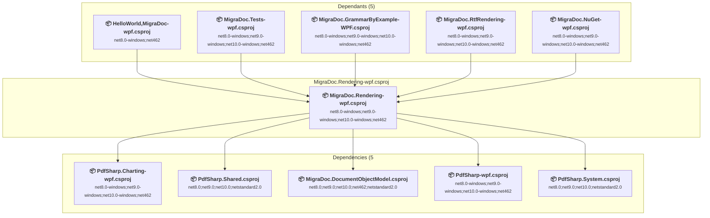

### API Compatibility

| Category | Count | Impact |
| :--- | :---: | :--- |
| 🔴 Binary Incompatible | 0 | High - Require code changes |
| 🟡 Source Incompatible | 0 | Medium - Needs re-compilation and potential conflicting API error fixing |
| 🔵 Behavioral change | 0 | Low - Behavioral changes that may require testing at runtime |
| ✅ Compatible | 0 |  |
| ***Total APIs Analyzed*** | ***0*** |  |

<a id="srcfoundationsrcmigradocsrcmigradocrtfrenderingmigradocrtfrenderingcsproj"></a>
### src\foundation\src\MigraDoc\src\MigraDoc.RtfRendering\MigraDoc.RtfRendering.csproj

#### Project Info

- **Current Target Framework:** net8.0;net9.0;net10.0;netstandard2.0
- **Proposed Target Framework:** net8.0;net9.0;net10.0;netstandard2.0;net10.0
- **SDK-style**: True
- **Project Kind:** ClassLibrary
- **Dependencies**: 5
- **Dependants**: 2
- **Number of Files**: 55
- **Number of Files with Incidents**: 1
- **Lines of Code**: 6624
- **Estimated LOC to modify**: 0+ (at least 0.0% of the project)

#### Dependency Graph

Legend:
📦 SDK-style project
⚙️ Classic project

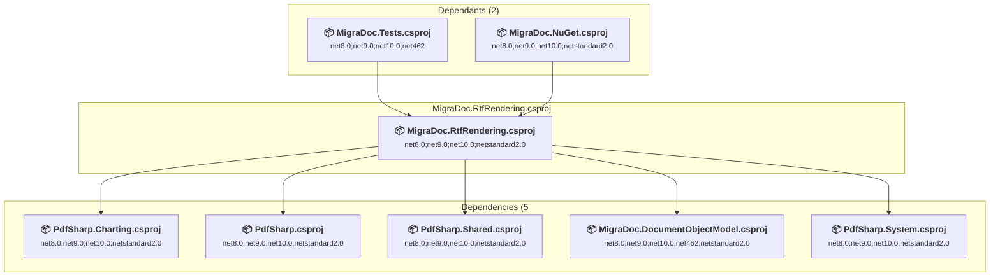

### API Compatibility

| Category | Count | Impact |
| :--- | :---: | :--- |
| 🔴 Binary Incompatible | 0 | High - Require code changes |
| 🟡 Source Incompatible | 0 | Medium - Needs re-compilation and potential conflicting API error fixing |
| 🔵 Behavioral change | 0 | Low - Behavioral changes that may require testing at runtime |
| ✅ Compatible | 0 |  |
| ***Total APIs Analyzed*** | ***0*** |  |

<a id="srcfoundationsrcmigradocsrcmigradocrtfrendering-gdimigradocrtfrendering-gdicsproj"></a>
### src\foundation\src\MigraDoc\src\MigraDoc.RtfRendering-gdi\MigraDoc.RtfRendering-gdi.csproj

#### Project Info

- **Current Target Framework:** net8.0-windows;net9.0-windows;net10.0-windows;net462
- **Proposed Target Framework:** net8.0-windows;net9.0-windows;net10.0-windows;net462;net10.0--windows;net10.0
- **SDK-style**: True
- **Project Kind:** ClassLibrary
- **Dependencies**: 6
- **Dependants**: 2
- **Number of Files**: 50
- **Number of Files with Incidents**: 1
- **Lines of Code**: 5855
- **Estimated LOC to modify**: 0+ (at least 0.0% of the project)

#### Dependency Graph

Legend:
📦 SDK-style project
⚙️ Classic project

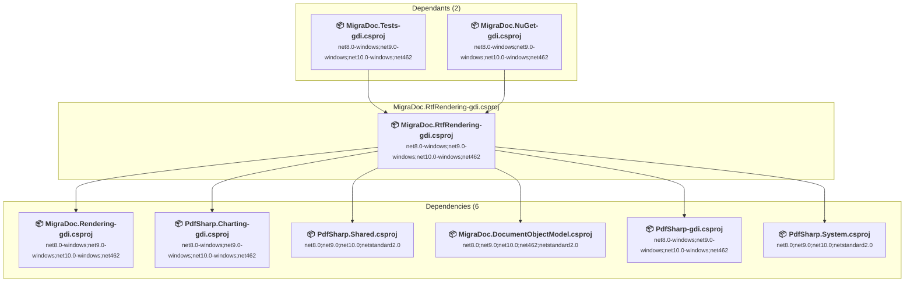

### API Compatibility

| Category | Count | Impact |
| :--- | :---: | :--- |
| 🔴 Binary Incompatible | 0 | High - Require code changes |
| 🟡 Source Incompatible | 0 | Medium - Needs re-compilation and potential conflicting API error fixing |
| 🔵 Behavioral change | 0 | Low - Behavioral changes that may require testing at runtime |
| ✅ Compatible | 0 |  |
| ***Total APIs Analyzed*** | ***0*** |  |

<a id="srcfoundationsrcmigradocsrcmigradocrtfrendering-wpfmigradocrtfrendering-wpfcsproj"></a>
### src\foundation\src\MigraDoc\src\MigraDoc.RtfRendering-wpf\MigraDoc.RtfRendering-wpf.csproj

#### Project Info

- **Current Target Framework:** net8.0-windows;net9.0-windows;net10.0-windows;net462
- **Proposed Target Framework:** net8.0-windows;net9.0-windows;net10.0-windows;net462;net10.0--windows;net10.0
- **SDK-style**: True
- **Project Kind:** ClassLibrary
- **Dependencies**: 6
- **Dependants**: 2
- **Number of Files**: 51
- **Number of Files with Incidents**: 1
- **Lines of Code**: 5855
- **Estimated LOC to modify**: 0+ (at least 0.0% of the project)

#### Dependency Graph

Legend:
📦 SDK-style project
⚙️ Classic project


### API Compatibility

| Category | Count | Impact |
| :--- | :---: | :--- |
| 🔴 Binary Incompatible | 0 | High - Require code changes |
| 🟡 Source Incompatible | 0 | Medium - Needs re-compilation and potential conflicting API error fixing |
| 🔵 Behavioral change | 0 | Low - Behavioral changes that may require testing at runtime |
| ✅ Compatible | 0 |  |
| ***Total APIs Analyzed*** | ***0*** |  |

<a id="srcfoundationsrcmigradoctestsmigradocdocumentobjectmodeltestsmigradocdocumentobjectmodeltestscsproj"></a>
### src\foundation\src\MigraDoc\tests\MigraDoc.DocumentObjectModel.Tests\MigraDoc.DocumentObjectModel.Tests.csproj

#### Project Info

- **Current Target Framework:** net8.0;net9.0;net10.0;net462
- **Proposed Target Framework:** net8.0;net9.0;net10.0;net462;net10.0
- **SDK-style**: True
- **Project Kind:** DotNetCoreApp
- **Dependencies**: 7
- **Dependants**: 0
- **Number of Files**: 22
- **Number of Files with Incidents**: 1
- **Lines of Code**: 4927
- **Estimated LOC to modify**: 0+ (at least 0.0% of the project)

#### Dependency Graph

Legend:
📦 SDK-style project
⚙️ Classic project

```mermaid
flowchart TB
    subgraph current["MigraDoc.DocumentObjectModel.Tests.csproj"]
        MAIN["<b>📦&nbsp;MigraDoc.DocumentObjectModel.Tests.csproj</b><br/><small>net8.0;net9.0;net10.0;net462</small>"]
        click MAIN "#srcfoundationsrcmigradoctestsmigradocdocumentobjectmodeltestsmigradocdocumentobjectmodeltestscsproj"
    end
    subgraph downstream["Dependencies (7"]
        P6["<b>📦&nbsp;PdfSharp.Charting.csproj</b><br/><small>net8.0;net9.0;net10.0;netstandard2.0</small>"]
        P5["<b>📦&nbsp;PdfSharp.csproj</b><br/><small>net8.0;net9.0;net10.0;netstandard2.0</small>"]
        P8["<b>📦&nbsp;MigraDoc.Rendering.csproj</b><br/><small>net8.0;net9.0;net10.0;netstandard2.0</small>"]
        P10["<b>📦&nbsp;PdfSharp.Snippets.csproj</b><br/><small>net8.0;net9.0;net10.0;netstandard2.0</small>"]
        P2["<b>📦&nbsp;PdfSharp.TestHelper.csproj</b><br/><small>net8.0;netstandard2.0</small>"]
        P7["<b>📦&nbsp;MigraDoc.DocumentObjectModel.csproj</b><br/><small>net8.0;net9.0;net10.0;net462;netstandard2.0</small>"]
        P63["<b>📦&nbsp;PdfSharp.Testing.csproj</b><br/><small>net8.0;net9.0;net10.0;netstandard2.0</small>"]
        click P6 "#srcfoundationsrcpdfsharpsrcpdfsharpchartingpdfsharpchartingcsproj"
        click P5 "#srcfoundationsrcpdfsharpsrcpdfsharppdfsharpcsproj"
        click P8 "#srcfoundationsrcmigradocsrcmigradocrenderingmigradocrenderingcsproj"
        click P10 "#srcfoundationsrcsharedsrcpdfsharpsnippetspdfsharpsnippetscsproj"
        click P2 "#srctoolssrcpdfsharptesthelperpdfsharptesthelpercsproj"
        click P7 "#srcfoundationsrcmigradocsrcmigradocdocumentobjectmodelmigradocdocumentobjectmodelcsproj"
        click P63 "#srcfoundationsrcsharedsrcpdfsharptestingpdfsharptestingcsproj"
    end
    MAIN --> P6
    MAIN --> P5
    MAIN --> P8
    MAIN --> P10
    MAIN --> P2
    MAIN --> P7
    MAIN --> P63

```

### API Compatibility

| Category | Count | Impact |
| :--- | :---: | :--- |
| 🔴 Binary Incompatible | 0 | High - Require code changes |
| 🟡 Source Incompatible | 0 | Medium - Needs re-compilation and potential conflicting API error fixing |
| 🔵 Behavioral change | 0 | Low - Behavioral changes that may require testing at runtime |
| ✅ Compatible | 0 |  |
| ***Total APIs Analyzed*** | ***0*** |  |

<a id="srcfoundationsrcmigradoctestsmigradocgbe-runnermigradocgbe-runnercsproj"></a>
### src\foundation\src\MigraDoc\tests\MigraDoc.GBE-Runner\MigraDoc.GBE-Runner.csproj

#### Project Info

- **Current Target Framework:** net8.0;net9.0;net10.0;net462
- **Proposed Target Framework:** net8.0;net9.0;net10.0;net462;net10.0
- **SDK-style**: True
- **Project Kind:** DotNetCoreApp
- **Dependencies**: 6
- **Dependants**: 0
- **Number of Files**: 45
- **Number of Files with Incidents**: 1
- **Lines of Code**: 2473
- **Estimated LOC to modify**: 0+ (at least 0.0% of the project)

#### Dependency Graph

Legend:
📦 SDK-style project
⚙️ Classic project

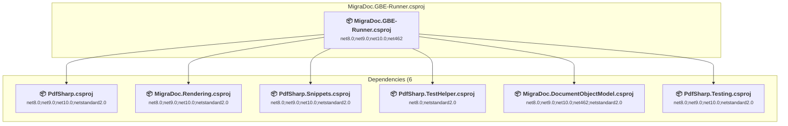

### API Compatibility

| Category | Count | Impact |
| :--- | :---: | :--- |
| 🔴 Binary Incompatible | 0 | High - Require code changes |
| 🟡 Source Incompatible | 0 | Medium - Needs re-compilation and potential conflicting API error fixing |
| 🔵 Behavioral change | 0 | Low - Behavioral changes that may require testing at runtime |
| ✅ Compatible | 0 |  |
| ***Total APIs Analyzed*** | ***0*** |  |

<a id="srcfoundationsrcmigradoctestsmigradocgrammarbyexamplemigradocgrammarbyexamplecsproj"></a>
### src\foundation\src\MigraDoc\tests\MigraDoc.GrammarByExample\MigraDoc.GrammarByExample.csproj

#### Project Info

- **Current Target Framework:** net8.0;net9.0;net10.0;net462
- **Proposed Target Framework:** net8.0;net9.0;net10.0;net462;net10.0
- **SDK-style**: True
- **Project Kind:** DotNetCoreApp
- **Dependencies**: 5
- **Dependants**: 0
- **Number of Files**: 44
- **Number of Files with Incidents**: 1
- **Lines of Code**: 2323
- **Estimated LOC to modify**: 0+ (at least 0.0% of the project)

#### Dependency Graph

Legend:
📦 SDK-style project
⚙️ Classic project

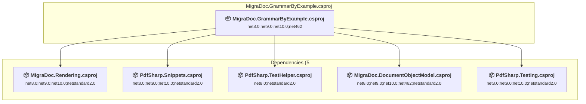

### API Compatibility

| Category | Count | Impact |
| :--- | :---: | :--- |
| 🔴 Binary Incompatible | 0 | High - Require code changes |
| 🟡 Source Incompatible | 0 | Medium - Needs re-compilation and potential conflicting API error fixing |
| 🔵 Behavioral change | 0 | Low - Behavioral changes that may require testing at runtime |
| ✅ Compatible | 0 |  |
| ***Total APIs Analyzed*** | ***0*** |  |

<a id="srcfoundationsrcmigradoctestsmigradocgrammarbyexample-gdimigradocgrammarbyexample-gdicsproj"></a>
### src\foundation\src\MigraDoc\tests\MigraDoc.GrammarByExample-GDI\MigraDoc.GrammarByExample-GDI.csproj

#### Project Info

- **Current Target Framework:** net8.0-windows;net9.0-windows;net10.0-windows;net462
- **Proposed Target Framework:** net8.0-windows;net9.0-windows;net10.0-windows;net462;net10.0--windows;net10.0
- **SDK-style**: True
- **Project Kind:** DotNetCoreApp
- **Dependencies**: 4
- **Dependants**: 0
- **Number of Files**: 44
- **Number of Files with Incidents**: 1
- **Lines of Code**: 2323
- **Estimated LOC to modify**: 0+ (at least 0.0% of the project)

#### Dependency Graph

Legend:
📦 SDK-style project
⚙️ Classic project

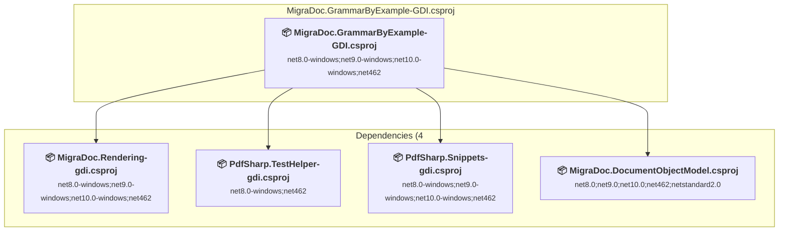

### API Compatibility

| Category | Count | Impact |
| :--- | :---: | :--- |
| 🔴 Binary Incompatible | 0 | High - Require code changes |
| 🟡 Source Incompatible | 0 | Medium - Needs re-compilation and potential conflicting API error fixing |
| 🔵 Behavioral change | 0 | Low - Behavioral changes that may require testing at runtime |
| ✅ Compatible | 0 |  |
| ***Total APIs Analyzed*** | ***0*** |  |

<a id="srcfoundationsrcmigradoctestsmigradocgrammarbyexample-wpfmigradocgrammarbyexample-wpfcsproj"></a>
### src\foundation\src\MigraDoc\tests\MigraDoc.GrammarByExample-WPF\MigraDoc.GrammarByExample-WPF.csproj

#### Project Info

- **Current Target Framework:** net8.0-windows;net9.0-windows;net10.0-windows;net462
- **Proposed Target Framework:** net8.0-windows;net9.0-windows;net10.0-windows;net462;net10.0-windows
- **SDK-style**: True
- **Project Kind:** Wpf
- **Dependencies**: 4
- **Dependants**: 0
- **Number of Files**: 44
- **Number of Files with Incidents**: 1
- **Lines of Code**: 2323
- **Estimated LOC to modify**: 0+ (at least 0.0% of the project)

#### Dependency Graph

Legend:
📦 SDK-style project
⚙️ Classic project

```mermaid
flowchart TB
    subgraph current["MigraDoc.GrammarByExample-WPF.csproj"]
        MAIN["<b>📦&nbsp;MigraDoc.GrammarByExample-WPF.csproj</b><br/><small>net8.0-windows;net9.0-windows;net10.0-windows;net462</small>"]
        click MAIN "#srcfoundationsrcmigradoctestsmigradocgrammarbyexample-wpfmigradocgrammarbyexample-wpfcsproj"
    end
    subgraph downstream["Dependencies (4"]
        P16["<b>📦&nbsp;MigraDoc.Rendering-wpf.csproj</b><br/><small>net8.0-windows;net9.0-windows;net10.0-windows;net462</small>"]
        P59["<b>📦&nbsp;PdfSharp.TestHelper-wpf.csproj</b><br/><small>net8.0-windows;net462</small>"]
        P7["<b>📦&nbsp;MigraDoc.DocumentObjectModel.csproj</b><br/><small>net8.0;net9.0;net10.0;net462;netstandard2.0</small>"]
        P19["<b>📦&nbsp;PdfSharp.Snippets-wpf.csproj</b><br/><small>net8.0-windows;net9.0-windows;net10.0-windows;net462</small>"]
        click P16 "#srcfoundationsrcmigradocsrcmigradocrendering-wpfmigradocrendering-wpfcsproj"
        click P59 "#srctoolssrcpdfsharptesthelper-wpfpdfsharptesthelper-wpfcsproj"
        click P7 "#srcfoundationsrcmigradocsrcmigradocdocumentobjectmodelmigradocdocumentobjectmodelcsproj"
        click P19 "#srcfoundationsrcsharedsrcpdfsharpsnippets-wpfpdfsharpsnippets-wpfcsproj"
    end
    MAIN --> P16
    MAIN --> P59
    MAIN --> P7
    MAIN --> P19

```

### API Compatibility

| Category | Count | Impact |
| :--- | :---: | :--- |
| 🔴 Binary Incompatible | 0 | High - Require code changes |
| 🟡 Source Incompatible | 0 | Medium - Needs re-compilation and potential conflicting API error fixing |
| 🔵 Behavioral change | 0 | Low - Behavioral changes that may require testing at runtime |
| ✅ Compatible | 0 |  |
| ***Total APIs Analyzed*** | ***0*** |  |

<a id="srcfoundationsrcmigradoctestsmigradoctestsmigradoctestscsproj"></a>
### src\foundation\src\MigraDoc\tests\MigraDoc.Tests\MigraDoc.Tests.csproj

#### Project Info

- **Current Target Framework:** net8.0;net9.0;net10.0;net462
- **Proposed Target Framework:** net8.0;net9.0;net10.0;net462;net10.0
- **SDK-style**: True
- **Project Kind:** DotNetCoreApp
- **Dependencies**: 11
- **Dependants**: 0
- **Number of Files**: 22
- **Number of Files with Incidents**: 1
- **Lines of Code**: 4985
- **Estimated LOC to modify**: 0+ (at least 0.0% of the project)

#### Dependency Graph

Legend:
📦 SDK-style project
⚙️ Classic project

```mermaid
flowchart TB
    subgraph current["MigraDoc.Tests.csproj"]
        MAIN["<b>📦&nbsp;MigraDoc.Tests.csproj</b><br/><small>net8.0;net9.0;net10.0;net462</small>"]
        click MAIN "#srcfoundationsrcmigradoctestsmigradoctestsmigradoctestscsproj"
    end
    subgraph downstream["Dependencies (11"]
        P6["<b>📦&nbsp;PdfSharp.Charting.csproj</b><br/><small>net8.0;net9.0;net10.0;netstandard2.0</small>"]
        P5["<b>📦&nbsp;PdfSharp.csproj</b><br/><small>net8.0;net9.0;net10.0;netstandard2.0</small>"]
        P8["<b>📦&nbsp;MigraDoc.Rendering.csproj</b><br/><small>net8.0;net9.0;net10.0;netstandard2.0</small>"]
        P10["<b>📦&nbsp;PdfSharp.Snippets.csproj</b><br/><small>net8.0;net9.0;net10.0;netstandard2.0</small>"]
        P40["<b>📦&nbsp;MigraDoc.RtfRendering.csproj</b><br/><small>net8.0;net9.0;net10.0;netstandard2.0</small>"]
        P67["<b>📦&nbsp;PdfSharp.Shared.csproj</b><br/><small>net8.0;net9.0;net10.0;netstandard2.0</small>"]
        P2["<b>📦&nbsp;PdfSharp.TestHelper.csproj</b><br/><small>net8.0;netstandard2.0</small>"]
        P7["<b>📦&nbsp;MigraDoc.DocumentObjectModel.csproj</b><br/><small>net8.0;net9.0;net10.0;net462;netstandard2.0</small>"]
        P72["<b>📦&nbsp;PdfSharp.Cryptography.csproj</b><br/><small>net8.0;net9.0;net10.0;netstandard2.0</small>"]
        P63["<b>📦&nbsp;PdfSharp.Testing.csproj</b><br/><small>net8.0;net9.0;net10.0;netstandard2.0</small>"]
        P33["<b>📦&nbsp;PdfSharp.System.csproj</b><br/><small>net8.0;net9.0;net10.0;netstandard2.0</small>"]
        click P6 "#srcfoundationsrcpdfsharpsrcpdfsharpchartingpdfsharpchartingcsproj"
        click P5 "#srcfoundationsrcpdfsharpsrcpdfsharppdfsharpcsproj"
        click P8 "#srcfoundationsrcmigradocsrcmigradocrenderingmigradocrenderingcsproj"
        click P10 "#srcfoundationsrcsharedsrcpdfsharpsnippetspdfsharpsnippetscsproj"
        click P40 "#srcfoundationsrcmigradocsrcmigradocrtfrenderingmigradocrtfrenderingcsproj"
        click P67 "#srcfoundationsrcsharedsrcpdfsharpsharedpdfsharpsharedcsproj"
        click P2 "#srctoolssrcpdfsharptesthelperpdfsharptesthelpercsproj"
        click P7 "#srcfoundationsrcmigradocsrcmigradocdocumentobjectmodelmigradocdocumentobjectmodelcsproj"
        click P72 "#srcfoundationsrcpdfsharpsrcpdfsharpcryptographypdfsharpcryptographycsproj"
        click P63 "#srcfoundationsrcsharedsrcpdfsharptestingpdfsharptestingcsproj"
        click P33 "#srcfoundationsrcsharedsrcpdfsharpsystempdfsharpsystemcsproj"
    end
    MAIN --> P6
    MAIN --> P5
    MAIN --> P8
    MAIN --> P10
    MAIN --> P40
    MAIN --> P67
    MAIN --> P2
    MAIN --> P7
    MAIN --> P72
    MAIN --> P63
    MAIN --> P33

```

### API Compatibility

| Category | Count | Impact |
| :--- | :---: | :--- |
| 🔴 Binary Incompatible | 0 | High - Require code changes |
| 🟡 Source Incompatible | 0 | Medium - Needs re-compilation and potential conflicting API error fixing |
| 🔵 Behavioral change | 0 | Low - Behavioral changes that may require testing at runtime |
| ✅ Compatible | 0 |  |
| ***Total APIs Analyzed*** | ***0*** |  |

<a id="srcfoundationsrcmigradoctestsmigradoctests-gdimigradoctests-gdicsproj"></a>
### src\foundation\src\MigraDoc\tests\MigraDoc.Tests-gdi\MigraDoc.Tests-gdi.csproj

#### Project Info

- **Current Target Framework:** net8.0-windows;net9.0-windows;net10.0-windows;net462
- **Proposed Target Framework:** net8.0-windows;net9.0-windows;net10.0-windows;net462;net10.0--windows;net10.0
- **SDK-style**: True
- **Project Kind:** DotNetCoreApp
- **Dependencies**: 11
- **Dependants**: 0
- **Number of Files**: 18
- **Number of Files with Incidents**: 1
- **Lines of Code**: 4144
- **Estimated LOC to modify**: 0+ (at least 0.0% of the project)

#### Dependency Graph

Legend:
📦 SDK-style project
⚙️ Classic project

```mermaid
flowchart TB
    subgraph current["MigraDoc.Tests-gdi.csproj"]
        MAIN["<b>📦&nbsp;MigraDoc.Tests-gdi.csproj</b><br/><small>net8.0-windows;net9.0-windows;net10.0-windows;net462</small>"]
        click MAIN "#srcfoundationsrcmigradoctestsmigradoctests-gdimigradoctests-gdicsproj"
    end
    subgraph downstream["Dependencies (11"]
        P30["<b>📦&nbsp;MigraDoc.Rendering-gdi.csproj</b><br/><small>net8.0-windows;net9.0-windows;net10.0-windows;net462</small>"]
        P58["<b>📦&nbsp;PdfSharp.TestHelper-gdi.csproj</b><br/><small>net8.0-windows;net462</small>"]
        P42["<b>📦&nbsp;MigraDoc.RtfRendering-gdi.csproj</b><br/><small>net8.0-windows;net9.0-windows;net10.0-windows;net462</small>"]
        P24["<b>📦&nbsp;PdfSharp.Charting-gdi.csproj</b><br/><small>net8.0-windows;net9.0-windows;net10.0-windows;net462</small>"]
        P20["<b>📦&nbsp;PdfSharp.Snippets-gdi.csproj</b><br/><small>net8.0-windows;net9.0-windows;net10.0-windows;net462</small>"]
        P64["<b>📦&nbsp;PdfSharp.Testing-gdi.csproj</b><br/><small>net8.0-windows;net9.0-windows;net10.0-windows;net462</small>"]
        P67["<b>📦&nbsp;PdfSharp.Shared.csproj</b><br/><small>net8.0;net9.0;net10.0;netstandard2.0</small>"]
        P7["<b>📦&nbsp;MigraDoc.DocumentObjectModel.csproj</b><br/><small>net8.0;net9.0;net10.0;net462;netstandard2.0</small>"]
        P72["<b>📦&nbsp;PdfSharp.Cryptography.csproj</b><br/><small>net8.0;net9.0;net10.0;netstandard2.0</small>"]
        P15["<b>📦&nbsp;PdfSharp-gdi.csproj</b><br/><small>net8.0-windows;net9.0-windows;net10.0-windows;net462</small>"]
        P33["<b>📦&nbsp;PdfSharp.System.csproj</b><br/><small>net8.0;net9.0;net10.0;netstandard2.0</small>"]
        click P30 "#srcfoundationsrcmigradocsrcmigradocrendering-gdimigradocrendering-gdicsproj"
        click P58 "#srctoolssrcpdfsharptesthelper-gdipdfsharptesthelper-gdicsproj"
        click P42 "#srcfoundationsrcmigradocsrcmigradocrtfrendering-gdimigradocrtfrendering-gdicsproj"
        click P24 "#srcfoundationsrcpdfsharpsrcpdfsharpcharting-gdipdfsharpcharting-gdicsproj"
        click P20 "#srcfoundationsrcsharedsrcpdfsharpsnippets-gdipdfsharpsnippets-gdicsproj"
        click P64 "#srcfoundationsrcsharedsrcpdfsharptesting-gdipdfsharptesting-gdicsproj"
        click P67 "#srcfoundationsrcsharedsrcpdfsharpsharedpdfsharpsharedcsproj"
        click P7 "#srcfoundationsrcmigradocsrcmigradocdocumentobjectmodelmigradocdocumentobjectmodelcsproj"
        click P72 "#srcfoundationsrcpdfsharpsrcpdfsharpcryptographypdfsharpcryptographycsproj"
        click P15 "#srcfoundationsrcpdfsharpsrcpdfsharp-gdipdfsharp-gdicsproj"
        click P33 "#srcfoundationsrcsharedsrcpdfsharpsystempdfsharpsystemcsproj"
    end
    MAIN --> P30
    MAIN --> P58
    MAIN --> P42
    MAIN --> P24
    MAIN --> P20
    MAIN --> P64
    MAIN --> P67
    MAIN --> P7
    MAIN --> P72
    MAIN --> P15
    MAIN --> P33

```

### API Compatibility

| Category | Count | Impact |
| :--- | :---: | :--- |
| 🔴 Binary Incompatible | 0 | High - Require code changes |
| 🟡 Source Incompatible | 0 | Medium - Needs re-compilation and potential conflicting API error fixing |
| 🔵 Behavioral change | 0 | Low - Behavioral changes that may require testing at runtime |
| ✅ Compatible | 0 |  |
| ***Total APIs Analyzed*** | ***0*** |  |

<a id="srcfoundationsrcmigradoctestsmigradoctests-wpfmigradoctests-wpfcsproj"></a>
### src\foundation\src\MigraDoc\tests\MigraDoc.Tests-wpf\MigraDoc.Tests-wpf.csproj

#### Project Info

- **Current Target Framework:** net8.0-windows;net9.0-windows;net10.0-windows;net462
- **Proposed Target Framework:** net8.0-windows;net9.0-windows;net10.0-windows;net462;net10.0-windows
- **SDK-style**: True
- **Project Kind:** Wpf
- **Dependencies**: 11
- **Dependants**: 0
- **Number of Files**: 18
- **Number of Files with Incidents**: 1
- **Lines of Code**: 4144
- **Estimated LOC to modify**: 0+ (at least 0.0% of the project)

#### Dependency Graph

Legend:
📦 SDK-style project
⚙️ Classic project

```mermaid
flowchart TB
    subgraph current["MigraDoc.Tests-wpf.csproj"]
        MAIN["<b>📦&nbsp;MigraDoc.Tests-wpf.csproj</b><br/><small>net8.0-windows;net9.0-windows;net10.0-windows;net462</small>"]
        click MAIN "#srcfoundationsrcmigradoctestsmigradoctests-wpfmigradoctests-wpfcsproj"
    end
    subgraph downstream["Dependencies (11"]
        P16["<b>📦&nbsp;MigraDoc.Rendering-wpf.csproj</b><br/><small>net8.0-windows;net9.0-windows;net10.0-windows;net462</small>"]
        P23["<b>📦&nbsp;PdfSharp.Charting-wpf.csproj</b><br/><small>net8.0-windows;net9.0-windows;net10.0-windows;net462</small>"]
        P59["<b>📦&nbsp;PdfSharp.TestHelper-wpf.csproj</b><br/><small>net8.0-windows;net462</small>"]
        P41["<b>📦&nbsp;MigraDoc.RtfRendering-wpf.csproj</b><br/><small>net8.0-windows;net9.0-windows;net10.0-windows;net462</small>"]
        P67["<b>📦&nbsp;PdfSharp.Shared.csproj</b><br/><small>net8.0;net9.0;net10.0;netstandard2.0</small>"]
        P65["<b>📦&nbsp;PdfSharp.Testing-wpf.csproj</b><br/><small>net8.0-windows;net9.0-windows;net10.0-windows;net462</small>"]
        P7["<b>📦&nbsp;MigraDoc.DocumentObjectModel.csproj</b><br/><small>net8.0;net9.0;net10.0;net462;netstandard2.0</small>"]
        P72["<b>📦&nbsp;PdfSharp.Cryptography.csproj</b><br/><small>net8.0;net9.0;net10.0;netstandard2.0</small>"]
        P14["<b>📦&nbsp;PdfSharp-wpf.csproj</b><br/><small>net8.0-windows;net9.0-windows;net10.0-windows;net462</small>"]
        P33["<b>📦&nbsp;PdfSharp.System.csproj</b><br/><small>net8.0;net9.0;net10.0;netstandard2.0</small>"]
        P19["<b>📦&nbsp;PdfSharp.Snippets-wpf.csproj</b><br/><small>net8.0-windows;net9.0-windows;net10.0-windows;net462</small>"]
        click P16 "#srcfoundationsrcmigradocsrcmigradocrendering-wpfmigradocrendering-wpfcsproj"
        click P23 "#srcfoundationsrcpdfsharpsrcpdfsharpcharting-wpfpdfsharpcharting-wpfcsproj"
        click P59 "#srctoolssrcpdfsharptesthelper-wpfpdfsharptesthelper-wpfcsproj"
        click P41 "#srcfoundationsrcmigradocsrcmigradocrtfrendering-wpfmigradocrtfrendering-wpfcsproj"
        click P67 "#srcfoundationsrcsharedsrcpdfsharpsharedpdfsharpsharedcsproj"
        click P65 "#srcfoundationsrcsharedsrcpdfsharptesting-wpfpdfsharptesting-wpfcsproj"
        click P7 "#srcfoundationsrcmigradocsrcmigradocdocumentobjectmodelmigradocdocumentobjectmodelcsproj"
        click P72 "#srcfoundationsrcpdfsharpsrcpdfsharpcryptographypdfsharpcryptographycsproj"
        click P14 "#srcfoundationsrcpdfsharpsrcpdfsharp-wpfpdfsharp-wpfcsproj"
        click P33 "#srcfoundationsrcsharedsrcpdfsharpsystempdfsharpsystemcsproj"
        click P19 "#srcfoundationsrcsharedsrcpdfsharpsnippets-wpfpdfsharpsnippets-wpfcsproj"
    end
    MAIN --> P16
    MAIN --> P23
    MAIN --> P59
    MAIN --> P41
    MAIN --> P67
    MAIN --> P65
    MAIN --> P7
    MAIN --> P72
    MAIN --> P14
    MAIN --> P33
    MAIN --> P19

```

### API Compatibility

| Category | Count | Impact |
| :--- | :---: | :--- |
| 🔴 Binary Incompatible | 0 | High - Require code changes |
| 🟡 Source Incompatible | 0 | Medium - Needs re-compilation and potential conflicting API error fixing |
| 🔵 Behavioral change | 0 | Low - Behavioral changes that may require testing at runtime |
| ✅ Compatible | 0 |  |
| ***Total APIs Analyzed*** | ***0*** |  |

<a id="srcfoundationsrcpdfsharpfeaturespdfsharpfeaturesrunnerpdfsharpfeaturesrunnercsproj"></a>
### src\foundation\src\PDFsharp\features\PdfSharp.Features.Runner\PdfSharp.Features.Runner.csproj

#### Project Info

- **Current Target Framework:** net8.0;net462
- **Proposed Target Framework:** net8.0;net462;net10.0
- **SDK-style**: True
- **Project Kind:** DotNetCoreApp
- **Dependencies**: 1
- **Dependants**: 0
- **Number of Files**: 1
- **Number of Files with Incidents**: 1
- **Lines of Code**: 107
- **Estimated LOC to modify**: 0+ (at least 0.0% of the project)

#### Dependency Graph

Legend:
📦 SDK-style project
⚙️ Classic project

```mermaid
flowchart TB
    subgraph current["PdfSharp.Features.Runner.csproj"]
        MAIN["<b>📦&nbsp;PdfSharp.Features.Runner.csproj</b><br/><small>net8.0;net462</small>"]
        click MAIN "#srcfoundationsrcpdfsharpfeaturespdfsharpfeaturesrunnerpdfsharpfeaturesrunnercsproj"
    end
    subgraph downstream["Dependencies (1"]
        P13["<b>📦&nbsp;PdfSharp.Features.csproj</b><br/><small>net8.0;netstandard2.0</small>"]
        click P13 "#srcfoundationsrcpdfsharpfeaturespdfsharpfeaturespdfsharpfeaturescsproj"
    end
    MAIN --> P13

```

### API Compatibility

| Category | Count | Impact |
| :--- | :---: | :--- |
| 🔴 Binary Incompatible | 0 | High - Require code changes |
| 🟡 Source Incompatible | 0 | Medium - Needs re-compilation and potential conflicting API error fixing |
| 🔵 Behavioral change | 0 | Low - Behavioral changes that may require testing at runtime |
| ✅ Compatible | 0 |  |
| ***Total APIs Analyzed*** | ***0*** |  |

<a id="srcfoundationsrcpdfsharpfeaturespdfsharpfeaturesrunner-gdipdfsharpfeaturesrunner-gdicsproj"></a>
### src\foundation\src\PDFsharp\features\PDFsharp.Features.Runner-gdi\PDFsharp.Features.Runner-gdi.csproj

#### Project Info

- **Current Target Framework:** net8.0-windows;net462
- **Proposed Target Framework:** net8.0-windows;net462;net10.0--windows;net10.0
- **SDK-style**: True
- **Project Kind:** DotNetCoreApp
- **Dependencies**: 1
- **Dependants**: 0
- **Number of Files**: 1
- **Number of Files with Incidents**: 1
- **Lines of Code**: 107
- **Estimated LOC to modify**: 0+ (at least 0.0% of the project)

#### Dependency Graph

Legend:
📦 SDK-style project
⚙️ Classic project

```mermaid
flowchart TB
    subgraph current["PDFsharp.Features.Runner-gdi.csproj"]
        MAIN["<b>📦&nbsp;PDFsharp.Features.Runner-gdi.csproj</b><br/><small>net8.0-windows;net462</small>"]
        click MAIN "#srcfoundationsrcpdfsharpfeaturespdfsharpfeaturesrunner-gdipdfsharpfeaturesrunner-gdicsproj"
    end
    subgraph downstream["Dependencies (1"]
        P22["<b>📦&nbsp;PDFsharp.Features-gdi.csproj</b><br/><small>net8.0-windows;net462</small>"]
        click P22 "#srcfoundationsrcpdfsharpfeaturespdfsharpfeatures-gdipdfsharpfeatures-gdicsproj"
    end
    MAIN --> P22

```

### API Compatibility

| Category | Count | Impact |
| :--- | :---: | :--- |
| 🔴 Binary Incompatible | 0 | High - Require code changes |
| 🟡 Source Incompatible | 0 | Medium - Needs re-compilation and potential conflicting API error fixing |
| 🔵 Behavioral change | 0 | Low - Behavioral changes that may require testing at runtime |
| ✅ Compatible | 0 |  |
| ***Total APIs Analyzed*** | ***0*** |  |

<a id="srcfoundationsrcpdfsharpfeaturespdfsharpfeaturesrunner-wpfpdfsharpfeaturesrunner-wpfcsproj"></a>
### src\foundation\src\PDFsharp\features\PDFsharp.Features.Runner-wpf\PDFsharp.Features.Runner-wpf.csproj

#### Project Info

- **Current Target Framework:** net8.0-windows;net462
- **Proposed Target Framework:** net8.0-windows;net462;net10.0-windows
- **SDK-style**: True
- **Project Kind:** Wpf
- **Dependencies**: 1
- **Dependants**: 0
- **Number of Files**: 1
- **Number of Files with Incidents**: 1
- **Lines of Code**: 107
- **Estimated LOC to modify**: 0+ (at least 0.0% of the project)

#### Dependency Graph

Legend:
📦 SDK-style project
⚙️ Classic project

```mermaid
flowchart TB
    subgraph current["PDFsharp.Features.Runner-wpf.csproj"]
        MAIN["<b>📦&nbsp;PDFsharp.Features.Runner-wpf.csproj</b><br/><small>net8.0-windows;net462</small>"]
        click MAIN "#srcfoundationsrcpdfsharpfeaturespdfsharpfeaturesrunner-wpfpdfsharpfeaturesrunner-wpfcsproj"
    end
    subgraph downstream["Dependencies (1"]
        P21["<b>📦&nbsp;PDFsharp.Features-wpf.csproj</b><br/><small>net8.0-windows;net462</small>"]
        click P21 "#srcfoundationsrcpdfsharpfeaturespdfsharpfeatures-wpfpdfsharpfeatures-wpfcsproj"
    end
    MAIN --> P21

```

### API Compatibility

| Category | Count | Impact |
| :--- | :---: | :--- |
| 🔴 Binary Incompatible | 0 | High - Require code changes |
| 🟡 Source Incompatible | 0 | Medium - Needs re-compilation and potential conflicting API error fixing |
| 🔵 Behavioral change | 0 | Low - Behavioral changes that may require testing at runtime |
| ✅ Compatible | 0 |  |
| ***Total APIs Analyzed*** | ***0*** |  |

<a id="srcfoundationsrcpdfsharpfeaturespdfsharpfeaturespdfsharpfeaturescsproj"></a>
### src\foundation\src\PDFsharp\features\PdfSharp.Features\PdfSharp.Features.csproj

#### Project Info

- **Current Target Framework:** net8.0;netstandard2.0
- **Proposed Target Framework:** net8.0;netstandard2.0;net10.0
- **SDK-style**: True
- **Project Kind:** ClassLibrary
- **Dependencies**: 5
- **Dependants**: 1
- **Number of Files**: 23
- **Number of Files with Incidents**: 1
- **Lines of Code**: 1765
- **Estimated LOC to modify**: 0+ (at least 0.0% of the project)

#### Dependency Graph

Legend:
📦 SDK-style project
⚙️ Classic project

```mermaid
flowchart TB
    subgraph upstream["Dependants (1)"]
        P52["<b>📦&nbsp;PdfSharp.Features.Runner.csproj</b><br/><small>net8.0;net462</small>"]
        click P52 "#srcfoundationsrcpdfsharpfeaturespdfsharpfeaturesrunnerpdfsharpfeaturesrunnercsproj"
    end
    subgraph current["PdfSharp.Features.csproj"]
        MAIN["<b>📦&nbsp;PdfSharp.Features.csproj</b><br/><small>net8.0;netstandard2.0</small>"]
        click MAIN "#srcfoundationsrcpdfsharpfeaturespdfsharpfeaturespdfsharpfeaturescsproj"
    end
    subgraph downstream["Dependencies (5"]
        P10["<b>📦&nbsp;PdfSharp.Snippets.csproj</b><br/><small>net8.0;net9.0;net10.0;netstandard2.0</small>"]
        P5["<b>📦&nbsp;PdfSharp.csproj</b><br/><small>net8.0;net9.0;net10.0;netstandard2.0</small>"]
        P6["<b>📦&nbsp;PdfSharp.Charting.csproj</b><br/><small>net8.0;net9.0;net10.0;netstandard2.0</small>"]
        P2["<b>📦&nbsp;PdfSharp.TestHelper.csproj</b><br/><small>net8.0;netstandard2.0</small>"]
        P9["<b>📦&nbsp;PdfSharp.Quality.csproj</b><br/><small>net8.0;net9.0;net10.0;netstandard2.0</small>"]
        click P10 "#srcfoundationsrcsharedsrcpdfsharpsnippetspdfsharpsnippetscsproj"
        click P5 "#srcfoundationsrcpdfsharpsrcpdfsharppdfsharpcsproj"
        click P6 "#srcfoundationsrcpdfsharpsrcpdfsharpchartingpdfsharpchartingcsproj"
        click P2 "#srctoolssrcpdfsharptesthelperpdfsharptesthelpercsproj"
        click P9 "#srcfoundationsrcsharedsrcpdfsharpqualitypdfsharpqualitycsproj"
    end
    P52 --> MAIN
    MAIN --> P10
    MAIN --> P5
    MAIN --> P6
    MAIN --> P2
    MAIN --> P9

```

### API Compatibility

| Category | Count | Impact |
| :--- | :---: | :--- |
| 🔴 Binary Incompatible | 0 | High - Require code changes |
| 🟡 Source Incompatible | 0 | Medium - Needs re-compilation and potential conflicting API error fixing |
| 🔵 Behavioral change | 0 | Low - Behavioral changes that may require testing at runtime |
| ✅ Compatible | 0 |  |
| ***Total APIs Analyzed*** | ***0*** |  |

<a id="srcfoundationsrcpdfsharpfeaturespdfsharpfeatures-gdipdfsharpfeatures-gdicsproj"></a>
### src\foundation\src\PDFsharp\features\PDFsharp.Features-gdi\PDFsharp.Features-gdi.csproj

#### Project Info

- **Current Target Framework:** net8.0-windows;net462
- **Proposed Target Framework:** net8.0-windows;net462;net10.0--windows;net10.0
- **SDK-style**: True
- **Project Kind:** ClassLibrary
- **Dependencies**: 5
- **Dependants**: 1
- **Number of Files**: 22
- **Number of Files with Incidents**: 1
- **Lines of Code**: 1742
- **Estimated LOC to modify**: 0+ (at least 0.0% of the project)

#### Dependency Graph

Legend:
📦 SDK-style project
⚙️ Classic project

```mermaid
flowchart TB
    subgraph upstream["Dependants (1)"]
        P53["<b>📦&nbsp;PDFsharp.Features.Runner-gdi.csproj</b><br/><small>net8.0-windows;net462</small>"]
        click P53 "#srcfoundationsrcpdfsharpfeaturespdfsharpfeaturesrunner-gdipdfsharpfeaturesrunner-gdicsproj"
    end
    subgraph current["PDFsharp.Features-gdi.csproj"]
        MAIN["<b>📦&nbsp;PDFsharp.Features-gdi.csproj</b><br/><small>net8.0-windows;net462</small>"]
        click MAIN "#srcfoundationsrcpdfsharpfeaturespdfsharpfeatures-gdipdfsharpfeatures-gdicsproj"
    end
    subgraph downstream["Dependencies (5"]
        P58["<b>📦&nbsp;PdfSharp.TestHelper-gdi.csproj</b><br/><small>net8.0-windows;net462</small>"]
        P18["<b>📦&nbsp;PdfSharp.Quality-gdi.csproj</b><br/><small>net8.0-windows;net9.0-windows;net10.0-windows;net462</small>"]
        P11["<b>📦&nbsp;PdfSharp.WPFonts.csproj</b><br/><small>net8.0;net9.0;net10.0;netstandard2.0</small>"]
        P20["<b>📦&nbsp;PdfSharp.Snippets-gdi.csproj</b><br/><small>net8.0-windows;net9.0-windows;net10.0-windows;net462</small>"]
        P15["<b>📦&nbsp;PdfSharp-gdi.csproj</b><br/><small>net8.0-windows;net9.0-windows;net10.0-windows;net462</small>"]
        click P58 "#srctoolssrcpdfsharptesthelper-gdipdfsharptesthelper-gdicsproj"
        click P18 "#srcfoundationsrcsharedsrcpdfsharpquality-gdipdfsharpquality-gdicsproj"
        click P11 "#srcfoundationsrcsharedsrcpdfsharpwpfontspdfsharpwpfontscsproj"
        click P20 "#srcfoundationsrcsharedsrcpdfsharpsnippets-gdipdfsharpsnippets-gdicsproj"
        click P15 "#srcfoundationsrcpdfsharpsrcpdfsharp-gdipdfsharp-gdicsproj"
    end
    P53 --> MAIN
    MAIN --> P58
    MAIN --> P18
    MAIN --> P11
    MAIN --> P20
    MAIN --> P15

```

### API Compatibility

| Category | Count | Impact |
| :--- | :---: | :--- |
| 🔴 Binary Incompatible | 0 | High - Require code changes |
| 🟡 Source Incompatible | 0 | Medium - Needs re-compilation and potential conflicting API error fixing |
| 🔵 Behavioral change | 0 | Low - Behavioral changes that may require testing at runtime |
| ✅ Compatible | 0 |  |
| ***Total APIs Analyzed*** | ***0*** |  |

<a id="srcfoundationsrcpdfsharpfeaturespdfsharpfeatures-wpfpdfsharpfeatures-wpfcsproj"></a>
### src\foundation\src\PDFsharp\features\PDFsharp.Features-wpf\PDFsharp.Features-wpf.csproj

#### Project Info

- **Current Target Framework:** net8.0-windows;net462
- **Proposed Target Framework:** net8.0-windows;net462;net10.0-windows
- **SDK-style**: True
- **Project Kind:** Wpf
- **Dependencies**: 5
- **Dependants**: 1
- **Number of Files**: 22
- **Number of Files with Incidents**: 1
- **Lines of Code**: 1742
- **Estimated LOC to modify**: 0+ (at least 0.0% of the project)

#### Dependency Graph

Legend:
📦 SDK-style project
⚙️ Classic project

```mermaid
flowchart TB
    subgraph upstream["Dependants (1)"]
        P54["<b>📦&nbsp;PDFsharp.Features.Runner-wpf.csproj</b><br/><small>net8.0-windows;net462</small>"]
        click P54 "#srcfoundationsrcpdfsharpfeaturespdfsharpfeaturesrunner-wpfpdfsharpfeaturesrunner-wpfcsproj"
    end
    subgraph current["PDFsharp.Features-wpf.csproj"]
        MAIN["<b>📦&nbsp;PDFsharp.Features-wpf.csproj</b><br/><small>net8.0-windows;net462</small>"]
        click MAIN "#srcfoundationsrcpdfsharpfeaturespdfsharpfeatures-wpfpdfsharpfeatures-wpfcsproj"
    end
    subgraph downstream["Dependencies (5"]
        P59["<b>📦&nbsp;PdfSharp.TestHelper-wpf.csproj</b><br/><small>net8.0-windows;net462</small>"]
        P11["<b>📦&nbsp;PdfSharp.WPFonts.csproj</b><br/><small>net8.0;net9.0;net10.0;netstandard2.0</small>"]
        P14["<b>📦&nbsp;PdfSharp-wpf.csproj</b><br/><small>net8.0-windows;net9.0-windows;net10.0-windows;net462</small>"]
        P17["<b>📦&nbsp;PdfSharp.Quality-wpf.csproj</b><br/><small>net8.0-windows;net9.0-windows;net10.0-windows;net462</small>"]
        P19["<b>📦&nbsp;PdfSharp.Snippets-wpf.csproj</b><br/><small>net8.0-windows;net9.0-windows;net10.0-windows;net462</small>"]
        click P59 "#srctoolssrcpdfsharptesthelper-wpfpdfsharptesthelper-wpfcsproj"
        click P11 "#srcfoundationsrcsharedsrcpdfsharpwpfontspdfsharpwpfontscsproj"
        click P14 "#srcfoundationsrcpdfsharpsrcpdfsharp-wpfpdfsharp-wpfcsproj"
        click P17 "#srcfoundationsrcsharedsrcpdfsharpquality-wpfpdfsharpquality-wpfcsproj"
        click P19 "#srcfoundationsrcsharedsrcpdfsharpsnippets-wpfpdfsharpsnippets-wpfcsproj"
    end
    P54 --> MAIN
    MAIN --> P59
    MAIN --> P11
    MAIN --> P14
    MAIN --> P17
    MAIN --> P19

```

### API Compatibility

| Category | Count | Impact |
| :--- | :---: | :--- |
| 🔴 Binary Incompatible | 0 | High - Require code changes |
| 🟡 Source Incompatible | 0 | Medium - Needs re-compilation and potential conflicting API error fixing |
| 🔵 Behavioral change | 0 | Low - Behavioral changes that may require testing at runtime |
| ✅ Compatible | 0 |  |
| ***Total APIs Analyzed*** | ***0*** |  |

<a id="srcfoundationsrcpdfsharpsrcpdfsharpbarcodespdfsharpbarcodescsproj"></a>
### src\foundation\src\PDFsharp\src\PdfSharp.BarCodes\PdfSharp.BarCodes.csproj

#### Project Info

- **Current Target Framework:** net8.0;net9.0;net10.0;netstandard2.0
- **Proposed Target Framework:** net8.0;net9.0;net10.0;netstandard2.0;net10.0
- **SDK-style**: True
- **Project Kind:** ClassLibrary
- **Dependencies**: 3
- **Dependants**: 1
- **Number of Files**: 20
- **Number of Files with Incidents**: 1
- **Lines of Code**: 2672
- **Estimated LOC to modify**: 0+ (at least 0.0% of the project)

#### Dependency Graph

Legend:
📦 SDK-style project
⚙️ Classic project

```mermaid
flowchart TB
    subgraph upstream["Dependants (1)"]
        P43["<b>📦&nbsp;PDFsharp.NuGet.csproj</b><br/><small>net8.0;net9.0;net10.0;netstandard2.0</small>"]
        click P43 "#srcfoundationnugetsrcpdfsharpnugetpdfsharpnugetcsproj"
    end
    subgraph current["PdfSharp.BarCodes.csproj"]
        MAIN["<b>📦&nbsp;PdfSharp.BarCodes.csproj</b><br/><small>net8.0;net9.0;net10.0;netstandard2.0</small>"]
        click MAIN "#srcfoundationsrcpdfsharpsrcpdfsharpbarcodespdfsharpbarcodescsproj"
    end
    subgraph downstream["Dependencies (3"]
        P67["<b>📦&nbsp;PdfSharp.Shared.csproj</b><br/><small>net8.0;net9.0;net10.0;netstandard2.0</small>"]
        P5["<b>📦&nbsp;PdfSharp.csproj</b><br/><small>net8.0;net9.0;net10.0;netstandard2.0</small>"]
        P33["<b>📦&nbsp;PdfSharp.System.csproj</b><br/><small>net8.0;net9.0;net10.0;netstandard2.0</small>"]
        click P67 "#srcfoundationsrcsharedsrcpdfsharpsharedpdfsharpsharedcsproj"
        click P5 "#srcfoundationsrcpdfsharpsrcpdfsharppdfsharpcsproj"
        click P33 "#srcfoundationsrcsharedsrcpdfsharpsystempdfsharpsystemcsproj"
    end
    P43 --> MAIN
    MAIN --> P67
    MAIN --> P5
    MAIN --> P33

```

### API Compatibility

| Category | Count | Impact |
| :--- | :---: | :--- |
| 🔴 Binary Incompatible | 0 | High - Require code changes |
| 🟡 Source Incompatible | 0 | Medium - Needs re-compilation and potential conflicting API error fixing |
| 🔵 Behavioral change | 0 | Low - Behavioral changes that may require testing at runtime |
| ✅ Compatible | 0 |  |
| ***Total APIs Analyzed*** | ***0*** |  |

<a id="srcfoundationsrcpdfsharpsrcpdfsharpbarcodes-gdipdfsharpbarcodes-gdicsproj"></a>
### src\foundation\src\PDFsharp\src\PdfSharp.BarCodes-gdi\PdfSharp.BarCodes-gdi.csproj

#### Project Info

- **Current Target Framework:** net8.0-windows;net9.0-windows;net10.0-windows;net462
- **Proposed Target Framework:** net8.0-windows;net9.0-windows;net10.0-windows;net462;net10.0--windows;net10.0
- **SDK-style**: True
- **Project Kind:** ClassLibrary
- **Dependencies**: 3
- **Dependants**: 1
- **Number of Files**: 20
- **Number of Files with Incidents**: 1
- **Lines of Code**: 2672
- **Estimated LOC to modify**: 0+ (at least 0.0% of the project)

#### Dependency Graph

Legend:
📦 SDK-style project
⚙️ Classic project

```mermaid
flowchart TB
    subgraph upstream["Dependants (1)"]
        P45["<b>📦&nbsp;PDFsharp.NuGet-gdi.csproj</b><br/><small>net8.0-windows;net9.0-windows;net10.0-windows;net462</small>"]
        click P45 "#srcfoundationnugetsrcpdfsharpnuget-gdipdfsharpnuget-gdicsproj"
    end
    subgraph current["PdfSharp.BarCodes-gdi.csproj"]
        MAIN["<b>📦&nbsp;PdfSharp.BarCodes-gdi.csproj</b><br/><small>net8.0-windows;net9.0-windows;net10.0-windows;net462</small>"]
        click MAIN "#srcfoundationsrcpdfsharpsrcpdfsharpbarcodes-gdipdfsharpbarcodes-gdicsproj"
    end
    subgraph downstream["Dependencies (3"]
        P67["<b>📦&nbsp;PdfSharp.Shared.csproj</b><br/><small>net8.0;net9.0;net10.0;netstandard2.0</small>"]
        P15["<b>📦&nbsp;PdfSharp-gdi.csproj</b><br/><small>net8.0-windows;net9.0-windows;net10.0-windows;net462</small>"]
        P33["<b>📦&nbsp;PdfSharp.System.csproj</b><br/><small>net8.0;net9.0;net10.0;netstandard2.0</small>"]
        click P67 "#srcfoundationsrcsharedsrcpdfsharpsharedpdfsharpsharedcsproj"
        click P15 "#srcfoundationsrcpdfsharpsrcpdfsharp-gdipdfsharp-gdicsproj"
        click P33 "#srcfoundationsrcsharedsrcpdfsharpsystempdfsharpsystemcsproj"
    end
    P45 --> MAIN
    MAIN --> P67
    MAIN --> P15
    MAIN --> P33

```

### API Compatibility

| Category | Count | Impact |
| :--- | :---: | :--- |
| 🔴 Binary Incompatible | 0 | High - Require code changes |
| 🟡 Source Incompatible | 0 | Medium - Needs re-compilation and potential conflicting API error fixing |
| 🔵 Behavioral change | 0 | Low - Behavioral changes that may require testing at runtime |
| ✅ Compatible | 0 |  |
| ***Total APIs Analyzed*** | ***0*** |  |

<a id="srcfoundationsrcpdfsharpsrcpdfsharpbarcodes-wpfpdfsharpbarcodes-wpfcsproj"></a>
### src\foundation\src\PDFsharp\src\PdfSharp.BarCodes-wpf\PdfSharp.BarCodes-wpf.csproj

#### Project Info

- **Current Target Framework:** net8.0-windows;net9.0-windows;net10.0-windows;net462
- **Proposed Target Framework:** net8.0-windows;net9.0-windows;net10.0-windows;net462;net10.0-windows
- **SDK-style**: True
- **Project Kind:** Wpf
- **Dependencies**: 3
- **Dependants**: 1
- **Number of Files**: 20
- **Number of Files with Incidents**: 1
- **Lines of Code**: 2672
- **Estimated LOC to modify**: 0+ (at least 0.0% of the project)

#### Dependency Graph

Legend:
📦 SDK-style project
⚙️ Classic project

```mermaid
flowchart TB
    subgraph upstream["Dependants (1)"]
        P49["<b>📦&nbsp;PDFsharp.NuGet-wpf.csproj</b><br/><small>net8.0-windows;net9.0-windows;net10.0-windows;net462</small>"]
        click P49 "#srcfoundationnugetsrcpdfsharpnuget-wpfpdfsharpnuget-wpfcsproj"
    end
    subgraph current["PdfSharp.BarCodes-wpf.csproj"]
        MAIN["<b>📦&nbsp;PdfSharp.BarCodes-wpf.csproj</b><br/><small>net8.0-windows;net9.0-windows;net10.0-windows;net462</small>"]
        click MAIN "#srcfoundationsrcpdfsharpsrcpdfsharpbarcodes-wpfpdfsharpbarcodes-wpfcsproj"
    end
    subgraph downstream["Dependencies (3"]
        P67["<b>📦&nbsp;PdfSharp.Shared.csproj</b><br/><small>net8.0;net9.0;net10.0;netstandard2.0</small>"]
        P14["<b>📦&nbsp;PdfSharp-wpf.csproj</b><br/><small>net8.0-windows;net9.0-windows;net10.0-windows;net462</small>"]
        P33["<b>📦&nbsp;PdfSharp.System.csproj</b><br/><small>net8.0;net9.0;net10.0;netstandard2.0</small>"]
        click P67 "#srcfoundationsrcsharedsrcpdfsharpsharedpdfsharpsharedcsproj"
        click P14 "#srcfoundationsrcpdfsharpsrcpdfsharp-wpfpdfsharp-wpfcsproj"
        click P33 "#srcfoundationsrcsharedsrcpdfsharpsystempdfsharpsystemcsproj"
    end
    P49 --> MAIN
    MAIN --> P67
    MAIN --> P14
    MAIN --> P33

```

### API Compatibility

| Category | Count | Impact |
| :--- | :---: | :--- |
| 🔴 Binary Incompatible | 0 | High - Require code changes |
| 🟡 Source Incompatible | 0 | Medium - Needs re-compilation and potential conflicting API error fixing |
| 🔵 Behavioral change | 0 | Low - Behavioral changes that may require testing at runtime |
| ✅ Compatible | 0 |  |
| ***Total APIs Analyzed*** | ***0*** |  |

<a id="srcfoundationsrcpdfsharpsrcpdfsharpchartingpdfsharpchartingcsproj"></a>
### src\foundation\src\PDFsharp\src\PdfSharp.Charting\PdfSharp.Charting.csproj

#### Project Info

- **Current Target Framework:** net8.0;net9.0;net10.0;netstandard2.0
- **Proposed Target Framework:** net8.0;net9.0;net10.0;netstandard2.0;net10.0
- **SDK-style**: True
- **Project Kind:** ClassLibrary
- **Dependencies**: 2
- **Dependants**: 11
- **Number of Files**: 89
- **Number of Files with Incidents**: 1
- **Lines of Code**: 8843
- **Estimated LOC to modify**: 0+ (at least 0.0% of the project)

#### Dependency Graph

Legend:
📦 SDK-style project
⚙️ Classic project

```mermaid
flowchart TB
    subgraph upstream["Dependants (11)"]
        P1["<b>📦&nbsp;PdfSharp.Tests.csproj</b><br/><small>net8.0;net9.0;net10.0;net462</small>"]
        P3["<b>📦&nbsp;MigraDoc.Tests.csproj</b><br/><small>net8.0;net9.0;net10.0;net462</small>"]
        P8["<b>📦&nbsp;MigraDoc.Rendering.csproj</b><br/><small>net8.0;net9.0;net10.0;netstandard2.0</small>"]
        P10["<b>📦&nbsp;PdfSharp.Snippets.csproj</b><br/><small>net8.0;net9.0;net10.0;netstandard2.0</small>"]
        P13["<b>📦&nbsp;PdfSharp.Features.csproj</b><br/><small>net8.0;netstandard2.0</small>"]
        P32["<b>📦&nbsp;MigraDoc.DocumentObjectModel.Tests.csproj</b><br/><small>net8.0;net9.0;net10.0;net462</small>"]
        P40["<b>📦&nbsp;MigraDoc.RtfRendering.csproj</b><br/><small>net8.0;net9.0;net10.0;netstandard2.0</small>"]
        P43["<b>📦&nbsp;PDFsharp.NuGet.csproj</b><br/><small>net8.0;net9.0;net10.0;netstandard2.0</small>"]
        P47["<b>📦&nbsp;MigraDoc.NuGet.csproj</b><br/><small>net8.0;net9.0;net10.0;netstandard2.0</small>"]
        P50["<b>📦&nbsp;Shared.TestApp.csproj</b><br/><small>net8.0;net9.0;net10.0;net462</small>"]
        P51["<b>📦&nbsp;Shared.Tests.csproj</b><br/><small>net8.0;net462</small>"]
        click P1 "#srcfoundationsrcpdfsharptestspdfsharptestspdfsharptestscsproj"
        click P3 "#srcfoundationsrcmigradoctestsmigradoctestsmigradoctestscsproj"
        click P8 "#srcfoundationsrcmigradocsrcmigradocrenderingmigradocrenderingcsproj"
        click P10 "#srcfoundationsrcsharedsrcpdfsharpsnippetspdfsharpsnippetscsproj"
        click P13 "#srcfoundationsrcpdfsharpfeaturespdfsharpfeaturespdfsharpfeaturescsproj"
        click P32 "#srcfoundationsrcmigradoctestsmigradocdocumentobjectmodeltestsmigradocdocumentobjectmodeltestscsproj"
        click P40 "#srcfoundationsrcmigradocsrcmigradocrtfrenderingmigradocrtfrenderingcsproj"
        click P43 "#srcfoundationnugetsrcpdfsharpnugetpdfsharpnugetcsproj"
        click P47 "#srcfoundationnugetsrcmigradocnugetmigradocnugetcsproj"
        click P50 "#srcfoundationsrcsharedtestappssharedtestappsharedtestappcsproj"
        click P51 "#srcfoundationsrcsharedtestssharedtestssharedtestscsproj"
    end
    subgraph current["PdfSharp.Charting.csproj"]
        MAIN["<b>📦&nbsp;PdfSharp.Charting.csproj</b><br/><small>net8.0;net9.0;net10.0;netstandard2.0</small>"]
        click MAIN "#srcfoundationsrcpdfsharpsrcpdfsharpchartingpdfsharpchartingcsproj"
    end
    subgraph downstream["Dependencies (2"]
        P5["<b>📦&nbsp;PdfSharp.csproj</b><br/><small>net8.0;net9.0;net10.0;netstandard2.0</small>"]
        P33["<b>📦&nbsp;PdfSharp.System.csproj</b><br/><small>net8.0;net9.0;net10.0;netstandard2.0</small>"]
        click P5 "#srcfoundationsrcpdfsharpsrcpdfsharppdfsharpcsproj"
        click P33 "#srcfoundationsrcsharedsrcpdfsharpsystempdfsharpsystemcsproj"
    end
    P1 --> MAIN
    P3 --> MAIN
    P8 --> MAIN
    P10 --> MAIN
    P13 --> MAIN
    P32 --> MAIN
    P40 --> MAIN
    P43 --> MAIN
    P47 --> MAIN
    P50 --> MAIN
    P51 --> MAIN
    MAIN --> P5
    MAIN --> P33

```

### API Compatibility

| Category | Count | Impact |
| :--- | :---: | :--- |
| 🔴 Binary Incompatible | 0 | High - Require code changes |
| 🟡 Source Incompatible | 0 | Medium - Needs re-compilation and potential conflicting API error fixing |
| 🔵 Behavioral change | 0 | Low - Behavioral changes that may require testing at runtime |
| ✅ Compatible | 0 |  |
| ***Total APIs Analyzed*** | ***0*** |  |

<a id="srcfoundationsrcpdfsharpsrcpdfsharpcharting-gdipdfsharpcharting-gdicsproj"></a>
### src\foundation\src\PDFsharp\src\PdfSharp.Charting-gdi\PdfSharp.Charting-gdi.csproj

#### Project Info

- **Current Target Framework:** net8.0-windows;net9.0-windows;net10.0-windows;net462
- **Proposed Target Framework:** net8.0-windows;net9.0-windows;net10.0-windows;net462;net10.0--windows;net10.0
- **SDK-style**: True
- **Project Kind:** ClassLibrary
- **Dependencies**: 3
- **Dependants**: 6
- **Number of Files**: 89
- **Number of Files with Incidents**: 1
- **Lines of Code**: 8843
- **Estimated LOC to modify**: 0+ (at least 0.0% of the project)

#### Dependency Graph

Legend:
📦 SDK-style project
⚙️ Classic project

```mermaid
flowchart TB
    subgraph upstream["Dependants (6)"]
        P30["<b>📦&nbsp;MigraDoc.Rendering-gdi.csproj</b><br/><small>net8.0-windows;net9.0-windows;net10.0-windows;net462</small>"]
        P35["<b>📦&nbsp;MigraDoc.Tests-gdi.csproj</b><br/><small>net8.0-windows;net9.0-windows;net10.0-windows;net462</small>"]
        P42["<b>📦&nbsp;MigraDoc.RtfRendering-gdi.csproj</b><br/><small>net8.0-windows;net9.0-windows;net10.0-windows;net462</small>"]
        P45["<b>📦&nbsp;PDFsharp.NuGet-gdi.csproj</b><br/><small>net8.0-windows;net9.0-windows;net10.0-windows;net462</small>"]
        P48["<b>📦&nbsp;MigraDoc.NuGet-gdi.csproj</b><br/><small>net8.0-windows;net9.0-windows;net10.0-windows;net462</small>"]
        P55["<b>📦&nbsp;PdfSharp.Tests-gdi.csproj</b><br/><small>net8.0-windows;net9.0-windows;net10.0-windows;net462</small>"]
        click P30 "#srcfoundationsrcmigradocsrcmigradocrendering-gdimigradocrendering-gdicsproj"
        click P35 "#srcfoundationsrcmigradoctestsmigradoctests-gdimigradoctests-gdicsproj"
        click P42 "#srcfoundationsrcmigradocsrcmigradocrtfrendering-gdimigradocrtfrendering-gdicsproj"
        click P45 "#srcfoundationnugetsrcpdfsharpnuget-gdipdfsharpnuget-gdicsproj"
        click P48 "#srcfoundationnugetsrcmigradocnuget-gdimigradocnuget-gdicsproj"
        click P55 "#srcfoundationsrcpdfsharptestspdfsharptests-gdipdfsharptests-gdicsproj"
    end
    subgraph current["PdfSharp.Charting-gdi.csproj"]
        MAIN["<b>📦&nbsp;PdfSharp.Charting-gdi.csproj</b><br/><small>net8.0-windows;net9.0-windows;net10.0-windows;net462</small>"]
        click MAIN "#srcfoundationsrcpdfsharpsrcpdfsharpcharting-gdipdfsharpcharting-gdicsproj"
    end
    subgraph downstream["Dependencies (3"]
        P67["<b>📦&nbsp;PdfSharp.Shared.csproj</b><br/><small>net8.0;net9.0;net10.0;netstandard2.0</small>"]
        P15["<b>📦&nbsp;PdfSharp-gdi.csproj</b><br/><small>net8.0-windows;net9.0-windows;net10.0-windows;net462</small>"]
        P33["<b>📦&nbsp;PdfSharp.System.csproj</b><br/><small>net8.0;net9.0;net10.0;netstandard2.0</small>"]
        click P67 "#srcfoundationsrcsharedsrcpdfsharpsharedpdfsharpsharedcsproj"
        click P15 "#srcfoundationsrcpdfsharpsrcpdfsharp-gdipdfsharp-gdicsproj"
        click P33 "#srcfoundationsrcsharedsrcpdfsharpsystempdfsharpsystemcsproj"
    end
    P30 --> MAIN
    P35 --> MAIN
    P42 --> MAIN
    P45 --> MAIN
    P48 --> MAIN
    P55 --> MAIN
    MAIN --> P67
    MAIN --> P15
    MAIN --> P33

```

### API Compatibility

| Category | Count | Impact |
| :--- | :---: | :--- |
| 🔴 Binary Incompatible | 0 | High - Require code changes |
| 🟡 Source Incompatible | 0 | Medium - Needs re-compilation and potential conflicting API error fixing |
| 🔵 Behavioral change | 0 | Low - Behavioral changes that may require testing at runtime |
| ✅ Compatible | 0 |  |
| ***Total APIs Analyzed*** | ***0*** |  |

<a id="srcfoundationsrcpdfsharpsrcpdfsharpcharting-wpfpdfsharpcharting-wpfcsproj"></a>
### src\foundation\src\PDFsharp\src\PdfSharp.Charting-wpf\PdfSharp.Charting-wpf.csproj

#### Project Info

- **Current Target Framework:** net8.0-windows;net9.0-windows;net10.0-windows;net462
- **Proposed Target Framework:** net8.0-windows;net9.0-windows;net10.0-windows;net462;net10.0-windows
- **SDK-style**: True
- **Project Kind:** Wpf
- **Dependencies**: 3
- **Dependants**: 7
- **Number of Files**: 89
- **Number of Files with Incidents**: 1
- **Lines of Code**: 8843
- **Estimated LOC to modify**: 0+ (at least 0.0% of the project)

#### Dependency Graph

Legend:
📦 SDK-style project
⚙️ Classic project

```mermaid
flowchart TB
    subgraph upstream["Dependants (7)"]
        P16["<b>📦&nbsp;MigraDoc.Rendering-wpf.csproj</b><br/><small>net8.0-windows;net9.0-windows;net10.0-windows;net462</small>"]
        P34["<b>📦&nbsp;MigraDoc.Tests-wpf.csproj</b><br/><small>net8.0-windows;net9.0-windows;net10.0-windows;net462</small>"]
        P41["<b>📦&nbsp;MigraDoc.RtfRendering-wpf.csproj</b><br/><small>net8.0-windows;net9.0-windows;net10.0-windows;net462</small>"]
        P44["<b>📦&nbsp;Dummy-PDFsharp.NuGet-wpf.csproj</b><br/><small>net8.0-windows;net462</small>"]
        P46["<b>📦&nbsp;MigraDoc.NuGet-wpf.csproj</b><br/><small>net8.0-windows;net9.0-windows;net10.0-windows;net462</small>"]
        P49["<b>📦&nbsp;PDFsharp.NuGet-wpf.csproj</b><br/><small>net8.0-windows;net9.0-windows;net10.0-windows;net462</small>"]
        P56["<b>📦&nbsp;PdfSharp.tests-wpf.csproj</b><br/><small>net8.0-windows;net9.0-windows;net10.0-windows;net462</small>"]
        click P16 "#srcfoundationsrcmigradocsrcmigradocrendering-wpfmigradocrendering-wpfcsproj"
        click P34 "#srcfoundationsrcmigradoctestsmigradoctests-wpfmigradoctests-wpfcsproj"
        click P41 "#srcfoundationsrcmigradocsrcmigradocrtfrendering-wpfmigradocrtfrendering-wpfcsproj"
        click P44 "#srcfoundationnugetsrcdummy-pdfsharpnuget-wpfdummy-pdfsharpnuget-wpfcsproj"
        click P46 "#srcfoundationnugetsrcmigradocnuget-wpfmigradocnuget-wpfcsproj"
        click P49 "#srcfoundationnugetsrcpdfsharpnuget-wpfpdfsharpnuget-wpfcsproj"
        click P56 "#srcfoundationsrcpdfsharptestspdfsharptests-wpfpdfsharptests-wpfcsproj"
    end
    subgraph current["PdfSharp.Charting-wpf.csproj"]
        MAIN["<b>📦&nbsp;PdfSharp.Charting-wpf.csproj</b><br/><small>net8.0-windows;net9.0-windows;net10.0-windows;net462</small>"]
        click MAIN "#srcfoundationsrcpdfsharpsrcpdfsharpcharting-wpfpdfsharpcharting-wpfcsproj"
    end
    subgraph downstream["Dependencies (3"]
        P67["<b>📦&nbsp;PdfSharp.Shared.csproj</b><br/><small>net8.0;net9.0;net10.0;netstandard2.0</small>"]
        P14["<b>📦&nbsp;PdfSharp-wpf.csproj</b><br/><small>net8.0-windows;net9.0-windows;net10.0-windows;net462</small>"]
        P33["<b>📦&nbsp;PdfSharp.System.csproj</b><br/><small>net8.0;net9.0;net10.0;netstandard2.0</small>"]
        click P67 "#srcfoundationsrcsharedsrcpdfsharpsharedpdfsharpsharedcsproj"
        click P14 "#srcfoundationsrcpdfsharpsrcpdfsharp-wpfpdfsharp-wpfcsproj"
        click P33 "#srcfoundationsrcsharedsrcpdfsharpsystempdfsharpsystemcsproj"
    end
    P16 --> MAIN
    P34 --> MAIN
    P41 --> MAIN
    P44 --> MAIN
    P46 --> MAIN
    P49 --> MAIN
    P56 --> MAIN
    MAIN --> P67
    MAIN --> P14
    MAIN --> P33

```

### API Compatibility

| Category | Count | Impact |
| :--- | :---: | :--- |
| 🔴 Binary Incompatible | 0 | High - Require code changes |
| 🟡 Source Incompatible | 0 | Medium - Needs re-compilation and potential conflicting API error fixing |
| 🔵 Behavioral change | 0 | Low - Behavioral changes that may require testing at runtime |
| ✅ Compatible | 0 |  |
| ***Total APIs Analyzed*** | ***0*** |  |

<a id="srcfoundationsrcpdfsharpsrcpdfsharpcryptographypdfsharpcryptographycsproj"></a>
### src\foundation\src\PDFsharp\src\PdfSharp.Cryptography\PdfSharp.Cryptography.csproj

#### Project Info

- **Current Target Framework:** net8.0;net9.0;net10.0;netstandard2.0
- **Proposed Target Framework:** net8.0;net9.0;net10.0;netstandard2.0;net10.0
- **SDK-style**: True
- **Project Kind:** ClassLibrary
- **Dependencies**: 2
- **Dependants**: 9
- **Number of Files**: 5
- **Number of Files with Incidents**: 1
- **Lines of Code**: 302
- **Estimated LOC to modify**: 0+ (at least 0.0% of the project)

#### Dependency Graph

Legend:
📦 SDK-style project
⚙️ Classic project

```mermaid
flowchart TB
    subgraph upstream["Dependants (9)"]
        P1["<b>📦&nbsp;PdfSharp.Tests.csproj</b><br/><small>net8.0;net9.0;net10.0;net462</small>"]
        P3["<b>📦&nbsp;MigraDoc.Tests.csproj</b><br/><small>net8.0;net9.0;net10.0;net462</small>"]
        P34["<b>📦&nbsp;MigraDoc.Tests-wpf.csproj</b><br/><small>net8.0-windows;net9.0-windows;net10.0-windows;net462</small>"]
        P35["<b>📦&nbsp;MigraDoc.Tests-gdi.csproj</b><br/><small>net8.0-windows;net9.0-windows;net10.0-windows;net462</small>"]
        P43["<b>📦&nbsp;PDFsharp.NuGet.csproj</b><br/><small>net8.0;net9.0;net10.0;netstandard2.0</small>"]
        P45["<b>📦&nbsp;PDFsharp.NuGet-gdi.csproj</b><br/><small>net8.0-windows;net9.0-windows;net10.0-windows;net462</small>"]
        P49["<b>📦&nbsp;PDFsharp.NuGet-wpf.csproj</b><br/><small>net8.0-windows;net9.0-windows;net10.0-windows;net462</small>"]
        P55["<b>📦&nbsp;PdfSharp.Tests-gdi.csproj</b><br/><small>net8.0-windows;net9.0-windows;net10.0-windows;net462</small>"]
        P56["<b>📦&nbsp;PdfSharp.tests-wpf.csproj</b><br/><small>net8.0-windows;net9.0-windows;net10.0-windows;net462</small>"]
        click P1 "#srcfoundationsrcpdfsharptestspdfsharptestspdfsharptestscsproj"
        click P3 "#srcfoundationsrcmigradoctestsmigradoctestsmigradoctestscsproj"
        click P34 "#srcfoundationsrcmigradoctestsmigradoctests-wpfmigradoctests-wpfcsproj"
        click P35 "#srcfoundationsrcmigradoctestsmigradoctests-gdimigradoctests-gdicsproj"
        click P43 "#srcfoundationnugetsrcpdfsharpnugetpdfsharpnugetcsproj"
        click P45 "#srcfoundationnugetsrcpdfsharpnuget-gdipdfsharpnuget-gdicsproj"
        click P49 "#srcfoundationnugetsrcpdfsharpnuget-wpfpdfsharpnuget-wpfcsproj"
        click P55 "#srcfoundationsrcpdfsharptestspdfsharptests-gdipdfsharptests-gdicsproj"
        click P56 "#srcfoundationsrcpdfsharptestspdfsharptests-wpfpdfsharptests-wpfcsproj"
    end
    subgraph current["PdfSharp.Cryptography.csproj"]
        MAIN["<b>📦&nbsp;PdfSharp.Cryptography.csproj</b><br/><small>net8.0;net9.0;net10.0;netstandard2.0</small>"]
        click MAIN "#srcfoundationsrcpdfsharpsrcpdfsharpcryptographypdfsharpcryptographycsproj"
    end
    subgraph downstream["Dependencies (2"]
        P67["<b>📦&nbsp;PdfSharp.Shared.csproj</b><br/><small>net8.0;net9.0;net10.0;netstandard2.0</small>"]
        P33["<b>📦&nbsp;PdfSharp.System.csproj</b><br/><small>net8.0;net9.0;net10.0;netstandard2.0</small>"]
        click P67 "#srcfoundationsrcsharedsrcpdfsharpsharedpdfsharpsharedcsproj"
        click P33 "#srcfoundationsrcsharedsrcpdfsharpsystempdfsharpsystemcsproj"
    end
    P1 --> MAIN
    P3 --> MAIN
    P34 --> MAIN
    P35 --> MAIN
    P43 --> MAIN
    P45 --> MAIN
    P49 --> MAIN
    P55 --> MAIN
    P56 --> MAIN
    MAIN --> P67
    MAIN --> P33

```

### API Compatibility

| Category | Count | Impact |
| :--- | :---: | :--- |
| 🔴 Binary Incompatible | 0 | High - Require code changes |
| 🟡 Source Incompatible | 0 | Medium - Needs re-compilation and potential conflicting API error fixing |
| 🔵 Behavioral change | 0 | Low - Behavioral changes that may require testing at runtime |
| ✅ Compatible | 0 |  |
| ***Total APIs Analyzed*** | ***0*** |  |

<a id="srcfoundationsrcpdfsharpsrcpdfsharppdfsharpcsproj"></a>
### src\foundation\src\PDFsharp\src\PdfSharp\PdfSharp.csproj

#### Project Info

- **Current Target Framework:** net8.0;net9.0;net10.0;netstandard2.0
- **Proposed Target Framework:** net8.0;net9.0;net10.0;netstandard2.0;net10.0
- **SDK-style**: True
- **Project Kind:** ClassLibrary
- **Dependencies**: 2
- **Dependants**: 18
- **Number of Files**: 400
- **Number of Files with Incidents**: 1
- **Lines of Code**: 98180
- **Estimated LOC to modify**: 0+ (at least 0.0% of the project)

#### Dependency Graph

Legend:
📦 SDK-style project
⚙️ Classic project

```mermaid
flowchart TB
    subgraph upstream["Dependants (18)"]
        P1["<b>📦&nbsp;PdfSharp.Tests.csproj</b><br/><small>net8.0;net9.0;net10.0;net462</small>"]
        P2["<b>📦&nbsp;PdfSharp.TestHelper.csproj</b><br/><small>net8.0;netstandard2.0</small>"]
        P3["<b>📦&nbsp;MigraDoc.Tests.csproj</b><br/><small>net8.0;net9.0;net10.0;net462</small>"]
        P4["<b>📦&nbsp;HelloWorld,PDFsharp.csproj</b><br/><small>net8.0;net462</small>"]
        P6["<b>📦&nbsp;PdfSharp.Charting.csproj</b><br/><small>net8.0;net9.0;net10.0;netstandard2.0</small>"]
        P8["<b>📦&nbsp;MigraDoc.Rendering.csproj</b><br/><small>net8.0;net9.0;net10.0;netstandard2.0</small>"]
        P9["<b>📦&nbsp;PdfSharp.Quality.csproj</b><br/><small>net8.0;net9.0;net10.0;netstandard2.0</small>"]
        P10["<b>📦&nbsp;PdfSharp.Snippets.csproj</b><br/><small>net8.0;net9.0;net10.0;netstandard2.0</small>"]
        P13["<b>📦&nbsp;PdfSharp.Features.csproj</b><br/><small>net8.0;netstandard2.0</small>"]
        P32["<b>📦&nbsp;MigraDoc.DocumentObjectModel.Tests.csproj</b><br/><small>net8.0;net9.0;net10.0;net462</small>"]
        P39["<b>📦&nbsp;MigraDoc.GBE-Runner.csproj</b><br/><small>net8.0;net9.0;net10.0;net462</small>"]
        P40["<b>📦&nbsp;MigraDoc.RtfRendering.csproj</b><br/><small>net8.0;net9.0;net10.0;netstandard2.0</small>"]
        P43["<b>📦&nbsp;PDFsharp.NuGet.csproj</b><br/><small>net8.0;net9.0;net10.0;netstandard2.0</small>"]
        P47["<b>📦&nbsp;MigraDoc.NuGet.csproj</b><br/><small>net8.0;net9.0;net10.0;netstandard2.0</small>"]
        P50["<b>📦&nbsp;Shared.TestApp.csproj</b><br/><small>net8.0;net9.0;net10.0;net462</small>"]
        P51["<b>📦&nbsp;Shared.Tests.csproj</b><br/><small>net8.0;net462</small>"]
        P63["<b>📦&nbsp;PdfSharp.Testing.csproj</b><br/><small>net8.0;net9.0;net10.0;netstandard2.0</small>"]
        P70["<b>📦&nbsp;PdfSharp.BarCodes.csproj</b><br/><small>net8.0;net9.0;net10.0;netstandard2.0</small>"]
        click P1 "#srcfoundationsrcpdfsharptestspdfsharptestspdfsharptestscsproj"
        click P2 "#srctoolssrcpdfsharptesthelperpdfsharptesthelpercsproj"
        click P3 "#srcfoundationsrcmigradoctestsmigradoctestsmigradoctestscsproj"
        click P4 "#srcsamplessrcpdfsharpsrchelloworldhelloworld,pdfsharpcsproj"
        click P6 "#srcfoundationsrcpdfsharpsrcpdfsharpchartingpdfsharpchartingcsproj"
        click P8 "#srcfoundationsrcmigradocsrcmigradocrenderingmigradocrenderingcsproj"
        click P9 "#srcfoundationsrcsharedsrcpdfsharpqualitypdfsharpqualitycsproj"
        click P10 "#srcfoundationsrcsharedsrcpdfsharpsnippetspdfsharpsnippetscsproj"
        click P13 "#srcfoundationsrcpdfsharpfeaturespdfsharpfeaturespdfsharpfeaturescsproj"
        click P32 "#srcfoundationsrcmigradoctestsmigradocdocumentobjectmodeltestsmigradocdocumentobjectmodeltestscsproj"
        click P39 "#srcfoundationsrcmigradoctestsmigradocgbe-runnermigradocgbe-runnercsproj"
        click P40 "#srcfoundationsrcmigradocsrcmigradocrtfrenderingmigradocrtfrenderingcsproj"
        click P43 "#srcfoundationnugetsrcpdfsharpnugetpdfsharpnugetcsproj"
        click P47 "#srcfoundationnugetsrcmigradocnugetmigradocnugetcsproj"
        click P50 "#srcfoundationsrcsharedtestappssharedtestappsharedtestappcsproj"
        click P51 "#srcfoundationsrcsharedtestssharedtestssharedtestscsproj"
        click P63 "#srcfoundationsrcsharedsrcpdfsharptestingpdfsharptestingcsproj"
        click P70 "#srcfoundationsrcpdfsharpsrcpdfsharpbarcodespdfsharpbarcodescsproj"
    end
    subgraph current["PdfSharp.csproj"]
        MAIN["<b>📦&nbsp;PdfSharp.csproj</b><br/><small>net8.0;net9.0;net10.0;netstandard2.0</small>"]
        click MAIN "#srcfoundationsrcpdfsharpsrcpdfsharppdfsharpcsproj"
    end
    subgraph downstream["Dependencies (2"]
        P67["<b>📦&nbsp;PdfSharp.Shared.csproj</b><br/><small>net8.0;net9.0;net10.0;netstandard2.0</small>"]
        P33["<b>📦&nbsp;PdfSharp.System.csproj</b><br/><small>net8.0;net9.0;net10.0;netstandard2.0</small>"]
        click P67 "#srcfoundationsrcsharedsrcpdfsharpsharedpdfsharpsharedcsproj"
        click P33 "#srcfoundationsrcsharedsrcpdfsharpsystempdfsharpsystemcsproj"
    end
    P1 --> MAIN
    P2 --> MAIN
    P3 --> MAIN
    P4 --> MAIN
    P6 --> MAIN
    P8 --> MAIN
    P9 --> MAIN
    P10 --> MAIN
    P13 --> MAIN
    P32 --> MAIN
    P39 --> MAIN
    P40 --> MAIN
    P43 --> MAIN
    P47 --> MAIN
    P50 --> MAIN
    P51 --> MAIN
    P63 --> MAIN
    P70 --> MAIN
    MAIN --> P67
    MAIN --> P33

```

### API Compatibility

| Category | Count | Impact |
| :--- | :---: | :--- |
| 🔴 Binary Incompatible | 0 | High - Require code changes |
| 🟡 Source Incompatible | 0 | Medium - Needs re-compilation and potential conflicting API error fixing |
| 🔵 Behavioral change | 0 | Low - Behavioral changes that may require testing at runtime |
| ✅ Compatible | 0 |  |
| ***Total APIs Analyzed*** | ***0*** |  |

<a id="srcfoundationsrcpdfsharpsrcpdfsharp-gdipdfsharp-gdicsproj"></a>
### src\foundation\src\PDFsharp\src\PdfSharp-gdi\PdfSharp-gdi.csproj

#### Project Info

- **Current Target Framework:** net8.0-windows;net9.0-windows;net10.0-windows;net462
- **Proposed Target Framework:** net8.0-windows;net9.0-windows;net10.0-windows;net462;net10.0--windows;net10.0
- **SDK-style**: True
- **Project Kind:** ClassLibrary
- **Dependencies**: 2
- **Dependants**: 14
- **Number of Files**: 383
- **Number of Files with Incidents**: 1
- **Lines of Code**: 96809
- **Estimated LOC to modify**: 0+ (at least 0.0% of the project)

#### Dependency Graph

Legend:
📦 SDK-style project
⚙️ Classic project

```mermaid
flowchart TB
    subgraph upstream["Dependants (14)"]
        P18["<b>📦&nbsp;PdfSharp.Quality-gdi.csproj</b><br/><small>net8.0-windows;net9.0-windows;net10.0-windows;net462</small>"]
        P20["<b>📦&nbsp;PdfSharp.Snippets-gdi.csproj</b><br/><small>net8.0-windows;net9.0-windows;net10.0-windows;net462</small>"]
        P22["<b>📦&nbsp;PDFsharp.Features-gdi.csproj</b><br/><small>net8.0-windows;net462</small>"]
        P24["<b>📦&nbsp;PdfSharp.Charting-gdi.csproj</b><br/><small>net8.0-windows;net9.0-windows;net10.0-windows;net462</small>"]
        P29["<b>📦&nbsp;HelloWorld-gdi,PDFsharp.csproj</b><br/><small>net8.0-windows;net462</small>"]
        P30["<b>📦&nbsp;MigraDoc.Rendering-gdi.csproj</b><br/><small>net8.0-windows;net9.0-windows;net10.0-windows;net462</small>"]
        P35["<b>📦&nbsp;MigraDoc.Tests-gdi.csproj</b><br/><small>net8.0-windows;net9.0-windows;net10.0-windows;net462</small>"]
        P42["<b>📦&nbsp;MigraDoc.RtfRendering-gdi.csproj</b><br/><small>net8.0-windows;net9.0-windows;net10.0-windows;net462</small>"]
        P45["<b>📦&nbsp;PDFsharp.NuGet-gdi.csproj</b><br/><small>net8.0-windows;net9.0-windows;net10.0-windows;net462</small>"]
        P48["<b>📦&nbsp;MigraDoc.NuGet-gdi.csproj</b><br/><small>net8.0-windows;net9.0-windows;net10.0-windows;net462</small>"]
        P55["<b>📦&nbsp;PdfSharp.Tests-gdi.csproj</b><br/><small>net8.0-windows;net9.0-windows;net10.0-windows;net462</small>"]
        P58["<b>📦&nbsp;PdfSharp.TestHelper-gdi.csproj</b><br/><small>net8.0-windows;net462</small>"]
        P64["<b>📦&nbsp;PdfSharp.Testing-gdi.csproj</b><br/><small>net8.0-windows;net9.0-windows;net10.0-windows;net462</small>"]
        P68["<b>📦&nbsp;PdfSharp.BarCodes-gdi.csproj</b><br/><small>net8.0-windows;net9.0-windows;net10.0-windows;net462</small>"]
        click P18 "#srcfoundationsrcsharedsrcpdfsharpquality-gdipdfsharpquality-gdicsproj"
        click P20 "#srcfoundationsrcsharedsrcpdfsharpsnippets-gdipdfsharpsnippets-gdicsproj"
        click P22 "#srcfoundationsrcpdfsharpfeaturespdfsharpfeatures-gdipdfsharpfeatures-gdicsproj"
        click P24 "#srcfoundationsrcpdfsharpsrcpdfsharpcharting-gdipdfsharpcharting-gdicsproj"
        click P29 "#srcsamplessrcpdfsharpsrchelloworld-gdihelloworld-gdi,pdfsharpcsproj"
        click P30 "#srcfoundationsrcmigradocsrcmigradocrendering-gdimigradocrendering-gdicsproj"
        click P35 "#srcfoundationsrcmigradoctestsmigradoctests-gdimigradoctests-gdicsproj"
        click P42 "#srcfoundationsrcmigradocsrcmigradocrtfrendering-gdimigradocrtfrendering-gdicsproj"
        click P45 "#srcfoundationnugetsrcpdfsharpnuget-gdipdfsharpnuget-gdicsproj"
        click P48 "#srcfoundationnugetsrcmigradocnuget-gdimigradocnuget-gdicsproj"
        click P55 "#srcfoundationsrcpdfsharptestspdfsharptests-gdipdfsharptests-gdicsproj"
        click P58 "#srctoolssrcpdfsharptesthelper-gdipdfsharptesthelper-gdicsproj"
        click P64 "#srcfoundationsrcsharedsrcpdfsharptesting-gdipdfsharptesting-gdicsproj"
        click P68 "#srcfoundationsrcpdfsharpsrcpdfsharpbarcodes-gdipdfsharpbarcodes-gdicsproj"
    end
    subgraph current["PdfSharp-gdi.csproj"]
        MAIN["<b>📦&nbsp;PdfSharp-gdi.csproj</b><br/><small>net8.0-windows;net9.0-windows;net10.0-windows;net462</small>"]
        click MAIN "#srcfoundationsrcpdfsharpsrcpdfsharp-gdipdfsharp-gdicsproj"
    end
    subgraph downstream["Dependencies (2"]
        P67["<b>📦&nbsp;PdfSharp.Shared.csproj</b><br/><small>net8.0;net9.0;net10.0;netstandard2.0</small>"]
        P33["<b>📦&nbsp;PdfSharp.System.csproj</b><br/><small>net8.0;net9.0;net10.0;netstandard2.0</small>"]
        click P67 "#srcfoundationsrcsharedsrcpdfsharpsharedpdfsharpsharedcsproj"
        click P33 "#srcfoundationsrcsharedsrcpdfsharpsystempdfsharpsystemcsproj"
    end
    P18 --> MAIN
    P20 --> MAIN
    P22 --> MAIN
    P24 --> MAIN
    P29 --> MAIN
    P30 --> MAIN
    P35 --> MAIN
    P42 --> MAIN
    P45 --> MAIN
    P48 --> MAIN
    P55 --> MAIN
    P58 --> MAIN
    P64 --> MAIN
    P68 --> MAIN
    MAIN --> P67
    MAIN --> P33

```

### API Compatibility

| Category | Count | Impact |
| :--- | :---: | :--- |
| 🔴 Binary Incompatible | 0 | High - Require code changes |
| 🟡 Source Incompatible | 0 | Medium - Needs re-compilation and potential conflicting API error fixing |
| 🔵 Behavioral change | 0 | Low - Behavioral changes that may require testing at runtime |
| ✅ Compatible | 0 |  |
| ***Total APIs Analyzed*** | ***0*** |  |

<a id="srcfoundationsrcpdfsharpsrcpdfsharp-wpfpdfsharp-wpfcsproj"></a>
### src\foundation\src\PDFsharp\src\PdfSharp-wpf\PdfSharp-wpf.csproj

#### Project Info

- **Current Target Framework:** net8.0-windows;net9.0-windows;net10.0-windows;net462
- **Proposed Target Framework:** net8.0-windows;net9.0-windows;net10.0-windows;net462;net10.0-windows
- **SDK-style**: True
- **Project Kind:** Wpf
- **Dependencies**: 2
- **Dependants**: 15
- **Number of Files**: 382
- **Number of Files with Incidents**: 1
- **Lines of Code**: 95875
- **Estimated LOC to modify**: 0+ (at least 0.0% of the project)

#### Dependency Graph

Legend:
📦 SDK-style project
⚙️ Classic project

```mermaid
flowchart TB
    subgraph upstream["Dependants (15)"]
        P16["<b>📦&nbsp;MigraDoc.Rendering-wpf.csproj</b><br/><small>net8.0-windows;net9.0-windows;net10.0-windows;net462</small>"]
        P17["<b>📦&nbsp;PdfSharp.Quality-wpf.csproj</b><br/><small>net8.0-windows;net9.0-windows;net10.0-windows;net462</small>"]
        P19["<b>📦&nbsp;PdfSharp.Snippets-wpf.csproj</b><br/><small>net8.0-windows;net9.0-windows;net10.0-windows;net462</small>"]
        P21["<b>📦&nbsp;PDFsharp.Features-wpf.csproj</b><br/><small>net8.0-windows;net462</small>"]
        P23["<b>📦&nbsp;PdfSharp.Charting-wpf.csproj</b><br/><small>net8.0-windows;net9.0-windows;net10.0-windows;net462</small>"]
        P27["<b>📦&nbsp;HelloWorld-wpf,PDFsharp.csproj</b><br/><small>net8.0-windows;net462</small>"]
        P34["<b>📦&nbsp;MigraDoc.Tests-wpf.csproj</b><br/><small>net8.0-windows;net9.0-windows;net10.0-windows;net462</small>"]
        P41["<b>📦&nbsp;MigraDoc.RtfRendering-wpf.csproj</b><br/><small>net8.0-windows;net9.0-windows;net10.0-windows;net462</small>"]
        P44["<b>📦&nbsp;Dummy-PDFsharp.NuGet-wpf.csproj</b><br/><small>net8.0-windows;net462</small>"]
        P46["<b>📦&nbsp;MigraDoc.NuGet-wpf.csproj</b><br/><small>net8.0-windows;net9.0-windows;net10.0-windows;net462</small>"]
        P49["<b>📦&nbsp;PDFsharp.NuGet-wpf.csproj</b><br/><small>net8.0-windows;net9.0-windows;net10.0-windows;net462</small>"]
        P56["<b>📦&nbsp;PdfSharp.tests-wpf.csproj</b><br/><small>net8.0-windows;net9.0-windows;net10.0-windows;net462</small>"]
        P59["<b>📦&nbsp;PdfSharp.TestHelper-wpf.csproj</b><br/><small>net8.0-windows;net462</small>"]
        P65["<b>📦&nbsp;PdfSharp.Testing-wpf.csproj</b><br/><small>net8.0-windows;net9.0-windows;net10.0-windows;net462</small>"]
        P69["<b>📦&nbsp;PdfSharp.BarCodes-wpf.csproj</b><br/><small>net8.0-windows;net9.0-windows;net10.0-windows;net462</small>"]
        click P16 "#srcfoundationsrcmigradocsrcmigradocrendering-wpfmigradocrendering-wpfcsproj"
        click P17 "#srcfoundationsrcsharedsrcpdfsharpquality-wpfpdfsharpquality-wpfcsproj"
        click P19 "#srcfoundationsrcsharedsrcpdfsharpsnippets-wpfpdfsharpsnippets-wpfcsproj"
        click P21 "#srcfoundationsrcpdfsharpfeaturespdfsharpfeatures-wpfpdfsharpfeatures-wpfcsproj"
        click P23 "#srcfoundationsrcpdfsharpsrcpdfsharpcharting-wpfpdfsharpcharting-wpfcsproj"
        click P27 "#srcsamplessrcpdfsharpsrchelloworld-wpfhelloworld-wpf,pdfsharpcsproj"
        click P34 "#srcfoundationsrcmigradoctestsmigradoctests-wpfmigradoctests-wpfcsproj"
        click P41 "#srcfoundationsrcmigradocsrcmigradocrtfrendering-wpfmigradocrtfrendering-wpfcsproj"
        click P44 "#srcfoundationnugetsrcdummy-pdfsharpnuget-wpfdummy-pdfsharpnuget-wpfcsproj"
        click P46 "#srcfoundationnugetsrcmigradocnuget-wpfmigradocnuget-wpfcsproj"
        click P49 "#srcfoundationnugetsrcpdfsharpnuget-wpfpdfsharpnuget-wpfcsproj"
        click P56 "#srcfoundationsrcpdfsharptestspdfsharptests-wpfpdfsharptests-wpfcsproj"
        click P59 "#srctoolssrcpdfsharptesthelper-wpfpdfsharptesthelper-wpfcsproj"
        click P65 "#srcfoundationsrcsharedsrcpdfsharptesting-wpfpdfsharptesting-wpfcsproj"
        click P69 "#srcfoundationsrcpdfsharpsrcpdfsharpbarcodes-wpfpdfsharpbarcodes-wpfcsproj"
    end
    subgraph current["PdfSharp-wpf.csproj"]
        MAIN["<b>📦&nbsp;PdfSharp-wpf.csproj</b><br/><small>net8.0-windows;net9.0-windows;net10.0-windows;net462</small>"]
        click MAIN "#srcfoundationsrcpdfsharpsrcpdfsharp-wpfpdfsharp-wpfcsproj"
    end
    subgraph downstream["Dependencies (2"]
        P67["<b>📦&nbsp;PdfSharp.Shared.csproj</b><br/><small>net8.0;net9.0;net10.0;netstandard2.0</small>"]
        P33["<b>📦&nbsp;PdfSharp.System.csproj</b><br/><small>net8.0;net9.0;net10.0;netstandard2.0</small>"]
        click P67 "#srcfoundationsrcsharedsrcpdfsharpsharedpdfsharpsharedcsproj"
        click P33 "#srcfoundationsrcsharedsrcpdfsharpsystempdfsharpsystemcsproj"
    end
    P16 --> MAIN
    P17 --> MAIN
    P19 --> MAIN
    P21 --> MAIN
    P23 --> MAIN
    P27 --> MAIN
    P34 --> MAIN
    P41 --> MAIN
    P44 --> MAIN
    P46 --> MAIN
    P49 --> MAIN
    P56 --> MAIN
    P59 --> MAIN
    P65 --> MAIN
    P69 --> MAIN
    MAIN --> P67
    MAIN --> P33

```

### API Compatibility

| Category | Count | Impact |
| :--- | :---: | :--- |
| 🔴 Binary Incompatible | 0 | High - Require code changes |
| 🟡 Source Incompatible | 0 | Medium - Needs re-compilation and potential conflicting API error fixing |
| 🔵 Behavioral change | 0 | Low - Behavioral changes that may require testing at runtime |
| ✅ Compatible | 0 |  |
| ***Total APIs Analyzed*** | ***0*** |  |

<a id="srcfoundationsrcpdfsharptestspdfsharptestspdfsharptestscsproj"></a>
### src\foundation\src\PDFsharp\tests\PdfSharp.Tests\PdfSharp.Tests.csproj

#### Project Info

- **Current Target Framework:** net8.0;net9.0;net10.0;net462
- **Proposed Target Framework:** net8.0;net9.0;net10.0;net462;net10.0
- **SDK-style**: True
- **Project Kind:** DotNetCoreApp
- **Dependencies**: 8
- **Dependants**: 0
- **Number of Files**: 37
- **Number of Files with Incidents**: 1
- **Lines of Code**: 5471
- **Estimated LOC to modify**: 0+ (at least 0.0% of the project)

#### Dependency Graph

Legend:
📦 SDK-style project
⚙️ Classic project

```mermaid
flowchart TB
    subgraph current["PdfSharp.Tests.csproj"]
        MAIN["<b>📦&nbsp;PdfSharp.Tests.csproj</b><br/><small>net8.0;net9.0;net10.0;net462</small>"]
        click MAIN "#srcfoundationsrcpdfsharptestspdfsharptestspdfsharptestscsproj"
    end
    subgraph downstream["Dependencies (8"]
        P72["<b>📦&nbsp;PdfSharp.Cryptography.csproj</b><br/><small>net8.0;net9.0;net10.0;netstandard2.0</small>"]
        P10["<b>📦&nbsp;PdfSharp.Snippets.csproj</b><br/><small>net8.0;net9.0;net10.0;netstandard2.0</small>"]
        P5["<b>📦&nbsp;PdfSharp.csproj</b><br/><small>net8.0;net9.0;net10.0;netstandard2.0</small>"]
        P67["<b>📦&nbsp;PdfSharp.Shared.csproj</b><br/><small>net8.0;net9.0;net10.0;netstandard2.0</small>"]
        P6["<b>📦&nbsp;PdfSharp.Charting.csproj</b><br/><small>net8.0;net9.0;net10.0;netstandard2.0</small>"]
        P2["<b>📦&nbsp;PdfSharp.TestHelper.csproj</b><br/><small>net8.0;netstandard2.0</small>"]
        P63["<b>📦&nbsp;PdfSharp.Testing.csproj</b><br/><small>net8.0;net9.0;net10.0;netstandard2.0</small>"]
        P33["<b>📦&nbsp;PdfSharp.System.csproj</b><br/><small>net8.0;net9.0;net10.0;netstandard2.0</small>"]
        click P72 "#srcfoundationsrcpdfsharpsrcpdfsharpcryptographypdfsharpcryptographycsproj"
        click P10 "#srcfoundationsrcsharedsrcpdfsharpsnippetspdfsharpsnippetscsproj"
        click P5 "#srcfoundationsrcpdfsharpsrcpdfsharppdfsharpcsproj"
        click P67 "#srcfoundationsrcsharedsrcpdfsharpsharedpdfsharpsharedcsproj"
        click P6 "#srcfoundationsrcpdfsharpsrcpdfsharpchartingpdfsharpchartingcsproj"
        click P2 "#srctoolssrcpdfsharptesthelperpdfsharptesthelpercsproj"
        click P63 "#srcfoundationsrcsharedsrcpdfsharptestingpdfsharptestingcsproj"
        click P33 "#srcfoundationsrcsharedsrcpdfsharpsystempdfsharpsystemcsproj"
    end
    MAIN --> P72
    MAIN --> P10
    MAIN --> P5
    MAIN --> P67
    MAIN --> P6
    MAIN --> P2
    MAIN --> P63
    MAIN --> P33

```

### API Compatibility

| Category | Count | Impact |
| :--- | :---: | :--- |
| 🔴 Binary Incompatible | 0 | High - Require code changes |
| 🟡 Source Incompatible | 0 | Medium - Needs re-compilation and potential conflicting API error fixing |
| 🔵 Behavioral change | 0 | Low - Behavioral changes that may require testing at runtime |
| ✅ Compatible | 0 |  |
| ***Total APIs Analyzed*** | ***0*** |  |

<a id="srcfoundationsrcpdfsharptestspdfsharptests-gdipdfsharptests-gdicsproj"></a>
### src\foundation\src\PDFsharp\tests\PdfSharp.Tests-gdi\PdfSharp.Tests-gdi.csproj

#### Project Info

- **Current Target Framework:** net8.0-windows;net9.0-windows;net10.0-windows;net462
- **Proposed Target Framework:** net8.0-windows;net9.0-windows;net10.0-windows;net462;net10.0--windows;net10.0
- **SDK-style**: True
- **Project Kind:** DotNetCoreApp
- **Dependencies**: 8
- **Dependants**: 0
- **Number of Files**: 34
- **Number of Files with Incidents**: 1
- **Lines of Code**: 5153
- **Estimated LOC to modify**: 0+ (at least 0.0% of the project)

#### Dependency Graph

Legend:
📦 SDK-style project
⚙️ Classic project

```mermaid
flowchart TB
    subgraph current["PdfSharp.Tests-gdi.csproj"]
        MAIN["<b>📦&nbsp;PdfSharp.Tests-gdi.csproj</b><br/><small>net8.0-windows;net9.0-windows;net10.0-windows;net462</small>"]
        click MAIN "#srcfoundationsrcpdfsharptestspdfsharptests-gdipdfsharptests-gdicsproj"
    end
    subgraph downstream["Dependencies (8"]
        P58["<b>📦&nbsp;PdfSharp.TestHelper-gdi.csproj</b><br/><small>net8.0-windows;net462</small>"]
        P72["<b>📦&nbsp;PdfSharp.Cryptography.csproj</b><br/><small>net8.0;net9.0;net10.0;netstandard2.0</small>"]
        P20["<b>📦&nbsp;PdfSharp.Snippets-gdi.csproj</b><br/><small>net8.0-windows;net9.0-windows;net10.0-windows;net462</small>"]
        P64["<b>📦&nbsp;PdfSharp.Testing-gdi.csproj</b><br/><small>net8.0-windows;net9.0-windows;net10.0-windows;net462</small>"]
        P67["<b>📦&nbsp;PdfSharp.Shared.csproj</b><br/><small>net8.0;net9.0;net10.0;netstandard2.0</small>"]
        P24["<b>📦&nbsp;PdfSharp.Charting-gdi.csproj</b><br/><small>net8.0-windows;net9.0-windows;net10.0-windows;net462</small>"]
        P15["<b>📦&nbsp;PdfSharp-gdi.csproj</b><br/><small>net8.0-windows;net9.0-windows;net10.0-windows;net462</small>"]
        P33["<b>📦&nbsp;PdfSharp.System.csproj</b><br/><small>net8.0;net9.0;net10.0;netstandard2.0</small>"]
        click P58 "#srctoolssrcpdfsharptesthelper-gdipdfsharptesthelper-gdicsproj"
        click P72 "#srcfoundationsrcpdfsharpsrcpdfsharpcryptographypdfsharpcryptographycsproj"
        click P20 "#srcfoundationsrcsharedsrcpdfsharpsnippets-gdipdfsharpsnippets-gdicsproj"
        click P64 "#srcfoundationsrcsharedsrcpdfsharptesting-gdipdfsharptesting-gdicsproj"
        click P67 "#srcfoundationsrcsharedsrcpdfsharpsharedpdfsharpsharedcsproj"
        click P24 "#srcfoundationsrcpdfsharpsrcpdfsharpcharting-gdipdfsharpcharting-gdicsproj"
        click P15 "#srcfoundationsrcpdfsharpsrcpdfsharp-gdipdfsharp-gdicsproj"
        click P33 "#srcfoundationsrcsharedsrcpdfsharpsystempdfsharpsystemcsproj"
    end
    MAIN --> P58
    MAIN --> P72
    MAIN --> P20
    MAIN --> P64
    MAIN --> P67
    MAIN --> P24
    MAIN --> P15
    MAIN --> P33

```

### API Compatibility

| Category | Count | Impact |
| :--- | :---: | :--- |
| 🔴 Binary Incompatible | 0 | High - Require code changes |
| 🟡 Source Incompatible | 0 | Medium - Needs re-compilation and potential conflicting API error fixing |
| 🔵 Behavioral change | 0 | Low - Behavioral changes that may require testing at runtime |
| ✅ Compatible | 0 |  |
| ***Total APIs Analyzed*** | ***0*** |  |

<a id="srcfoundationsrcpdfsharptestspdfsharptests-wpfpdfsharptests-wpfcsproj"></a>
### src\foundation\src\PDFsharp\tests\PdfSharp.tests-wpf\PdfSharp.tests-wpf.csproj

#### Project Info

- **Current Target Framework:** net8.0-windows;net9.0-windows;net10.0-windows;net462
- **Proposed Target Framework:** net8.0-windows;net9.0-windows;net10.0-windows;net462;net10.0-windows
- **SDK-style**: True
- **Project Kind:** Wpf
- **Dependencies**: 8
- **Dependants**: 0
- **Number of Files**: 34
- **Number of Files with Incidents**: 1
- **Lines of Code**: 5153
- **Estimated LOC to modify**: 0+ (at least 0.0% of the project)

#### Dependency Graph

Legend:
📦 SDK-style project
⚙️ Classic project

```mermaid
flowchart TB
    subgraph current["PdfSharp.tests-wpf.csproj"]
        MAIN["<b>📦&nbsp;PdfSharp.tests-wpf.csproj</b><br/><small>net8.0-windows;net9.0-windows;net10.0-windows;net462</small>"]
        click MAIN "#srcfoundationsrcpdfsharptestspdfsharptests-wpfpdfsharptests-wpfcsproj"
    end
    subgraph downstream["Dependencies (8"]
        P72["<b>📦&nbsp;PdfSharp.Cryptography.csproj</b><br/><small>net8.0;net9.0;net10.0;netstandard2.0</small>"]
        P59["<b>📦&nbsp;PdfSharp.TestHelper-wpf.csproj</b><br/><small>net8.0-windows;net462</small>"]
        P14["<b>📦&nbsp;PdfSharp-wpf.csproj</b><br/><small>net8.0-windows;net9.0-windows;net10.0-windows;net462</small>"]
        P23["<b>📦&nbsp;PdfSharp.Charting-wpf.csproj</b><br/><small>net8.0-windows;net9.0-windows;net10.0-windows;net462</small>"]
        P67["<b>📦&nbsp;PdfSharp.Shared.csproj</b><br/><small>net8.0;net9.0;net10.0;netstandard2.0</small>"]
        P65["<b>📦&nbsp;PdfSharp.Testing-wpf.csproj</b><br/><small>net8.0-windows;net9.0-windows;net10.0-windows;net462</small>"]
        P33["<b>📦&nbsp;PdfSharp.System.csproj</b><br/><small>net8.0;net9.0;net10.0;netstandard2.0</small>"]
        P19["<b>📦&nbsp;PdfSharp.Snippets-wpf.csproj</b><br/><small>net8.0-windows;net9.0-windows;net10.0-windows;net462</small>"]
        click P72 "#srcfoundationsrcpdfsharpsrcpdfsharpcryptographypdfsharpcryptographycsproj"
        click P59 "#srctoolssrcpdfsharptesthelper-wpfpdfsharptesthelper-wpfcsproj"
        click P14 "#srcfoundationsrcpdfsharpsrcpdfsharp-wpfpdfsharp-wpfcsproj"
        click P23 "#srcfoundationsrcpdfsharpsrcpdfsharpcharting-wpfpdfsharpcharting-wpfcsproj"
        click P67 "#srcfoundationsrcsharedsrcpdfsharpsharedpdfsharpsharedcsproj"
        click P65 "#srcfoundationsrcsharedsrcpdfsharptesting-wpfpdfsharptesting-wpfcsproj"
        click P33 "#srcfoundationsrcsharedsrcpdfsharpsystempdfsharpsystemcsproj"
        click P19 "#srcfoundationsrcsharedsrcpdfsharpsnippets-wpfpdfsharpsnippets-wpfcsproj"
    end
    MAIN --> P72
    MAIN --> P59
    MAIN --> P14
    MAIN --> P23
    MAIN --> P67
    MAIN --> P65
    MAIN --> P33
    MAIN --> P19

```

### API Compatibility

| Category | Count | Impact |
| :--- | :---: | :--- |
| 🔴 Binary Incompatible | 0 | High - Require code changes |
| 🟡 Source Incompatible | 0 | Medium - Needs re-compilation and potential conflicting API error fixing |
| 🔵 Behavioral change | 0 | Low - Behavioral changes that may require testing at runtime |
| ✅ Compatible | 0 |  |
| ***Total APIs Analyzed*** | ***0*** |  |

<a id="srcfoundationsrcsharedsrcpdfsharpfontspdfsharpfontscsproj"></a>
### src\foundation\src\shared\src\PdfSharp.Fonts\PdfSharp.Fonts.csproj

#### Project Info

- **Current Target Framework:** net8.0;net9.0;net10.0;netstandard2.0
- **Proposed Target Framework:** net8.0;net9.0;net10.0;netstandard2.0;net10.0
- **SDK-style**: True
- **Project Kind:** ClassLibrary
- **Dependencies**: 1
- **Dependants**: 2
- **Number of Files**: 0
- **Number of Files with Incidents**: 1
- **Lines of Code**: 0
- **Estimated LOC to modify**: 0+ (at least 0.0% of the project)

#### Dependency Graph

Legend:
📦 SDK-style project
⚙️ Classic project

```mermaid
flowchart TB
    subgraph upstream["Dependants (2)"]
        P61["<b>📦&nbsp;PdfSharp.Fonts.TestApp.csproj</b><br/><small>net8.0;net9.0;net10.0;net462</small>"]
        P62["<b>📦&nbsp;PdfSharp.Fonts.Test.csproj</b><br/><small>net8.0;net462</small>"]
        click P61 "#srcfoundationsrcsharedtestappspdfsharpfontstestapppdfsharpfontstestappcsproj"
        click P62 "#srcfoundationsrcsharedtestspdfsharpfontstestpdfsharpfontstestcsproj"
    end
    subgraph current["PdfSharp.Fonts.csproj"]
        MAIN["<b>📦&nbsp;PdfSharp.Fonts.csproj</b><br/><small>net8.0;net9.0;net10.0;netstandard2.0</small>"]
        click MAIN "#srcfoundationsrcsharedsrcpdfsharpfontspdfsharpfontscsproj"
    end
    subgraph downstream["Dependencies (1"]
        P33["<b>📦&nbsp;PdfSharp.System.csproj</b><br/><small>net8.0;net9.0;net10.0;netstandard2.0</small>"]
        click P33 "#srcfoundationsrcsharedsrcpdfsharpsystempdfsharpsystemcsproj"
    end
    P61 --> MAIN
    P62 --> MAIN
    MAIN --> P33

```

### API Compatibility

| Category | Count | Impact |
| :--- | :---: | :--- |
| 🔴 Binary Incompatible | 0 | High - Require code changes |
| 🟡 Source Incompatible | 0 | Medium - Needs re-compilation and potential conflicting API error fixing |
| 🔵 Behavioral change | 0 | Low - Behavioral changes that may require testing at runtime |
| ✅ Compatible | 0 |  |
| ***Total APIs Analyzed*** | ***0*** |  |

<a id="srcfoundationsrcsharedsrcpdfsharpqualitypdfsharpqualitycsproj"></a>
### src\foundation\src\shared\src\PdfSharp.Quality\PdfSharp.Quality.csproj

#### Project Info

- **Current Target Framework:** net8.0;net9.0;net10.0;netstandard2.0
- **Proposed Target Framework:** net8.0;net9.0;net10.0;netstandard2.0;net10.0
- **SDK-style**: True
- **Project Kind:** ClassLibrary
- **Dependencies**: 4
- **Dependants**: 11
- **Number of Files**: 18
- **Number of Files with Incidents**: 1
- **Lines of Code**: 4364
- **Estimated LOC to modify**: 0+ (at least 0.0% of the project)

#### Dependency Graph

Legend:
📦 SDK-style project
⚙️ Classic project

```mermaid
flowchart TB
    subgraph upstream["Dependants (11)"]
        P2["<b>📦&nbsp;PdfSharp.TestHelper.csproj</b><br/><small>net8.0;netstandard2.0</small>"]
        P4["<b>📦&nbsp;HelloWorld,PDFsharp.csproj</b><br/><small>net8.0;net462</small>"]
        P10["<b>📦&nbsp;PdfSharp.Snippets.csproj</b><br/><small>net8.0;net9.0;net10.0;netstandard2.0</small>"]
        P13["<b>📦&nbsp;PdfSharp.Features.csproj</b><br/><small>net8.0;netstandard2.0</small>"]
        P43["<b>📦&nbsp;PDFsharp.NuGet.csproj</b><br/><small>net8.0;net9.0;net10.0;netstandard2.0</small>"]
        P47["<b>📦&nbsp;MigraDoc.NuGet.csproj</b><br/><small>net8.0;net9.0;net10.0;netstandard2.0</small>"]
        P50["<b>📦&nbsp;Shared.TestApp.csproj</b><br/><small>net8.0;net9.0;net10.0;net462</small>"]
        P57["<b>📦&nbsp;PdfFileViewer.csproj</b><br/><small>net8.0</small>"]
        P61["<b>📦&nbsp;PdfSharp.Fonts.TestApp.csproj</b><br/><small>net8.0;net9.0;net10.0;net462</small>"]
        P62["<b>📦&nbsp;PdfSharp.Fonts.Test.csproj</b><br/><small>net8.0;net462</small>"]
        P63["<b>📦&nbsp;PdfSharp.Testing.csproj</b><br/><small>net8.0;net9.0;net10.0;netstandard2.0</small>"]
        click P2 "#srctoolssrcpdfsharptesthelperpdfsharptesthelpercsproj"
        click P4 "#srcsamplessrcpdfsharpsrchelloworldhelloworld,pdfsharpcsproj"
        click P10 "#srcfoundationsrcsharedsrcpdfsharpsnippetspdfsharpsnippetscsproj"
        click P13 "#srcfoundationsrcpdfsharpfeaturespdfsharpfeaturespdfsharpfeaturescsproj"
        click P43 "#srcfoundationnugetsrcpdfsharpnugetpdfsharpnugetcsproj"
        click P47 "#srcfoundationnugetsrcmigradocnugetmigradocnugetcsproj"
        click P50 "#srcfoundationsrcsharedtestappssharedtestappsharedtestappcsproj"
        click P57 "#srctoolssrcpdffileviewerpdffileviewercsproj"
        click P61 "#srcfoundationsrcsharedtestappspdfsharpfontstestapppdfsharpfontstestappcsproj"
        click P62 "#srcfoundationsrcsharedtestspdfsharpfontstestpdfsharpfontstestcsproj"
        click P63 "#srcfoundationsrcsharedsrcpdfsharptestingpdfsharptestingcsproj"
    end
    subgraph current["PdfSharp.Quality.csproj"]
        MAIN["<b>📦&nbsp;PdfSharp.Quality.csproj</b><br/><small>net8.0;net9.0;net10.0;netstandard2.0</small>"]
        click MAIN "#srcfoundationsrcsharedsrcpdfsharpqualitypdfsharpqualitycsproj"
    end
    subgraph downstream["Dependencies (4"]
        P11["<b>📦&nbsp;PdfSharp.WPFonts.csproj</b><br/><small>net8.0;net9.0;net10.0;netstandard2.0</small>"]
        P33["<b>📦&nbsp;PdfSharp.System.csproj</b><br/><small>net8.0;net9.0;net10.0;netstandard2.0</small>"]
        P67["<b>📦&nbsp;PdfSharp.Shared.csproj</b><br/><small>net8.0;net9.0;net10.0;netstandard2.0</small>"]
        P5["<b>📦&nbsp;PdfSharp.csproj</b><br/><small>net8.0;net9.0;net10.0;netstandard2.0</small>"]
        click P11 "#srcfoundationsrcsharedsrcpdfsharpwpfontspdfsharpwpfontscsproj"
        click P33 "#srcfoundationsrcsharedsrcpdfsharpsystempdfsharpsystemcsproj"
        click P67 "#srcfoundationsrcsharedsrcpdfsharpsharedpdfsharpsharedcsproj"
        click P5 "#srcfoundationsrcpdfsharpsrcpdfsharppdfsharpcsproj"
    end
    P2 --> MAIN
    P4 --> MAIN
    P10 --> MAIN
    P13 --> MAIN
    P43 --> MAIN
    P47 --> MAIN
    P50 --> MAIN
    P57 --> MAIN
    P61 --> MAIN
    P62 --> MAIN
    P63 --> MAIN
    MAIN --> P11
    MAIN --> P33
    MAIN --> P67
    MAIN --> P5

```

### API Compatibility

| Category | Count | Impact |
| :--- | :---: | :--- |
| 🔴 Binary Incompatible | 0 | High - Require code changes |
| 🟡 Source Incompatible | 0 | Medium - Needs re-compilation and potential conflicting API error fixing |
| 🔵 Behavioral change | 0 | Low - Behavioral changes that may require testing at runtime |
| ✅ Compatible | 0 |  |
| ***Total APIs Analyzed*** | ***0*** |  |

<a id="srcfoundationsrcsharedsrcpdfsharpquality-gdipdfsharpquality-gdicsproj"></a>
### src\foundation\src\shared\src\PdfSharp.Quality-gdi\PdfSharp.Quality-gdi.csproj

#### Project Info

- **Current Target Framework:** net8.0-windows;net9.0-windows;net10.0-windows;net462
- **Proposed Target Framework:** net8.0-windows;net9.0-windows;net10.0-windows;net462;net10.0--windows;net10.0
- **SDK-style**: True
- **Project Kind:** ClassLibrary
- **Dependencies**: 4
- **Dependants**: 7
- **Number of Files**: 17
- **Number of Files with Incidents**: 1
- **Lines of Code**: 4129
- **Estimated LOC to modify**: 0+ (at least 0.0% of the project)

#### Dependency Graph

Legend:
📦 SDK-style project
⚙️ Classic project

```mermaid
flowchart TB
    subgraph upstream["Dependants (7)"]
        P20["<b>📦&nbsp;PdfSharp.Snippets-gdi.csproj</b><br/><small>net8.0-windows;net9.0-windows;net10.0-windows;net462</small>"]
        P22["<b>📦&nbsp;PDFsharp.Features-gdi.csproj</b><br/><small>net8.0-windows;net462</small>"]
        P29["<b>📦&nbsp;HelloWorld-gdi,PDFsharp.csproj</b><br/><small>net8.0-windows;net462</small>"]
        P45["<b>📦&nbsp;PDFsharp.NuGet-gdi.csproj</b><br/><small>net8.0-windows;net9.0-windows;net10.0-windows;net462</small>"]
        P48["<b>📦&nbsp;MigraDoc.NuGet-gdi.csproj</b><br/><small>net8.0-windows;net9.0-windows;net10.0-windows;net462</small>"]
        P58["<b>📦&nbsp;PdfSharp.TestHelper-gdi.csproj</b><br/><small>net8.0-windows;net462</small>"]
        P64["<b>📦&nbsp;PdfSharp.Testing-gdi.csproj</b><br/><small>net8.0-windows;net9.0-windows;net10.0-windows;net462</small>"]
        click P20 "#srcfoundationsrcsharedsrcpdfsharpsnippets-gdipdfsharpsnippets-gdicsproj"
        click P22 "#srcfoundationsrcpdfsharpfeaturespdfsharpfeatures-gdipdfsharpfeatures-gdicsproj"
        click P29 "#srcsamplessrcpdfsharpsrchelloworld-gdihelloworld-gdi,pdfsharpcsproj"
        click P45 "#srcfoundationnugetsrcpdfsharpnuget-gdipdfsharpnuget-gdicsproj"
        click P48 "#srcfoundationnugetsrcmigradocnuget-gdimigradocnuget-gdicsproj"
        click P58 "#srctoolssrcpdfsharptesthelper-gdipdfsharptesthelper-gdicsproj"
        click P64 "#srcfoundationsrcsharedsrcpdfsharptesting-gdipdfsharptesting-gdicsproj"
    end
    subgraph current["PdfSharp.Quality-gdi.csproj"]
        MAIN["<b>📦&nbsp;PdfSharp.Quality-gdi.csproj</b><br/><small>net8.0-windows;net9.0-windows;net10.0-windows;net462</small>"]
        click MAIN "#srcfoundationsrcsharedsrcpdfsharpquality-gdipdfsharpquality-gdicsproj"
    end
    subgraph downstream["Dependencies (4"]
        P11["<b>📦&nbsp;PdfSharp.WPFonts.csproj</b><br/><small>net8.0;net9.0;net10.0;netstandard2.0</small>"]
        P33["<b>📦&nbsp;PdfSharp.System.csproj</b><br/><small>net8.0;net9.0;net10.0;netstandard2.0</small>"]
        P67["<b>📦&nbsp;PdfSharp.Shared.csproj</b><br/><small>net8.0;net9.0;net10.0;netstandard2.0</small>"]
        P15["<b>📦&nbsp;PdfSharp-gdi.csproj</b><br/><small>net8.0-windows;net9.0-windows;net10.0-windows;net462</small>"]
        click P11 "#srcfoundationsrcsharedsrcpdfsharpwpfontspdfsharpwpfontscsproj"
        click P33 "#srcfoundationsrcsharedsrcpdfsharpsystempdfsharpsystemcsproj"
        click P67 "#srcfoundationsrcsharedsrcpdfsharpsharedpdfsharpsharedcsproj"
        click P15 "#srcfoundationsrcpdfsharpsrcpdfsharp-gdipdfsharp-gdicsproj"
    end
    P20 --> MAIN
    P22 --> MAIN
    P29 --> MAIN
    P45 --> MAIN
    P48 --> MAIN
    P58 --> MAIN
    P64 --> MAIN
    MAIN --> P11
    MAIN --> P33
    MAIN --> P67
    MAIN --> P15

```

### API Compatibility

| Category | Count | Impact |
| :--- | :---: | :--- |
| 🔴 Binary Incompatible | 0 | High - Require code changes |
| 🟡 Source Incompatible | 0 | Medium - Needs re-compilation and potential conflicting API error fixing |
| 🔵 Behavioral change | 0 | Low - Behavioral changes that may require testing at runtime |
| ✅ Compatible | 0 |  |
| ***Total APIs Analyzed*** | ***0*** |  |

<a id="srcfoundationsrcsharedsrcpdfsharpquality-wpfpdfsharpquality-wpfcsproj"></a>
### src\foundation\src\shared\src\PdfSharp.Quality-wpf\PdfSharp.Quality-wpf.csproj

#### Project Info

- **Current Target Framework:** net8.0-windows;net9.0-windows;net10.0-windows;net462
- **Proposed Target Framework:** net8.0-windows;net9.0-windows;net10.0-windows;net462;net10.0-windows
- **SDK-style**: True
- **Project Kind:** Wpf
- **Dependencies**: 4
- **Dependants**: 8
- **Number of Files**: 18
- **Number of Files with Incidents**: 1
- **Lines of Code**: 4155
- **Estimated LOC to modify**: 0+ (at least 0.0% of the project)

#### Dependency Graph

Legend:
📦 SDK-style project
⚙️ Classic project

```mermaid
flowchart TB
    subgraph upstream["Dependants (8)"]
        P19["<b>📦&nbsp;PdfSharp.Snippets-wpf.csproj</b><br/><small>net8.0-windows;net9.0-windows;net10.0-windows;net462</small>"]
        P21["<b>📦&nbsp;PDFsharp.Features-wpf.csproj</b><br/><small>net8.0-windows;net462</small>"]
        P27["<b>📦&nbsp;HelloWorld-wpf,PDFsharp.csproj</b><br/><small>net8.0-windows;net462</small>"]
        P44["<b>📦&nbsp;Dummy-PDFsharp.NuGet-wpf.csproj</b><br/><small>net8.0-windows;net462</small>"]
        P46["<b>📦&nbsp;MigraDoc.NuGet-wpf.csproj</b><br/><small>net8.0-windows;net9.0-windows;net10.0-windows;net462</small>"]
        P49["<b>📦&nbsp;PDFsharp.NuGet-wpf.csproj</b><br/><small>net8.0-windows;net9.0-windows;net10.0-windows;net462</small>"]
        P59["<b>📦&nbsp;PdfSharp.TestHelper-wpf.csproj</b><br/><small>net8.0-windows;net462</small>"]
        P65["<b>📦&nbsp;PdfSharp.Testing-wpf.csproj</b><br/><small>net8.0-windows;net9.0-windows;net10.0-windows;net462</small>"]
        click P19 "#srcfoundationsrcsharedsrcpdfsharpsnippets-wpfpdfsharpsnippets-wpfcsproj"
        click P21 "#srcfoundationsrcpdfsharpfeaturespdfsharpfeatures-wpfpdfsharpfeatures-wpfcsproj"
        click P27 "#srcsamplessrcpdfsharpsrchelloworld-wpfhelloworld-wpf,pdfsharpcsproj"
        click P44 "#srcfoundationnugetsrcdummy-pdfsharpnuget-wpfdummy-pdfsharpnuget-wpfcsproj"
        click P46 "#srcfoundationnugetsrcmigradocnuget-wpfmigradocnuget-wpfcsproj"
        click P49 "#srcfoundationnugetsrcpdfsharpnuget-wpfpdfsharpnuget-wpfcsproj"
        click P59 "#srctoolssrcpdfsharptesthelper-wpfpdfsharptesthelper-wpfcsproj"
        click P65 "#srcfoundationsrcsharedsrcpdfsharptesting-wpfpdfsharptesting-wpfcsproj"
    end
    subgraph current["PdfSharp.Quality-wpf.csproj"]
        MAIN["<b>📦&nbsp;PdfSharp.Quality-wpf.csproj</b><br/><small>net8.0-windows;net9.0-windows;net10.0-windows;net462</small>"]
        click MAIN "#srcfoundationsrcsharedsrcpdfsharpquality-wpfpdfsharpquality-wpfcsproj"
    end
    subgraph downstream["Dependencies (4"]
        P11["<b>📦&nbsp;PdfSharp.WPFonts.csproj</b><br/><small>net8.0;net9.0;net10.0;netstandard2.0</small>"]
        P33["<b>📦&nbsp;PdfSharp.System.csproj</b><br/><small>net8.0;net9.0;net10.0;netstandard2.0</small>"]
        P67["<b>📦&nbsp;PdfSharp.Shared.csproj</b><br/><small>net8.0;net9.0;net10.0;netstandard2.0</small>"]
        P14["<b>📦&nbsp;PdfSharp-wpf.csproj</b><br/><small>net8.0-windows;net9.0-windows;net10.0-windows;net462</small>"]
        click P11 "#srcfoundationsrcsharedsrcpdfsharpwpfontspdfsharpwpfontscsproj"
        click P33 "#srcfoundationsrcsharedsrcpdfsharpsystempdfsharpsystemcsproj"
        click P67 "#srcfoundationsrcsharedsrcpdfsharpsharedpdfsharpsharedcsproj"
        click P14 "#srcfoundationsrcpdfsharpsrcpdfsharp-wpfpdfsharp-wpfcsproj"
    end
    P19 --> MAIN
    P21 --> MAIN
    P27 --> MAIN
    P44 --> MAIN
    P46 --> MAIN
    P49 --> MAIN
    P59 --> MAIN
    P65 --> MAIN
    MAIN --> P11
    MAIN --> P33
    MAIN --> P67
    MAIN --> P14

```

### API Compatibility

| Category | Count | Impact |
| :--- | :---: | :--- |
| 🔴 Binary Incompatible | 0 | High - Require code changes |
| 🟡 Source Incompatible | 0 | Medium - Needs re-compilation and potential conflicting API error fixing |
| 🔵 Behavioral change | 0 | Low - Behavioral changes that may require testing at runtime |
| ✅ Compatible | 0 |  |
| ***Total APIs Analyzed*** | ***0*** |  |

<a id="srcfoundationsrcsharedsrcpdfsharpsharedpdfsharpsharedcsproj"></a>
### src\foundation\src\shared\src\PdfSharp.Shared\PdfSharp.Shared.csproj

#### Project Info

- **Current Target Framework:** net8.0;net9.0;net10.0;netstandard2.0
- **Proposed Target Framework:** net8.0;net9.0;net10.0;netstandard2.0;net10.0
- **SDK-style**: True
- **Project Kind:** ClassLibrary
- **Dependencies**: 0
- **Dependants**: 36
- **Number of Files**: 11
- **Number of Files with Incidents**: 1
- **Lines of Code**: 659
- **Estimated LOC to modify**: 0+ (at least 0.0% of the project)

#### Dependency Graph

Legend:
📦 SDK-style project
⚙️ Classic project

```mermaid
flowchart TB
    subgraph upstream["Dependants (36)"]
        P1["<b>📦&nbsp;PdfSharp.Tests.csproj</b><br/><small>net8.0;net9.0;net10.0;net462</small>"]
        P2["<b>📦&nbsp;PdfSharp.TestHelper.csproj</b><br/><small>net8.0;netstandard2.0</small>"]
        P3["<b>📦&nbsp;MigraDoc.Tests.csproj</b><br/><small>net8.0;net9.0;net10.0;net462</small>"]
        P5["<b>📦&nbsp;PdfSharp.csproj</b><br/><small>net8.0;net9.0;net10.0;netstandard2.0</small>"]
        P7["<b>📦&nbsp;MigraDoc.DocumentObjectModel.csproj</b><br/><small>net8.0;net9.0;net10.0;net462;netstandard2.0</small>"]
        P8["<b>📦&nbsp;MigraDoc.Rendering.csproj</b><br/><small>net8.0;net9.0;net10.0;netstandard2.0</small>"]
        P9["<b>📦&nbsp;PdfSharp.Quality.csproj</b><br/><small>net8.0;net9.0;net10.0;netstandard2.0</small>"]
        P10["<b>📦&nbsp;PdfSharp.Snippets.csproj</b><br/><small>net8.0;net9.0;net10.0;netstandard2.0</small>"]
        P14["<b>📦&nbsp;PdfSharp-wpf.csproj</b><br/><small>net8.0-windows;net9.0-windows;net10.0-windows;net462</small>"]
        P15["<b>📦&nbsp;PdfSharp-gdi.csproj</b><br/><small>net8.0-windows;net9.0-windows;net10.0-windows;net462</small>"]
        P16["<b>📦&nbsp;MigraDoc.Rendering-wpf.csproj</b><br/><small>net8.0-windows;net9.0-windows;net10.0-windows;net462</small>"]
        P17["<b>📦&nbsp;PdfSharp.Quality-wpf.csproj</b><br/><small>net8.0-windows;net9.0-windows;net10.0-windows;net462</small>"]
        P18["<b>📦&nbsp;PdfSharp.Quality-gdi.csproj</b><br/><small>net8.0-windows;net9.0-windows;net10.0-windows;net462</small>"]
        P19["<b>📦&nbsp;PdfSharp.Snippets-wpf.csproj</b><br/><small>net8.0-windows;net9.0-windows;net10.0-windows;net462</small>"]
        P20["<b>📦&nbsp;PdfSharp.Snippets-gdi.csproj</b><br/><small>net8.0-windows;net9.0-windows;net10.0-windows;net462</small>"]
        P23["<b>📦&nbsp;PdfSharp.Charting-wpf.csproj</b><br/><small>net8.0-windows;net9.0-windows;net10.0-windows;net462</small>"]
        P24["<b>📦&nbsp;PdfSharp.Charting-gdi.csproj</b><br/><small>net8.0-windows;net9.0-windows;net10.0-windows;net462</small>"]
        P30["<b>📦&nbsp;MigraDoc.Rendering-gdi.csproj</b><br/><small>net8.0-windows;net9.0-windows;net10.0-windows;net462</small>"]
        P33["<b>📦&nbsp;PdfSharp.System.csproj</b><br/><small>net8.0;net9.0;net10.0;netstandard2.0</small>"]
        P34["<b>📦&nbsp;MigraDoc.Tests-wpf.csproj</b><br/><small>net8.0-windows;net9.0-windows;net10.0-windows;net462</small>"]
        P35["<b>📦&nbsp;MigraDoc.Tests-gdi.csproj</b><br/><small>net8.0-windows;net9.0-windows;net10.0-windows;net462</small>"]
        P40["<b>📦&nbsp;MigraDoc.RtfRendering.csproj</b><br/><small>net8.0;net9.0;net10.0;netstandard2.0</small>"]
        P41["<b>📦&nbsp;MigraDoc.RtfRendering-wpf.csproj</b><br/><small>net8.0-windows;net9.0-windows;net10.0-windows;net462</small>"]
        P42["<b>📦&nbsp;MigraDoc.RtfRendering-gdi.csproj</b><br/><small>net8.0-windows;net9.0-windows;net10.0-windows;net462</small>"]
        P51["<b>📦&nbsp;Shared.Tests.csproj</b><br/><small>net8.0;net462</small>"]
        P55["<b>📦&nbsp;PdfSharp.Tests-gdi.csproj</b><br/><small>net8.0-windows;net9.0-windows;net10.0-windows;net462</small>"]
        P56["<b>📦&nbsp;PdfSharp.tests-wpf.csproj</b><br/><small>net8.0-windows;net9.0-windows;net10.0-windows;net462</small>"]
        P58["<b>📦&nbsp;PdfSharp.TestHelper-gdi.csproj</b><br/><small>net8.0-windows;net462</small>"]
        P59["<b>📦&nbsp;PdfSharp.TestHelper-wpf.csproj</b><br/><small>net8.0-windows;net462</small>"]
        P63["<b>📦&nbsp;PdfSharp.Testing.csproj</b><br/><small>net8.0;net9.0;net10.0;netstandard2.0</small>"]
        P64["<b>📦&nbsp;PdfSharp.Testing-gdi.csproj</b><br/><small>net8.0-windows;net9.0-windows;net10.0-windows;net462</small>"]
        P65["<b>📦&nbsp;PdfSharp.Testing-wpf.csproj</b><br/><small>net8.0-windows;net9.0-windows;net10.0-windows;net462</small>"]
        P68["<b>📦&nbsp;PdfSharp.BarCodes-gdi.csproj</b><br/><small>net8.0-windows;net9.0-windows;net10.0-windows;net462</small>"]
        P69["<b>📦&nbsp;PdfSharp.BarCodes-wpf.csproj</b><br/><small>net8.0-windows;net9.0-windows;net10.0-windows;net462</small>"]
        P70["<b>📦&nbsp;PdfSharp.BarCodes.csproj</b><br/><small>net8.0;net9.0;net10.0;netstandard2.0</small>"]
        P72["<b>📦&nbsp;PdfSharp.Cryptography.csproj</b><br/><small>net8.0;net9.0;net10.0;netstandard2.0</small>"]
        click P1 "#srcfoundationsrcpdfsharptestspdfsharptestspdfsharptestscsproj"
        click P2 "#srctoolssrcpdfsharptesthelperpdfsharptesthelpercsproj"
        click P3 "#srcfoundationsrcmigradoctestsmigradoctestsmigradoctestscsproj"
        click P5 "#srcfoundationsrcpdfsharpsrcpdfsharppdfsharpcsproj"
        click P7 "#srcfoundationsrcmigradocsrcmigradocdocumentobjectmodelmigradocdocumentobjectmodelcsproj"
        click P8 "#srcfoundationsrcmigradocsrcmigradocrenderingmigradocrenderingcsproj"
        click P9 "#srcfoundationsrcsharedsrcpdfsharpqualitypdfsharpqualitycsproj"
        click P10 "#srcfoundationsrcsharedsrcpdfsharpsnippetspdfsharpsnippetscsproj"
        click P14 "#srcfoundationsrcpdfsharpsrcpdfsharp-wpfpdfsharp-wpfcsproj"
        click P15 "#srcfoundationsrcpdfsharpsrcpdfsharp-gdipdfsharp-gdicsproj"
        click P16 "#srcfoundationsrcmigradocsrcmigradocrendering-wpfmigradocrendering-wpfcsproj"
        click P17 "#srcfoundationsrcsharedsrcpdfsharpquality-wpfpdfsharpquality-wpfcsproj"
        click P18 "#srcfoundationsrcsharedsrcpdfsharpquality-gdipdfsharpquality-gdicsproj"
        click P19 "#srcfoundationsrcsharedsrcpdfsharpsnippets-wpfpdfsharpsnippets-wpfcsproj"
        click P20 "#srcfoundationsrcsharedsrcpdfsharpsnippets-gdipdfsharpsnippets-gdicsproj"
        click P23 "#srcfoundationsrcpdfsharpsrcpdfsharpcharting-wpfpdfsharpcharting-wpfcsproj"
        click P24 "#srcfoundationsrcpdfsharpsrcpdfsharpcharting-gdipdfsharpcharting-gdicsproj"
        click P30 "#srcfoundationsrcmigradocsrcmigradocrendering-gdimigradocrendering-gdicsproj"
        click P33 "#srcfoundationsrcsharedsrcpdfsharpsystempdfsharpsystemcsproj"
        click P34 "#srcfoundationsrcmigradoctestsmigradoctests-wpfmigradoctests-wpfcsproj"
        click P35 "#srcfoundationsrcmigradoctestsmigradoctests-gdimigradoctests-gdicsproj"
        click P40 "#srcfoundationsrcmigradocsrcmigradocrtfrenderingmigradocrtfrenderingcsproj"
        click P41 "#srcfoundationsrcmigradocsrcmigradocrtfrendering-wpfmigradocrtfrendering-wpfcsproj"
        click P42 "#srcfoundationsrcmigradocsrcmigradocrtfrendering-gdimigradocrtfrendering-gdicsproj"
        click P51 "#srcfoundationsrcsharedtestssharedtestssharedtestscsproj"
        click P55 "#srcfoundationsrcpdfsharptestspdfsharptests-gdipdfsharptests-gdicsproj"
        click P56 "#srcfoundationsrcpdfsharptestspdfsharptests-wpfpdfsharptests-wpfcsproj"
        click P58 "#srctoolssrcpdfsharptesthelper-gdipdfsharptesthelper-gdicsproj"
        click P59 "#srctoolssrcpdfsharptesthelper-wpfpdfsharptesthelper-wpfcsproj"
        click P63 "#srcfoundationsrcsharedsrcpdfsharptestingpdfsharptestingcsproj"
        click P64 "#srcfoundationsrcsharedsrcpdfsharptesting-gdipdfsharptesting-gdicsproj"
        click P65 "#srcfoundationsrcsharedsrcpdfsharptesting-wpfpdfsharptesting-wpfcsproj"
        click P68 "#srcfoundationsrcpdfsharpsrcpdfsharpbarcodes-gdipdfsharpbarcodes-gdicsproj"
        click P69 "#srcfoundationsrcpdfsharpsrcpdfsharpbarcodes-wpfpdfsharpbarcodes-wpfcsproj"
        click P70 "#srcfoundationsrcpdfsharpsrcpdfsharpbarcodespdfsharpbarcodescsproj"
        click P72 "#srcfoundationsrcpdfsharpsrcpdfsharpcryptographypdfsharpcryptographycsproj"
    end
    subgraph current["PdfSharp.Shared.csproj"]
        MAIN["<b>📦&nbsp;PdfSharp.Shared.csproj</b><br/><small>net8.0;net9.0;net10.0;netstandard2.0</small>"]
        click MAIN "#srcfoundationsrcsharedsrcpdfsharpsharedpdfsharpsharedcsproj"
    end
    P1 --> MAIN
    P2 --> MAIN
    P3 --> MAIN
    P5 --> MAIN
    P7 --> MAIN
    P8 --> MAIN
    P9 --> MAIN
    P10 --> MAIN
    P14 --> MAIN
    P15 --> MAIN
    P16 --> MAIN
    P17 --> MAIN
    P18 --> MAIN
    P19 --> MAIN
    P20 --> MAIN
    P23 --> MAIN
    P24 --> MAIN
    P30 --> MAIN
    P33 --> MAIN
    P34 --> MAIN
    P35 --> MAIN
    P40 --> MAIN
    P41 --> MAIN
    P42 --> MAIN
    P51 --> MAIN
    P55 --> MAIN
    P56 --> MAIN
    P58 --> MAIN
    P59 --> MAIN
    P63 --> MAIN
    P64 --> MAIN
    P65 --> MAIN
    P68 --> MAIN
    P69 --> MAIN
    P70 --> MAIN
    P72 --> MAIN

```

### API Compatibility

| Category | Count | Impact |
| :--- | :---: | :--- |
| 🔴 Binary Incompatible | 0 | High - Require code changes |
| 🟡 Source Incompatible | 0 | Medium - Needs re-compilation and potential conflicting API error fixing |
| 🔵 Behavioral change | 0 | Low - Behavioral changes that may require testing at runtime |
| ✅ Compatible | 0 |  |
| ***Total APIs Analyzed*** | ***0*** |  |

<a id="srcfoundationsrcsharedsrcpdfsharpsnippetspdfsharpsnippetscsproj"></a>
### src\foundation\src\shared\src\PdfSharp.Snippets\PdfSharp.Snippets.csproj

#### Project Info

- **Current Target Framework:** net8.0;net9.0;net10.0;netstandard2.0
- **Proposed Target Framework:** net8.0;net9.0;net10.0;netstandard2.0;net10.0
- **SDK-style**: True
- **Project Kind:** ClassLibrary
- **Dependencies**: 6
- **Dependants**: 11
- **Number of Files**: 57
- **Number of Files with Incidents**: 1
- **Lines of Code**: 7350
- **Estimated LOC to modify**: 0+ (at least 0.0% of the project)

#### Dependency Graph

Legend:
📦 SDK-style project
⚙️ Classic project

```mermaid
flowchart TB
    subgraph upstream["Dependants (11)"]
        P1["<b>📦&nbsp;PdfSharp.Tests.csproj</b><br/><small>net8.0;net9.0;net10.0;net462</small>"]
        P3["<b>📦&nbsp;MigraDoc.Tests.csproj</b><br/><small>net8.0;net9.0;net10.0;net462</small>"]
        P13["<b>📦&nbsp;PdfSharp.Features.csproj</b><br/><small>net8.0;netstandard2.0</small>"]
        P25["<b>📦&nbsp;HelloWorld,MigraDoc.csproj</b><br/><small>net8.0;net462</small>"]
        P32["<b>📦&nbsp;MigraDoc.DocumentObjectModel.Tests.csproj</b><br/><small>net8.0;net9.0;net10.0;net462</small>"]
        P36["<b>📦&nbsp;MigraDoc.GrammarByExample.csproj</b><br/><small>net8.0;net9.0;net10.0;net462</small>"]
        P39["<b>📦&nbsp;MigraDoc.GBE-Runner.csproj</b><br/><small>net8.0;net9.0;net10.0;net462</small>"]
        P43["<b>📦&nbsp;PDFsharp.NuGet.csproj</b><br/><small>net8.0;net9.0;net10.0;netstandard2.0</small>"]
        P47["<b>📦&nbsp;MigraDoc.NuGet.csproj</b><br/><small>net8.0;net9.0;net10.0;netstandard2.0</small>"]
        P50["<b>📦&nbsp;Shared.TestApp.csproj</b><br/><small>net8.0;net9.0;net10.0;net462</small>"]
        P51["<b>📦&nbsp;Shared.Tests.csproj</b><br/><small>net8.0;net462</small>"]
        click P1 "#srcfoundationsrcpdfsharptestspdfsharptestspdfsharptestscsproj"
        click P3 "#srcfoundationsrcmigradoctestsmigradoctestsmigradoctestscsproj"
        click P13 "#srcfoundationsrcpdfsharpfeaturespdfsharpfeaturespdfsharpfeaturescsproj"
        click P25 "#srcsamplessrcmigradocsrchelloworldhelloworld,migradoccsproj"
        click P32 "#srcfoundationsrcmigradoctestsmigradocdocumentobjectmodeltestsmigradocdocumentobjectmodeltestscsproj"
        click P36 "#srcfoundationsrcmigradoctestsmigradocgrammarbyexamplemigradocgrammarbyexamplecsproj"
        click P39 "#srcfoundationsrcmigradoctestsmigradocgbe-runnermigradocgbe-runnercsproj"
        click P43 "#srcfoundationnugetsrcpdfsharpnugetpdfsharpnugetcsproj"
        click P47 "#srcfoundationnugetsrcmigradocnugetmigradocnugetcsproj"
        click P50 "#srcfoundationsrcsharedtestappssharedtestappsharedtestappcsproj"
        click P51 "#srcfoundationsrcsharedtestssharedtestssharedtestscsproj"
    end
    subgraph current["PdfSharp.Snippets.csproj"]
        MAIN["<b>📦&nbsp;PdfSharp.Snippets.csproj</b><br/><small>net8.0;net9.0;net10.0;netstandard2.0</small>"]
        click MAIN "#srcfoundationsrcsharedsrcpdfsharpsnippetspdfsharpsnippetscsproj"
    end
    subgraph downstream["Dependencies (6"]
        P11["<b>📦&nbsp;PdfSharp.WPFonts.csproj</b><br/><small>net8.0;net9.0;net10.0;netstandard2.0</small>"]
        P33["<b>📦&nbsp;PdfSharp.System.csproj</b><br/><small>net8.0;net9.0;net10.0;netstandard2.0</small>"]
        P6["<b>📦&nbsp;PdfSharp.Charting.csproj</b><br/><small>net8.0;net9.0;net10.0;netstandard2.0</small>"]
        P67["<b>📦&nbsp;PdfSharp.Shared.csproj</b><br/><small>net8.0;net9.0;net10.0;netstandard2.0</small>"]
        P5["<b>📦&nbsp;PdfSharp.csproj</b><br/><small>net8.0;net9.0;net10.0;netstandard2.0</small>"]
        P9["<b>📦&nbsp;PdfSharp.Quality.csproj</b><br/><small>net8.0;net9.0;net10.0;netstandard2.0</small>"]
        click P11 "#srcfoundationsrcsharedsrcpdfsharpwpfontspdfsharpwpfontscsproj"
        click P33 "#srcfoundationsrcsharedsrcpdfsharpsystempdfsharpsystemcsproj"
        click P6 "#srcfoundationsrcpdfsharpsrcpdfsharpchartingpdfsharpchartingcsproj"
        click P67 "#srcfoundationsrcsharedsrcpdfsharpsharedpdfsharpsharedcsproj"
        click P5 "#srcfoundationsrcpdfsharpsrcpdfsharppdfsharpcsproj"
        click P9 "#srcfoundationsrcsharedsrcpdfsharpqualitypdfsharpqualitycsproj"
    end
    P1 --> MAIN
    P3 --> MAIN
    P13 --> MAIN
    P25 --> MAIN
    P32 --> MAIN
    P36 --> MAIN
    P39 --> MAIN
    P43 --> MAIN
    P47 --> MAIN
    P50 --> MAIN
    P51 --> MAIN
    MAIN --> P11
    MAIN --> P33
    MAIN --> P6
    MAIN --> P67
    MAIN --> P5
    MAIN --> P9

```

### API Compatibility

| Category | Count | Impact |
| :--- | :---: | :--- |
| 🔴 Binary Incompatible | 0 | High - Require code changes |
| 🟡 Source Incompatible | 0 | Medium - Needs re-compilation and potential conflicting API error fixing |
| 🔵 Behavioral change | 0 | Low - Behavioral changes that may require testing at runtime |
| ✅ Compatible | 0 |  |
| ***Total APIs Analyzed*** | ***0*** |  |

<a id="srcfoundationsrcsharedsrcpdfsharpsnippets-gdipdfsharpsnippets-gdicsproj"></a>
### src\foundation\src\shared\src\PdfSharp.Snippets-gdi\PdfSharp.Snippets-gdi.csproj

#### Project Info

- **Current Target Framework:** net8.0-windows;net9.0-windows;net10.0-windows;net462
- **Proposed Target Framework:** net8.0-windows;net9.0-windows;net10.0-windows;net462;net10.0--windows;net10.0
- **SDK-style**: True
- **Project Kind:** ClassLibrary
- **Dependencies**: 5
- **Dependants**: 7
- **Number of Files**: 56
- **Number of Files with Incidents**: 1
- **Lines of Code**: 7323
- **Estimated LOC to modify**: 0+ (at least 0.0% of the project)

#### Dependency Graph

Legend:
📦 SDK-style project
⚙️ Classic project

```mermaid
flowchart TB
    subgraph upstream["Dependants (7)"]
        P22["<b>📦&nbsp;PDFsharp.Features-gdi.csproj</b><br/><small>net8.0-windows;net462</small>"]
        P31["<b>📦&nbsp;HelloWorld,MigraDoc-gdi.csproj</b><br/><small>net8.0-windows;net462</small>"]
        P35["<b>📦&nbsp;MigraDoc.Tests-gdi.csproj</b><br/><small>net8.0-windows;net9.0-windows;net10.0-windows;net462</small>"]
        P38["<b>📦&nbsp;MigraDoc.GrammarByExample-GDI.csproj</b><br/><small>net8.0-windows;net9.0-windows;net10.0-windows;net462</small>"]
        P45["<b>📦&nbsp;PDFsharp.NuGet-gdi.csproj</b><br/><small>net8.0-windows;net9.0-windows;net10.0-windows;net462</small>"]
        P48["<b>📦&nbsp;MigraDoc.NuGet-gdi.csproj</b><br/><small>net8.0-windows;net9.0-windows;net10.0-windows;net462</small>"]
        P55["<b>📦&nbsp;PdfSharp.Tests-gdi.csproj</b><br/><small>net8.0-windows;net9.0-windows;net10.0-windows;net462</small>"]
        click P22 "#srcfoundationsrcpdfsharpfeaturespdfsharpfeatures-gdipdfsharpfeatures-gdicsproj"
        click P31 "#srcsamplessrcmigradocsrchelloworld-gdihelloworld,migradoc-gdicsproj"
        click P35 "#srcfoundationsrcmigradoctestsmigradoctests-gdimigradoctests-gdicsproj"
        click P38 "#srcfoundationsrcmigradoctestsmigradocgrammarbyexample-gdimigradocgrammarbyexample-gdicsproj"
        click P45 "#srcfoundationnugetsrcpdfsharpnuget-gdipdfsharpnuget-gdicsproj"
        click P48 "#srcfoundationnugetsrcmigradocnuget-gdimigradocnuget-gdicsproj"
        click P55 "#srcfoundationsrcpdfsharptestspdfsharptests-gdipdfsharptests-gdicsproj"
    end
    subgraph current["PdfSharp.Snippets-gdi.csproj"]
        MAIN["<b>📦&nbsp;PdfSharp.Snippets-gdi.csproj</b><br/><small>net8.0-windows;net9.0-windows;net10.0-windows;net462</small>"]
        click MAIN "#srcfoundationsrcsharedsrcpdfsharpsnippets-gdipdfsharpsnippets-gdicsproj"
    end
    subgraph downstream["Dependencies (5"]
        P11["<b>📦&nbsp;PdfSharp.WPFonts.csproj</b><br/><small>net8.0;net9.0;net10.0;netstandard2.0</small>"]
        P33["<b>📦&nbsp;PdfSharp.System.csproj</b><br/><small>net8.0;net9.0;net10.0;netstandard2.0</small>"]
        P67["<b>📦&nbsp;PdfSharp.Shared.csproj</b><br/><small>net8.0;net9.0;net10.0;netstandard2.0</small>"]
        P15["<b>📦&nbsp;PdfSharp-gdi.csproj</b><br/><small>net8.0-windows;net9.0-windows;net10.0-windows;net462</small>"]
        P18["<b>📦&nbsp;PdfSharp.Quality-gdi.csproj</b><br/><small>net8.0-windows;net9.0-windows;net10.0-windows;net462</small>"]
        click P11 "#srcfoundationsrcsharedsrcpdfsharpwpfontspdfsharpwpfontscsproj"
        click P33 "#srcfoundationsrcsharedsrcpdfsharpsystempdfsharpsystemcsproj"
        click P67 "#srcfoundationsrcsharedsrcpdfsharpsharedpdfsharpsharedcsproj"
        click P15 "#srcfoundationsrcpdfsharpsrcpdfsharp-gdipdfsharp-gdicsproj"
        click P18 "#srcfoundationsrcsharedsrcpdfsharpquality-gdipdfsharpquality-gdicsproj"
    end
    P22 --> MAIN
    P31 --> MAIN
    P35 --> MAIN
    P38 --> MAIN
    P45 --> MAIN
    P48 --> MAIN
    P55 --> MAIN
    MAIN --> P11
    MAIN --> P33
    MAIN --> P67
    MAIN --> P15
    MAIN --> P18

```

### API Compatibility

| Category | Count | Impact |
| :--- | :---: | :--- |
| 🔴 Binary Incompatible | 0 | High - Require code changes |
| 🟡 Source Incompatible | 0 | Medium - Needs re-compilation and potential conflicting API error fixing |
| 🔵 Behavioral change | 0 | Low - Behavioral changes that may require testing at runtime |
| ✅ Compatible | 0 |  |
| ***Total APIs Analyzed*** | ***0*** |  |

<a id="srcfoundationsrcsharedsrcpdfsharpsnippets-wpfpdfsharpsnippets-wpfcsproj"></a>
### src\foundation\src\shared\src\PdfSharp.Snippets-wpf\PdfSharp.Snippets-wpf.csproj

#### Project Info

- **Current Target Framework:** net8.0-windows;net9.0-windows;net10.0-windows;net462
- **Proposed Target Framework:** net8.0-windows;net9.0-windows;net10.0-windows;net462;net10.0-windows
- **SDK-style**: True
- **Project Kind:** Wpf
- **Dependencies**: 5
- **Dependants**: 8
- **Number of Files**: 56
- **Number of Files with Incidents**: 1
- **Lines of Code**: 7323
- **Estimated LOC to modify**: 0+ (at least 0.0% of the project)

#### Dependency Graph

Legend:
📦 SDK-style project
⚙️ Classic project

```mermaid
flowchart TB
    subgraph upstream["Dependants (8)"]
        P21["<b>📦&nbsp;PDFsharp.Features-wpf.csproj</b><br/><small>net8.0-windows;net462</small>"]
        P28["<b>📦&nbsp;HelloWorld,MigraDoc-wpf.csproj</b><br/><small>net8.0-windows;net462</small>"]
        P34["<b>📦&nbsp;MigraDoc.Tests-wpf.csproj</b><br/><small>net8.0-windows;net9.0-windows;net10.0-windows;net462</small>"]
        P37["<b>📦&nbsp;MigraDoc.GrammarByExample-WPF.csproj</b><br/><small>net8.0-windows;net9.0-windows;net10.0-windows;net462</small>"]
        P44["<b>📦&nbsp;Dummy-PDFsharp.NuGet-wpf.csproj</b><br/><small>net8.0-windows;net462</small>"]
        P46["<b>📦&nbsp;MigraDoc.NuGet-wpf.csproj</b><br/><small>net8.0-windows;net9.0-windows;net10.0-windows;net462</small>"]
        P49["<b>📦&nbsp;PDFsharp.NuGet-wpf.csproj</b><br/><small>net8.0-windows;net9.0-windows;net10.0-windows;net462</small>"]
        P56["<b>📦&nbsp;PdfSharp.tests-wpf.csproj</b><br/><small>net8.0-windows;net9.0-windows;net10.0-windows;net462</small>"]
        click P21 "#srcfoundationsrcpdfsharpfeaturespdfsharpfeatures-wpfpdfsharpfeatures-wpfcsproj"
        click P28 "#srcsamplessrcmigradocsrchelloworld-wpfhelloworld,migradoc-wpfcsproj"
        click P34 "#srcfoundationsrcmigradoctestsmigradoctests-wpfmigradoctests-wpfcsproj"
        click P37 "#srcfoundationsrcmigradoctestsmigradocgrammarbyexample-wpfmigradocgrammarbyexample-wpfcsproj"
        click P44 "#srcfoundationnugetsrcdummy-pdfsharpnuget-wpfdummy-pdfsharpnuget-wpfcsproj"
        click P46 "#srcfoundationnugetsrcmigradocnuget-wpfmigradocnuget-wpfcsproj"
        click P49 "#srcfoundationnugetsrcpdfsharpnuget-wpfpdfsharpnuget-wpfcsproj"
        click P56 "#srcfoundationsrcpdfsharptestspdfsharptests-wpfpdfsharptests-wpfcsproj"
    end
    subgraph current["PdfSharp.Snippets-wpf.csproj"]
        MAIN["<b>📦&nbsp;PdfSharp.Snippets-wpf.csproj</b><br/><small>net8.0-windows;net9.0-windows;net10.0-windows;net462</small>"]
        click MAIN "#srcfoundationsrcsharedsrcpdfsharpsnippets-wpfpdfsharpsnippets-wpfcsproj"
    end
    subgraph downstream["Dependencies (5"]
        P11["<b>📦&nbsp;PdfSharp.WPFonts.csproj</b><br/><small>net8.0;net9.0;net10.0;netstandard2.0</small>"]
        P33["<b>📦&nbsp;PdfSharp.System.csproj</b><br/><small>net8.0;net9.0;net10.0;netstandard2.0</small>"]
        P67["<b>📦&nbsp;PdfSharp.Shared.csproj</b><br/><small>net8.0;net9.0;net10.0;netstandard2.0</small>"]
        P17["<b>📦&nbsp;PdfSharp.Quality-wpf.csproj</b><br/><small>net8.0-windows;net9.0-windows;net10.0-windows;net462</small>"]
        P14["<b>📦&nbsp;PdfSharp-wpf.csproj</b><br/><small>net8.0-windows;net9.0-windows;net10.0-windows;net462</small>"]
        click P11 "#srcfoundationsrcsharedsrcpdfsharpwpfontspdfsharpwpfontscsproj"
        click P33 "#srcfoundationsrcsharedsrcpdfsharpsystempdfsharpsystemcsproj"
        click P67 "#srcfoundationsrcsharedsrcpdfsharpsharedpdfsharpsharedcsproj"
        click P17 "#srcfoundationsrcsharedsrcpdfsharpquality-wpfpdfsharpquality-wpfcsproj"
        click P14 "#srcfoundationsrcpdfsharpsrcpdfsharp-wpfpdfsharp-wpfcsproj"
    end
    P21 --> MAIN
    P28 --> MAIN
    P34 --> MAIN
    P37 --> MAIN
    P44 --> MAIN
    P46 --> MAIN
    P49 --> MAIN
    P56 --> MAIN
    MAIN --> P11
    MAIN --> P33
    MAIN --> P67
    MAIN --> P17
    MAIN --> P14

```

### API Compatibility

| Category | Count | Impact |
| :--- | :---: | :--- |
| 🔴 Binary Incompatible | 0 | High - Require code changes |
| 🟡 Source Incompatible | 0 | Medium - Needs re-compilation and potential conflicting API error fixing |
| 🔵 Behavioral change | 0 | Low - Behavioral changes that may require testing at runtime |
| ✅ Compatible | 0 |  |
| ***Total APIs Analyzed*** | ***0*** |  |

<a id="srcfoundationsrcsharedsrcpdfsharpsystempdfsharpsystemcsproj"></a>
### src\foundation\src\shared\src\PdfSharp.System\PdfSharp.System.csproj

#### Project Info

- **Current Target Framework:** net8.0;net9.0;net10.0;netstandard2.0
- **Proposed Target Framework:** net8.0;net9.0;net10.0;netstandard2.0;net10.0
- **SDK-style**: True
- **Project Kind:** ClassLibrary
- **Dependencies**: 1
- **Dependants**: 46
- **Number of Files**: 15
- **Number of Files with Incidents**: 1
- **Lines of Code**: 649
- **Estimated LOC to modify**: 0+ (at least 0.0% of the project)

#### Dependency Graph

Legend:
📦 SDK-style project
⚙️ Classic project

```mermaid
flowchart TB
    subgraph upstream["Dependants (46)"]
        P1["<b>📦&nbsp;PdfSharp.Tests.csproj</b><br/><small>net8.0;net9.0;net10.0;net462</small>"]
        P2["<b>📦&nbsp;PdfSharp.TestHelper.csproj</b><br/><small>net8.0;netstandard2.0</small>"]
        P3["<b>📦&nbsp;MigraDoc.Tests.csproj</b><br/><small>net8.0;net9.0;net10.0;net462</small>"]
        P5["<b>📦&nbsp;PdfSharp.csproj</b><br/><small>net8.0;net9.0;net10.0;netstandard2.0</small>"]
        P6["<b>📦&nbsp;PdfSharp.Charting.csproj</b><br/><small>net8.0;net9.0;net10.0;netstandard2.0</small>"]
        P7["<b>📦&nbsp;MigraDoc.DocumentObjectModel.csproj</b><br/><small>net8.0;net9.0;net10.0;net462;netstandard2.0</small>"]
        P8["<b>📦&nbsp;MigraDoc.Rendering.csproj</b><br/><small>net8.0;net9.0;net10.0;netstandard2.0</small>"]
        P9["<b>📦&nbsp;PdfSharp.Quality.csproj</b><br/><small>net8.0;net9.0;net10.0;netstandard2.0</small>"]
        P10["<b>📦&nbsp;PdfSharp.Snippets.csproj</b><br/><small>net8.0;net9.0;net10.0;netstandard2.0</small>"]
        P14["<b>📦&nbsp;PdfSharp-wpf.csproj</b><br/><small>net8.0-windows;net9.0-windows;net10.0-windows;net462</small>"]
        P15["<b>📦&nbsp;PdfSharp-gdi.csproj</b><br/><small>net8.0-windows;net9.0-windows;net10.0-windows;net462</small>"]
        P16["<b>📦&nbsp;MigraDoc.Rendering-wpf.csproj</b><br/><small>net8.0-windows;net9.0-windows;net10.0-windows;net462</small>"]
        P17["<b>📦&nbsp;PdfSharp.Quality-wpf.csproj</b><br/><small>net8.0-windows;net9.0-windows;net10.0-windows;net462</small>"]
        P18["<b>📦&nbsp;PdfSharp.Quality-gdi.csproj</b><br/><small>net8.0-windows;net9.0-windows;net10.0-windows;net462</small>"]
        P19["<b>📦&nbsp;PdfSharp.Snippets-wpf.csproj</b><br/><small>net8.0-windows;net9.0-windows;net10.0-windows;net462</small>"]
        P20["<b>📦&nbsp;PdfSharp.Snippets-gdi.csproj</b><br/><small>net8.0-windows;net9.0-windows;net10.0-windows;net462</small>"]
        P23["<b>📦&nbsp;PdfSharp.Charting-wpf.csproj</b><br/><small>net8.0-windows;net9.0-windows;net10.0-windows;net462</small>"]
        P24["<b>📦&nbsp;PdfSharp.Charting-gdi.csproj</b><br/><small>net8.0-windows;net9.0-windows;net10.0-windows;net462</small>"]
        P30["<b>📦&nbsp;MigraDoc.Rendering-gdi.csproj</b><br/><small>net8.0-windows;net9.0-windows;net10.0-windows;net462</small>"]
        P34["<b>📦&nbsp;MigraDoc.Tests-wpf.csproj</b><br/><small>net8.0-windows;net9.0-windows;net10.0-windows;net462</small>"]
        P35["<b>📦&nbsp;MigraDoc.Tests-gdi.csproj</b><br/><small>net8.0-windows;net9.0-windows;net10.0-windows;net462</small>"]
        P40["<b>📦&nbsp;MigraDoc.RtfRendering.csproj</b><br/><small>net8.0;net9.0;net10.0;netstandard2.0</small>"]
        P41["<b>📦&nbsp;MigraDoc.RtfRendering-wpf.csproj</b><br/><small>net8.0-windows;net9.0-windows;net10.0-windows;net462</small>"]
        P42["<b>📦&nbsp;MigraDoc.RtfRendering-gdi.csproj</b><br/><small>net8.0-windows;net9.0-windows;net10.0-windows;net462</small>"]
        P43["<b>📦&nbsp;PDFsharp.NuGet.csproj</b><br/><small>net8.0;net9.0;net10.0;netstandard2.0</small>"]
        P44["<b>📦&nbsp;Dummy-PDFsharp.NuGet-wpf.csproj</b><br/><small>net8.0-windows;net462</small>"]
        P45["<b>📦&nbsp;PDFsharp.NuGet-gdi.csproj</b><br/><small>net8.0-windows;net9.0-windows;net10.0-windows;net462</small>"]
        P46["<b>📦&nbsp;MigraDoc.NuGet-wpf.csproj</b><br/><small>net8.0-windows;net9.0-windows;net10.0-windows;net462</small>"]
        P47["<b>📦&nbsp;MigraDoc.NuGet.csproj</b><br/><small>net8.0;net9.0;net10.0;netstandard2.0</small>"]
        P48["<b>📦&nbsp;MigraDoc.NuGet-gdi.csproj</b><br/><small>net8.0-windows;net9.0-windows;net10.0-windows;net462</small>"]
        P49["<b>📦&nbsp;PDFsharp.NuGet-wpf.csproj</b><br/><small>net8.0-windows;net9.0-windows;net10.0-windows;net462</small>"]
        P51["<b>📦&nbsp;Shared.Tests.csproj</b><br/><small>net8.0;net462</small>"]
        P55["<b>📦&nbsp;PdfSharp.Tests-gdi.csproj</b><br/><small>net8.0-windows;net9.0-windows;net10.0-windows;net462</small>"]
        P56["<b>📦&nbsp;PdfSharp.tests-wpf.csproj</b><br/><small>net8.0-windows;net9.0-windows;net10.0-windows;net462</small>"]
        P58["<b>📦&nbsp;PdfSharp.TestHelper-gdi.csproj</b><br/><small>net8.0-windows;net462</small>"]
        P59["<b>📦&nbsp;PdfSharp.TestHelper-wpf.csproj</b><br/><small>net8.0-windows;net462</small>"]
        P60["<b>📦&nbsp;PdfSharp.Fonts.csproj</b><br/><small>net8.0;net9.0;net10.0;netstandard2.0</small>"]
        P61["<b>📦&nbsp;PdfSharp.Fonts.TestApp.csproj</b><br/><small>net8.0;net9.0;net10.0;net462</small>"]
        P62["<b>📦&nbsp;PdfSharp.Fonts.Test.csproj</b><br/><small>net8.0;net462</small>"]
        P63["<b>📦&nbsp;PdfSharp.Testing.csproj</b><br/><small>net8.0;net9.0;net10.0;netstandard2.0</small>"]
        P64["<b>📦&nbsp;PdfSharp.Testing-gdi.csproj</b><br/><small>net8.0-windows;net9.0-windows;net10.0-windows;net462</small>"]
        P65["<b>📦&nbsp;PdfSharp.Testing-wpf.csproj</b><br/><small>net8.0-windows;net9.0-windows;net10.0-windows;net462</small>"]
        P68["<b>📦&nbsp;PdfSharp.BarCodes-gdi.csproj</b><br/><small>net8.0-windows;net9.0-windows;net10.0-windows;net462</small>"]
        P69["<b>📦&nbsp;PdfSharp.BarCodes-wpf.csproj</b><br/><small>net8.0-windows;net9.0-windows;net10.0-windows;net462</small>"]
        P70["<b>📦&nbsp;PdfSharp.BarCodes.csproj</b><br/><small>net8.0;net9.0;net10.0;netstandard2.0</small>"]
        P72["<b>📦&nbsp;PdfSharp.Cryptography.csproj</b><br/><small>net8.0;net9.0;net10.0;netstandard2.0</small>"]
        click P1 "#srcfoundationsrcpdfsharptestspdfsharptestspdfsharptestscsproj"
        click P2 "#srctoolssrcpdfsharptesthelperpdfsharptesthelpercsproj"
        click P3 "#srcfoundationsrcmigradoctestsmigradoctestsmigradoctestscsproj"
        click P5 "#srcfoundationsrcpdfsharpsrcpdfsharppdfsharpcsproj"
        click P6 "#srcfoundationsrcpdfsharpsrcpdfsharpchartingpdfsharpchartingcsproj"
        click P7 "#srcfoundationsrcmigradocsrcmigradocdocumentobjectmodelmigradocdocumentobjectmodelcsproj"
        click P8 "#srcfoundationsrcmigradocsrcmigradocrenderingmigradocrenderingcsproj"
        click P9 "#srcfoundationsrcsharedsrcpdfsharpqualitypdfsharpqualitycsproj"
        click P10 "#srcfoundationsrcsharedsrcpdfsharpsnippetspdfsharpsnippetscsproj"
        click P14 "#srcfoundationsrcpdfsharpsrcpdfsharp-wpfpdfsharp-wpfcsproj"
        click P15 "#srcfoundationsrcpdfsharpsrcpdfsharp-gdipdfsharp-gdicsproj"
        click P16 "#srcfoundationsrcmigradocsrcmigradocrendering-wpfmigradocrendering-wpfcsproj"
        click P17 "#srcfoundationsrcsharedsrcpdfsharpquality-wpfpdfsharpquality-wpfcsproj"
        click P18 "#srcfoundationsrcsharedsrcpdfsharpquality-gdipdfsharpquality-gdicsproj"
        click P19 "#srcfoundationsrcsharedsrcpdfsharpsnippets-wpfpdfsharpsnippets-wpfcsproj"
        click P20 "#srcfoundationsrcsharedsrcpdfsharpsnippets-gdipdfsharpsnippets-gdicsproj"
        click P23 "#srcfoundationsrcpdfsharpsrcpdfsharpcharting-wpfpdfsharpcharting-wpfcsproj"
        click P24 "#srcfoundationsrcpdfsharpsrcpdfsharpcharting-gdipdfsharpcharting-gdicsproj"
        click P30 "#srcfoundationsrcmigradocsrcmigradocrendering-gdimigradocrendering-gdicsproj"
        click P34 "#srcfoundationsrcmigradoctestsmigradoctests-wpfmigradoctests-wpfcsproj"
        click P35 "#srcfoundationsrcmigradoctestsmigradoctests-gdimigradoctests-gdicsproj"
        click P40 "#srcfoundationsrcmigradocsrcmigradocrtfrenderingmigradocrtfrenderingcsproj"
        click P41 "#srcfoundationsrcmigradocsrcmigradocrtfrendering-wpfmigradocrtfrendering-wpfcsproj"
        click P42 "#srcfoundationsrcmigradocsrcmigradocrtfrendering-gdimigradocrtfrendering-gdicsproj"
        click P43 "#srcfoundationnugetsrcpdfsharpnugetpdfsharpnugetcsproj"
        click P44 "#srcfoundationnugetsrcdummy-pdfsharpnuget-wpfdummy-pdfsharpnuget-wpfcsproj"
        click P45 "#srcfoundationnugetsrcpdfsharpnuget-gdipdfsharpnuget-gdicsproj"
        click P46 "#srcfoundationnugetsrcmigradocnuget-wpfmigradocnuget-wpfcsproj"
        click P47 "#srcfoundationnugetsrcmigradocnugetmigradocnugetcsproj"
        click P48 "#srcfoundationnugetsrcmigradocnuget-gdimigradocnuget-gdicsproj"
        click P49 "#srcfoundationnugetsrcpdfsharpnuget-wpfpdfsharpnuget-wpfcsproj"
        click P51 "#srcfoundationsrcsharedtestssharedtestssharedtestscsproj"
        click P55 "#srcfoundationsrcpdfsharptestspdfsharptests-gdipdfsharptests-gdicsproj"
        click P56 "#srcfoundationsrcpdfsharptestspdfsharptests-wpfpdfsharptests-wpfcsproj"
        click P58 "#srctoolssrcpdfsharptesthelper-gdipdfsharptesthelper-gdicsproj"
        click P59 "#srctoolssrcpdfsharptesthelper-wpfpdfsharptesthelper-wpfcsproj"
        click P60 "#srcfoundationsrcsharedsrcpdfsharpfontspdfsharpfontscsproj"
        click P61 "#srcfoundationsrcsharedtestappspdfsharpfontstestapppdfsharpfontstestappcsproj"
        click P62 "#srcfoundationsrcsharedtestspdfsharpfontstestpdfsharpfontstestcsproj"
        click P63 "#srcfoundationsrcsharedsrcpdfsharptestingpdfsharptestingcsproj"
        click P64 "#srcfoundationsrcsharedsrcpdfsharptesting-gdipdfsharptesting-gdicsproj"
        click P65 "#srcfoundationsrcsharedsrcpdfsharptesting-wpfpdfsharptesting-wpfcsproj"
        click P68 "#srcfoundationsrcpdfsharpsrcpdfsharpbarcodes-gdipdfsharpbarcodes-gdicsproj"
        click P69 "#srcfoundationsrcpdfsharpsrcpdfsharpbarcodes-wpfpdfsharpbarcodes-wpfcsproj"
        click P70 "#srcfoundationsrcpdfsharpsrcpdfsharpbarcodespdfsharpbarcodescsproj"
        click P72 "#srcfoundationsrcpdfsharpsrcpdfsharpcryptographypdfsharpcryptographycsproj"
    end
    subgraph current["PdfSharp.System.csproj"]
        MAIN["<b>📦&nbsp;PdfSharp.System.csproj</b><br/><small>net8.0;net9.0;net10.0;netstandard2.0</small>"]
        click MAIN "#srcfoundationsrcsharedsrcpdfsharpsystempdfsharpsystemcsproj"
    end
    subgraph downstream["Dependencies (1"]
        P67["<b>📦&nbsp;PdfSharp.Shared.csproj</b><br/><small>net8.0;net9.0;net10.0;netstandard2.0</small>"]
        click P67 "#srcfoundationsrcsharedsrcpdfsharpsharedpdfsharpsharedcsproj"
    end
    P1 --> MAIN
    P2 --> MAIN
    P3 --> MAIN
    P5 --> MAIN
    P6 --> MAIN
    P7 --> MAIN
    P8 --> MAIN
    P9 --> MAIN
    P10 --> MAIN
    P14 --> MAIN
    P15 --> MAIN
    P16 --> MAIN
    P17 --> MAIN
    P18 --> MAIN
    P19 --> MAIN
    P20 --> MAIN
    P23 --> MAIN
    P24 --> MAIN
    P30 --> MAIN
    P34 --> MAIN
    P35 --> MAIN
    P40 --> MAIN
    P41 --> MAIN
    P42 --> MAIN
    P43 --> MAIN
    P44 --> MAIN
    P45 --> MAIN
    P46 --> MAIN
    P47 --> MAIN
    P48 --> MAIN
    P49 --> MAIN
    P51 --> MAIN
    P55 --> MAIN
    P56 --> MAIN
    P58 --> MAIN
    P59 --> MAIN
    P60 --> MAIN
    P61 --> MAIN
    P62 --> MAIN
    P63 --> MAIN
    P64 --> MAIN
    P65 --> MAIN
    P68 --> MAIN
    P69 --> MAIN
    P70 --> MAIN
    P72 --> MAIN
    MAIN --> P67

```

### API Compatibility

| Category | Count | Impact |
| :--- | :---: | :--- |
| 🔴 Binary Incompatible | 0 | High - Require code changes |
| 🟡 Source Incompatible | 0 | Medium - Needs re-compilation and potential conflicting API error fixing |
| 🔵 Behavioral change | 0 | Low - Behavioral changes that may require testing at runtime |
| ✅ Compatible | 0 |  |
| ***Total APIs Analyzed*** | ***0*** |  |

<a id="srcfoundationsrcsharedsrcpdfsharptestingpdfsharptestingcsproj"></a>
### src\foundation\src\shared\src\PdfSharp.Testing\PdfSharp.Testing.csproj

#### Project Info

- **Current Target Framework:** net8.0;net9.0;net10.0;netstandard2.0
- **Proposed Target Framework:** net8.0;net9.0;net10.0;netstandard2.0;net10.0
- **SDK-style**: True
- **Project Kind:** ClassLibrary
- **Dependencies**: 5
- **Dependants**: 6
- **Number of Files**: 0
- **Number of Files with Incidents**: 1
- **Lines of Code**: 0
- **Estimated LOC to modify**: 0+ (at least 0.0% of the project)

#### Dependency Graph

Legend:
📦 SDK-style project
⚙️ Classic project

```mermaid
flowchart TB
    subgraph upstream["Dependants (6)"]
        P1["<b>📦&nbsp;PdfSharp.Tests.csproj</b><br/><small>net8.0;net9.0;net10.0;net462</small>"]
        P3["<b>📦&nbsp;MigraDoc.Tests.csproj</b><br/><small>net8.0;net9.0;net10.0;net462</small>"]
        P32["<b>📦&nbsp;MigraDoc.DocumentObjectModel.Tests.csproj</b><br/><small>net8.0;net9.0;net10.0;net462</small>"]
        P36["<b>📦&nbsp;MigraDoc.GrammarByExample.csproj</b><br/><small>net8.0;net9.0;net10.0;net462</small>"]
        P39["<b>📦&nbsp;MigraDoc.GBE-Runner.csproj</b><br/><small>net8.0;net9.0;net10.0;net462</small>"]
        P51["<b>📦&nbsp;Shared.Tests.csproj</b><br/><small>net8.0;net462</small>"]
        click P1 "#srcfoundationsrcpdfsharptestspdfsharptestspdfsharptestscsproj"
        click P3 "#srcfoundationsrcmigradoctestsmigradoctestsmigradoctestscsproj"
        click P32 "#srcfoundationsrcmigradoctestsmigradocdocumentobjectmodeltestsmigradocdocumentobjectmodeltestscsproj"
        click P36 "#srcfoundationsrcmigradoctestsmigradocgrammarbyexamplemigradocgrammarbyexamplecsproj"
        click P39 "#srcfoundationsrcmigradoctestsmigradocgbe-runnermigradocgbe-runnercsproj"
        click P51 "#srcfoundationsrcsharedtestssharedtestssharedtestscsproj"
    end
    subgraph current["PdfSharp.Testing.csproj"]
        MAIN["<b>📦&nbsp;PdfSharp.Testing.csproj</b><br/><small>net8.0;net9.0;net10.0;netstandard2.0</small>"]
        click MAIN "#srcfoundationsrcsharedsrcpdfsharptestingpdfsharptestingcsproj"
    end
    subgraph downstream["Dependencies (5"]
        P11["<b>📦&nbsp;PdfSharp.WPFonts.csproj</b><br/><small>net8.0;net9.0;net10.0;netstandard2.0</small>"]
        P33["<b>📦&nbsp;PdfSharp.System.csproj</b><br/><small>net8.0;net9.0;net10.0;netstandard2.0</small>"]
        P67["<b>📦&nbsp;PdfSharp.Shared.csproj</b><br/><small>net8.0;net9.0;net10.0;netstandard2.0</small>"]
        P5["<b>📦&nbsp;PdfSharp.csproj</b><br/><small>net8.0;net9.0;net10.0;netstandard2.0</small>"]
        P9["<b>📦&nbsp;PdfSharp.Quality.csproj</b><br/><small>net8.0;net9.0;net10.0;netstandard2.0</small>"]
        click P11 "#srcfoundationsrcsharedsrcpdfsharpwpfontspdfsharpwpfontscsproj"
        click P33 "#srcfoundationsrcsharedsrcpdfsharpsystempdfsharpsystemcsproj"
        click P67 "#srcfoundationsrcsharedsrcpdfsharpsharedpdfsharpsharedcsproj"
        click P5 "#srcfoundationsrcpdfsharpsrcpdfsharppdfsharpcsproj"
        click P9 "#srcfoundationsrcsharedsrcpdfsharpqualitypdfsharpqualitycsproj"
    end
    P1 --> MAIN
    P3 --> MAIN
    P32 --> MAIN
    P36 --> MAIN
    P39 --> MAIN
    P51 --> MAIN
    MAIN --> P11
    MAIN --> P33
    MAIN --> P67
    MAIN --> P5
    MAIN --> P9

```

### API Compatibility

| Category | Count | Impact |
| :--- | :---: | :--- |
| 🔴 Binary Incompatible | 0 | High - Require code changes |
| 🟡 Source Incompatible | 0 | Medium - Needs re-compilation and potential conflicting API error fixing |
| 🔵 Behavioral change | 0 | Low - Behavioral changes that may require testing at runtime |
| ✅ Compatible | 0 |  |
| ***Total APIs Analyzed*** | ***0*** |  |

<a id="srcfoundationsrcsharedsrcpdfsharptesting-gdipdfsharptesting-gdicsproj"></a>
### src\foundation\src\shared\src\PdfSharp.Testing-gdi\PdfSharp.Testing-gdi.csproj

#### Project Info

- **Current Target Framework:** net8.0-windows;net9.0-windows;net10.0-windows;net462
- **Proposed Target Framework:** net8.0-windows;net9.0-windows;net10.0-windows;net462;net10.0--windows;net10.0
- **SDK-style**: True
- **Project Kind:** ClassLibrary
- **Dependencies**: 4
- **Dependants**: 2
- **Number of Files**: 0
- **Number of Files with Incidents**: 1
- **Lines of Code**: 0
- **Estimated LOC to modify**: 0+ (at least 0.0% of the project)

#### Dependency Graph

Legend:
📦 SDK-style project
⚙️ Classic project

```mermaid
flowchart TB
    subgraph upstream["Dependants (2)"]
        P35["<b>📦&nbsp;MigraDoc.Tests-gdi.csproj</b><br/><small>net8.0-windows;net9.0-windows;net10.0-windows;net462</small>"]
        P55["<b>📦&nbsp;PdfSharp.Tests-gdi.csproj</b><br/><small>net8.0-windows;net9.0-windows;net10.0-windows;net462</small>"]
        click P35 "#srcfoundationsrcmigradoctestsmigradoctests-gdimigradoctests-gdicsproj"
        click P55 "#srcfoundationsrcpdfsharptestspdfsharptests-gdipdfsharptests-gdicsproj"
    end
    subgraph current["PdfSharp.Testing-gdi.csproj"]
        MAIN["<b>📦&nbsp;PdfSharp.Testing-gdi.csproj</b><br/><small>net8.0-windows;net9.0-windows;net10.0-windows;net462</small>"]
        click MAIN "#srcfoundationsrcsharedsrcpdfsharptesting-gdipdfsharptesting-gdicsproj"
    end
    subgraph downstream["Dependencies (4"]
        P33["<b>📦&nbsp;PdfSharp.System.csproj</b><br/><small>net8.0;net9.0;net10.0;netstandard2.0</small>"]
        P67["<b>📦&nbsp;PdfSharp.Shared.csproj</b><br/><small>net8.0;net9.0;net10.0;netstandard2.0</small>"]
        P15["<b>📦&nbsp;PdfSharp-gdi.csproj</b><br/><small>net8.0-windows;net9.0-windows;net10.0-windows;net462</small>"]
        P18["<b>📦&nbsp;PdfSharp.Quality-gdi.csproj</b><br/><small>net8.0-windows;net9.0-windows;net10.0-windows;net462</small>"]
        click P33 "#srcfoundationsrcsharedsrcpdfsharpsystempdfsharpsystemcsproj"
        click P67 "#srcfoundationsrcsharedsrcpdfsharpsharedpdfsharpsharedcsproj"
        click P15 "#srcfoundationsrcpdfsharpsrcpdfsharp-gdipdfsharp-gdicsproj"
        click P18 "#srcfoundationsrcsharedsrcpdfsharpquality-gdipdfsharpquality-gdicsproj"
    end
    P35 --> MAIN
    P55 --> MAIN
    MAIN --> P33
    MAIN --> P67
    MAIN --> P15
    MAIN --> P18

```

### API Compatibility

| Category | Count | Impact |
| :--- | :---: | :--- |
| 🔴 Binary Incompatible | 0 | High - Require code changes |
| 🟡 Source Incompatible | 0 | Medium - Needs re-compilation and potential conflicting API error fixing |
| 🔵 Behavioral change | 0 | Low - Behavioral changes that may require testing at runtime |
| ✅ Compatible | 0 |  |
| ***Total APIs Analyzed*** | ***0*** |  |

<a id="srcfoundationsrcsharedsrcpdfsharptesting-wpfpdfsharptesting-wpfcsproj"></a>
### src\foundation\src\shared\src\PdfSharp.Testing-wpf\PdfSharp.Testing-wpf.csproj

#### Project Info

- **Current Target Framework:** net8.0-windows;net9.0-windows;net10.0-windows;net462
- **Proposed Target Framework:** net8.0-windows;net9.0-windows;net10.0-windows;net462;net10.0--windows;net10.0
- **SDK-style**: True
- **Project Kind:** ClassLibrary
- **Dependencies**: 4
- **Dependants**: 2
- **Number of Files**: 0
- **Number of Files with Incidents**: 1
- **Lines of Code**: 0
- **Estimated LOC to modify**: 0+ (at least 0.0% of the project)

#### Dependency Graph

Legend:
📦 SDK-style project
⚙️ Classic project

```mermaid
flowchart TB
    subgraph upstream["Dependants (2)"]
        P34["<b>📦&nbsp;MigraDoc.Tests-wpf.csproj</b><br/><small>net8.0-windows;net9.0-windows;net10.0-windows;net462</small>"]
        P56["<b>📦&nbsp;PdfSharp.tests-wpf.csproj</b><br/><small>net8.0-windows;net9.0-windows;net10.0-windows;net462</small>"]
        click P34 "#srcfoundationsrcmigradoctestsmigradoctests-wpfmigradoctests-wpfcsproj"
        click P56 "#srcfoundationsrcpdfsharptestspdfsharptests-wpfpdfsharptests-wpfcsproj"
    end
    subgraph current["PdfSharp.Testing-wpf.csproj"]
        MAIN["<b>📦&nbsp;PdfSharp.Testing-wpf.csproj</b><br/><small>net8.0-windows;net9.0-windows;net10.0-windows;net462</small>"]
        click MAIN "#srcfoundationsrcsharedsrcpdfsharptesting-wpfpdfsharptesting-wpfcsproj"
    end
    subgraph downstream["Dependencies (4"]
        P33["<b>📦&nbsp;PdfSharp.System.csproj</b><br/><small>net8.0;net9.0;net10.0;netstandard2.0</small>"]
        P67["<b>📦&nbsp;PdfSharp.Shared.csproj</b><br/><small>net8.0;net9.0;net10.0;netstandard2.0</small>"]
        P17["<b>📦&nbsp;PdfSharp.Quality-wpf.csproj</b><br/><small>net8.0-windows;net9.0-windows;net10.0-windows;net462</small>"]
        P14["<b>📦&nbsp;PdfSharp-wpf.csproj</b><br/><small>net8.0-windows;net9.0-windows;net10.0-windows;net462</small>"]
        click P33 "#srcfoundationsrcsharedsrcpdfsharpsystempdfsharpsystemcsproj"
        click P67 "#srcfoundationsrcsharedsrcpdfsharpsharedpdfsharpsharedcsproj"
        click P17 "#srcfoundationsrcsharedsrcpdfsharpquality-wpfpdfsharpquality-wpfcsproj"
        click P14 "#srcfoundationsrcpdfsharpsrcpdfsharp-wpfpdfsharp-wpfcsproj"
    end
    P34 --> MAIN
    P56 --> MAIN
    MAIN --> P33
    MAIN --> P67
    MAIN --> P17
    MAIN --> P14

```

### API Compatibility

| Category | Count | Impact |
| :--- | :---: | :--- |
| 🔴 Binary Incompatible | 0 | High - Require code changes |
| 🟡 Source Incompatible | 0 | Medium - Needs re-compilation and potential conflicting API error fixing |
| 🔵 Behavioral change | 0 | Low - Behavioral changes that may require testing at runtime |
| ✅ Compatible | 0 |  |
| ***Total APIs Analyzed*** | ***0*** |  |

<a id="srcfoundationsrcsharedsrcpdfsharpwpfontspdfsharpwpfontscsproj"></a>
### src\foundation\src\shared\src\PdfSharp.WPFonts\PdfSharp.WPFonts.csproj

#### Project Info

- **Current Target Framework:** net8.0;net9.0;net10.0;netstandard2.0
- **Proposed Target Framework:** net8.0;net9.0;net10.0;netstandard2.0;net10.0
- **SDK-style**: True
- **Project Kind:** ClassLibrary
- **Dependencies**: 0
- **Dependants**: 16
- **Number of Files**: 7
- **Number of Files with Incidents**: 1
- **Lines of Code**: 65
- **Estimated LOC to modify**: 0+ (at least 0.0% of the project)

#### Dependency Graph

Legend:
📦 SDK-style project
⚙️ Classic project

```mermaid
flowchart TB
    subgraph upstream["Dependants (16)"]
        P9["<b>📦&nbsp;PdfSharp.Quality.csproj</b><br/><small>net8.0;net9.0;net10.0;netstandard2.0</small>"]
        P10["<b>📦&nbsp;PdfSharp.Snippets.csproj</b><br/><small>net8.0;net9.0;net10.0;netstandard2.0</small>"]
        P17["<b>📦&nbsp;PdfSharp.Quality-wpf.csproj</b><br/><small>net8.0-windows;net9.0-windows;net10.0-windows;net462</small>"]
        P18["<b>📦&nbsp;PdfSharp.Quality-gdi.csproj</b><br/><small>net8.0-windows;net9.0-windows;net10.0-windows;net462</small>"]
        P19["<b>📦&nbsp;PdfSharp.Snippets-wpf.csproj</b><br/><small>net8.0-windows;net9.0-windows;net10.0-windows;net462</small>"]
        P20["<b>📦&nbsp;PdfSharp.Snippets-gdi.csproj</b><br/><small>net8.0-windows;net9.0-windows;net10.0-windows;net462</small>"]
        P21["<b>📦&nbsp;PDFsharp.Features-wpf.csproj</b><br/><small>net8.0-windows;net462</small>"]
        P22["<b>📦&nbsp;PDFsharp.Features-gdi.csproj</b><br/><small>net8.0-windows;net462</small>"]
        P43["<b>📦&nbsp;PDFsharp.NuGet.csproj</b><br/><small>net8.0;net9.0;net10.0;netstandard2.0</small>"]
        P44["<b>📦&nbsp;Dummy-PDFsharp.NuGet-wpf.csproj</b><br/><small>net8.0-windows;net462</small>"]
        P45["<b>📦&nbsp;PDFsharp.NuGet-gdi.csproj</b><br/><small>net8.0-windows;net9.0-windows;net10.0-windows;net462</small>"]
        P46["<b>📦&nbsp;MigraDoc.NuGet-wpf.csproj</b><br/><small>net8.0-windows;net9.0-windows;net10.0-windows;net462</small>"]
        P47["<b>📦&nbsp;MigraDoc.NuGet.csproj</b><br/><small>net8.0;net9.0;net10.0;netstandard2.0</small>"]
        P48["<b>📦&nbsp;MigraDoc.NuGet-gdi.csproj</b><br/><small>net8.0-windows;net9.0-windows;net10.0-windows;net462</small>"]
        P49["<b>📦&nbsp;PDFsharp.NuGet-wpf.csproj</b><br/><small>net8.0-windows;net9.0-windows;net10.0-windows;net462</small>"]
        P63["<b>📦&nbsp;PdfSharp.Testing.csproj</b><br/><small>net8.0;net9.0;net10.0;netstandard2.0</small>"]
        click P9 "#srcfoundationsrcsharedsrcpdfsharpqualitypdfsharpqualitycsproj"
        click P10 "#srcfoundationsrcsharedsrcpdfsharpsnippetspdfsharpsnippetscsproj"
        click P17 "#srcfoundationsrcsharedsrcpdfsharpquality-wpfpdfsharpquality-wpfcsproj"
        click P18 "#srcfoundationsrcsharedsrcpdfsharpquality-gdipdfsharpquality-gdicsproj"
        click P19 "#srcfoundationsrcsharedsrcpdfsharpsnippets-wpfpdfsharpsnippets-wpfcsproj"
        click P20 "#srcfoundationsrcsharedsrcpdfsharpsnippets-gdipdfsharpsnippets-gdicsproj"
        click P21 "#srcfoundationsrcpdfsharpfeaturespdfsharpfeatures-wpfpdfsharpfeatures-wpfcsproj"
        click P22 "#srcfoundationsrcpdfsharpfeaturespdfsharpfeatures-gdipdfsharpfeatures-gdicsproj"
        click P43 "#srcfoundationnugetsrcpdfsharpnugetpdfsharpnugetcsproj"
        click P44 "#srcfoundationnugetsrcdummy-pdfsharpnuget-wpfdummy-pdfsharpnuget-wpfcsproj"
        click P45 "#srcfoundationnugetsrcpdfsharpnuget-gdipdfsharpnuget-gdicsproj"
        click P46 "#srcfoundationnugetsrcmigradocnuget-wpfmigradocnuget-wpfcsproj"
        click P47 "#srcfoundationnugetsrcmigradocnugetmigradocnugetcsproj"
        click P48 "#srcfoundationnugetsrcmigradocnuget-gdimigradocnuget-gdicsproj"
        click P49 "#srcfoundationnugetsrcpdfsharpnuget-wpfpdfsharpnuget-wpfcsproj"
        click P63 "#srcfoundationsrcsharedsrcpdfsharptestingpdfsharptestingcsproj"
    end
    subgraph current["PdfSharp.WPFonts.csproj"]
        MAIN["<b>📦&nbsp;PdfSharp.WPFonts.csproj</b><br/><small>net8.0;net9.0;net10.0;netstandard2.0</small>"]
        click MAIN "#srcfoundationsrcsharedsrcpdfsharpwpfontspdfsharpwpfontscsproj"
    end
    P9 --> MAIN
    P10 --> MAIN
    P17 --> MAIN
    P18 --> MAIN
    P19 --> MAIN
    P20 --> MAIN
    P21 --> MAIN
    P22 --> MAIN
    P43 --> MAIN
    P44 --> MAIN
    P45 --> MAIN
    P46 --> MAIN
    P47 --> MAIN
    P48 --> MAIN
    P49 --> MAIN
    P63 --> MAIN

```

### API Compatibility

| Category | Count | Impact |
| :--- | :---: | :--- |
| 🔴 Binary Incompatible | 0 | High - Require code changes |
| 🟡 Source Incompatible | 0 | Medium - Needs re-compilation and potential conflicting API error fixing |
| 🔵 Behavioral change | 0 | Low - Behavioral changes that may require testing at runtime |
| ✅ Compatible | 0 |  |
| ***Total APIs Analyzed*** | ***0*** |  |

<a id="srcfoundationsrcsharedtestappspdfsharpfontstestapppdfsharpfontstestappcsproj"></a>
### src\foundation\src\shared\testapps\PdfSharp.Fonts.TestApp\PdfSharp.Fonts.TestApp.csproj

#### Project Info

- **Current Target Framework:** net8.0;net9.0;net10.0;net462
- **Proposed Target Framework:** net8.0;net9.0;net10.0;net462;net10.0
- **SDK-style**: True
- **Project Kind:** DotNetCoreApp
- **Dependencies**: 3
- **Dependants**: 0
- **Number of Files**: 1
- **Number of Files with Incidents**: 1
- **Lines of Code**: 17
- **Estimated LOC to modify**: 0+ (at least 0.0% of the project)

#### Dependency Graph

Legend:
📦 SDK-style project
⚙️ Classic project

```mermaid
flowchart TB
    subgraph current["PdfSharp.Fonts.TestApp.csproj"]
        MAIN["<b>📦&nbsp;PdfSharp.Fonts.TestApp.csproj</b><br/><small>net8.0;net9.0;net10.0;net462</small>"]
        click MAIN "#srcfoundationsrcsharedtestappspdfsharpfontstestapppdfsharpfontstestappcsproj"
    end
    subgraph downstream["Dependencies (3"]
        P60["<b>📦&nbsp;PdfSharp.Fonts.csproj</b><br/><small>net8.0;net9.0;net10.0;netstandard2.0</small>"]
        P9["<b>📦&nbsp;PdfSharp.Quality.csproj</b><br/><small>net8.0;net9.0;net10.0;netstandard2.0</small>"]
        P33["<b>📦&nbsp;PdfSharp.System.csproj</b><br/><small>net8.0;net9.0;net10.0;netstandard2.0</small>"]
        click P60 "#srcfoundationsrcsharedsrcpdfsharpfontspdfsharpfontscsproj"
        click P9 "#srcfoundationsrcsharedsrcpdfsharpqualitypdfsharpqualitycsproj"
        click P33 "#srcfoundationsrcsharedsrcpdfsharpsystempdfsharpsystemcsproj"
    end
    MAIN --> P60
    MAIN --> P9
    MAIN --> P33

```

### API Compatibility

| Category | Count | Impact |
| :--- | :---: | :--- |
| 🔴 Binary Incompatible | 0 | High - Require code changes |
| 🟡 Source Incompatible | 0 | Medium - Needs re-compilation and potential conflicting API error fixing |
| 🔵 Behavioral change | 0 | Low - Behavioral changes that may require testing at runtime |
| ✅ Compatible | 0 |  |
| ***Total APIs Analyzed*** | ***0*** |  |

<a id="srcfoundationsrcsharedtestappssharedtestappsharedtestappcsproj"></a>
### src\foundation\src\shared\testapps\Shared.TestApp\Shared.TestApp.csproj

#### Project Info

- **Current Target Framework:** net8.0;net9.0;net10.0;net462
- **Proposed Target Framework:** net8.0;net9.0;net10.0;net462;net10.0
- **SDK-style**: True
- **Project Kind:** DotNetCoreApp
- **Dependencies**: 4
- **Dependants**: 0
- **Number of Files**: 2
- **Number of Files with Incidents**: 1
- **Lines of Code**: 105
- **Estimated LOC to modify**: 0+ (at least 0.0% of the project)

#### Dependency Graph

Legend:
📦 SDK-style project
⚙️ Classic project

```mermaid
flowchart TB
    subgraph current["Shared.TestApp.csproj"]
        MAIN["<b>📦&nbsp;Shared.TestApp.csproj</b><br/><small>net8.0;net9.0;net10.0;net462</small>"]
        click MAIN "#srcfoundationsrcsharedtestappssharedtestappsharedtestappcsproj"
    end
    subgraph downstream["Dependencies (4"]
        P6["<b>📦&nbsp;PdfSharp.Charting.csproj</b><br/><small>net8.0;net9.0;net10.0;netstandard2.0</small>"]
        P5["<b>📦&nbsp;PdfSharp.csproj</b><br/><small>net8.0;net9.0;net10.0;netstandard2.0</small>"]
        P10["<b>📦&nbsp;PdfSharp.Snippets.csproj</b><br/><small>net8.0;net9.0;net10.0;netstandard2.0</small>"]
        P9["<b>📦&nbsp;PdfSharp.Quality.csproj</b><br/><small>net8.0;net9.0;net10.0;netstandard2.0</small>"]
        click P6 "#srcfoundationsrcpdfsharpsrcpdfsharpchartingpdfsharpchartingcsproj"
        click P5 "#srcfoundationsrcpdfsharpsrcpdfsharppdfsharpcsproj"
        click P10 "#srcfoundationsrcsharedsrcpdfsharpsnippetspdfsharpsnippetscsproj"
        click P9 "#srcfoundationsrcsharedsrcpdfsharpqualitypdfsharpqualitycsproj"
    end
    MAIN --> P6
    MAIN --> P5
    MAIN --> P10
    MAIN --> P9

```

### API Compatibility

| Category | Count | Impact |
| :--- | :---: | :--- |
| 🔴 Binary Incompatible | 0 | High - Require code changes |
| 🟡 Source Incompatible | 0 | Medium - Needs re-compilation and potential conflicting API error fixing |
| 🔵 Behavioral change | 0 | Low - Behavioral changes that may require testing at runtime |
| ✅ Compatible | 0 |  |
| ***Total APIs Analyzed*** | ***0*** |  |

<a id="srcfoundationsrcsharedtestspdfsharpfontstestpdfsharpfontstestcsproj"></a>
### src\foundation\src\shared\tests\PdfSharp.Fonts.Test\PdfSharp.Fonts.Test.csproj

#### Project Info

- **Current Target Framework:** net8.0;net462
- **Proposed Target Framework:** net8.0;net462;net10.0
- **SDK-style**: True
- **Project Kind:** DotNetCoreApp
- **Dependencies**: 3
- **Dependants**: 0
- **Number of Files**: 5
- **Number of Files with Incidents**: 1
- **Lines of Code**: 15
- **Estimated LOC to modify**: 0+ (at least 0.0% of the project)

#### Dependency Graph

Legend:
📦 SDK-style project
⚙️ Classic project

```mermaid
flowchart TB
    subgraph current["PdfSharp.Fonts.Test.csproj"]
        MAIN["<b>📦&nbsp;PdfSharp.Fonts.Test.csproj</b><br/><small>net8.0;net462</small>"]
        click MAIN "#srcfoundationsrcsharedtestspdfsharpfontstestpdfsharpfontstestcsproj"
    end
    subgraph downstream["Dependencies (3"]
        P60["<b>📦&nbsp;PdfSharp.Fonts.csproj</b><br/><small>net8.0;net9.0;net10.0;netstandard2.0</small>"]
        P9["<b>📦&nbsp;PdfSharp.Quality.csproj</b><br/><small>net8.0;net9.0;net10.0;netstandard2.0</small>"]
        P33["<b>📦&nbsp;PdfSharp.System.csproj</b><br/><small>net8.0;net9.0;net10.0;netstandard2.0</small>"]
        click P60 "#srcfoundationsrcsharedsrcpdfsharpfontspdfsharpfontscsproj"
        click P9 "#srcfoundationsrcsharedsrcpdfsharpqualitypdfsharpqualitycsproj"
        click P33 "#srcfoundationsrcsharedsrcpdfsharpsystempdfsharpsystemcsproj"
    end
    MAIN --> P60
    MAIN --> P9
    MAIN --> P33

```

### API Compatibility

| Category | Count | Impact |
| :--- | :---: | :--- |
| 🔴 Binary Incompatible | 0 | High - Require code changes |
| 🟡 Source Incompatible | 0 | Medium - Needs re-compilation and potential conflicting API error fixing |
| 🔵 Behavioral change | 0 | Low - Behavioral changes that may require testing at runtime |
| ✅ Compatible | 0 |  |
| ***Total APIs Analyzed*** | ***0*** |  |

<a id="srcfoundationsrcsharedtestssharedtestssharedtestscsproj"></a>
### src\foundation\src\shared\tests\Shared.Tests\Shared.Tests.csproj

#### Project Info

- **Current Target Framework:** net8.0;net462
- **Proposed Target Framework:** net8.0;net462;net10.0
- **SDK-style**: True
- **Project Kind:** DotNetCoreApp
- **Dependencies**: 7
- **Dependants**: 0
- **Number of Files**: 10
- **Number of Files with Incidents**: 1
- **Lines of Code**: 370
- **Estimated LOC to modify**: 0+ (at least 0.0% of the project)

#### Dependency Graph

Legend:
📦 SDK-style project
⚙️ Classic project

```mermaid
flowchart TB
    subgraph current["Shared.Tests.csproj"]
        MAIN["<b>📦&nbsp;Shared.Tests.csproj</b><br/><small>net8.0;net462</small>"]
        click MAIN "#srcfoundationsrcsharedtestssharedtestssharedtestscsproj"
    end
    subgraph downstream["Dependencies (7"]
        P6["<b>📦&nbsp;PdfSharp.Charting.csproj</b><br/><small>net8.0;net9.0;net10.0;netstandard2.0</small>"]
        P5["<b>📦&nbsp;PdfSharp.csproj</b><br/><small>net8.0;net9.0;net10.0;netstandard2.0</small>"]
        P10["<b>📦&nbsp;PdfSharp.Snippets.csproj</b><br/><small>net8.0;net9.0;net10.0;netstandard2.0</small>"]
        P63["<b>📦&nbsp;PdfSharp.Testing.csproj</b><br/><small>net8.0;net9.0;net10.0;netstandard2.0</small>"]
        P2["<b>📦&nbsp;PdfSharp.TestHelper.csproj</b><br/><small>net8.0;netstandard2.0</small>"]
        P33["<b>📦&nbsp;PdfSharp.System.csproj</b><br/><small>net8.0;net9.0;net10.0;netstandard2.0</small>"]
        P67["<b>📦&nbsp;PdfSharp.Shared.csproj</b><br/><small>net8.0;net9.0;net10.0;netstandard2.0</small>"]
        click P6 "#srcfoundationsrcpdfsharpsrcpdfsharpchartingpdfsharpchartingcsproj"
        click P5 "#srcfoundationsrcpdfsharpsrcpdfsharppdfsharpcsproj"
        click P10 "#srcfoundationsrcsharedsrcpdfsharpsnippetspdfsharpsnippetscsproj"
        click P63 "#srcfoundationsrcsharedsrcpdfsharptestingpdfsharptestingcsproj"
        click P2 "#srctoolssrcpdfsharptesthelperpdfsharptesthelpercsproj"
        click P33 "#srcfoundationsrcsharedsrcpdfsharpsystempdfsharpsystemcsproj"
        click P67 "#srcfoundationsrcsharedsrcpdfsharpsharedpdfsharpsharedcsproj"
    end
    MAIN --> P6
    MAIN --> P5
    MAIN --> P10
    MAIN --> P63
    MAIN --> P2
    MAIN --> P33
    MAIN --> P67

```

### API Compatibility

| Category | Count | Impact |
| :--- | :---: | :--- |
| 🔴 Binary Incompatible | 0 | High - Require code changes |
| 🟡 Source Incompatible | 0 | Medium - Needs re-compilation and potential conflicting API error fixing |
| 🔵 Behavioral change | 0 | Low - Behavioral changes that may require testing at runtime |
| ✅ Compatible | 0 |  |
| ***Total APIs Analyzed*** | ***0*** |  |

<a id="srcsamplessrcmigradocsrchelloworldhelloworld,migradoccsproj"></a>
### src\samples\src\MigraDoc\src\HelloWorld\HelloWorld,MigraDoc.csproj

#### Project Info

- **Current Target Framework:** net8.0;net462
- **Proposed Target Framework:** net8.0;net462;net10.0
- **SDK-style**: True
- **Project Kind:** DotNetCoreApp
- **Dependencies**: 3
- **Dependants**: 0
- **Number of Files**: 1
- **Number of Files with Incidents**: 1
- **Lines of Code**: 107
- **Estimated LOC to modify**: 0+ (at least 0.0% of the project)

#### Dependency Graph

Legend:
📦 SDK-style project
⚙️ Classic project

```mermaid
flowchart TB
    subgraph current["HelloWorld,MigraDoc.csproj"]
        MAIN["<b>📦&nbsp;HelloWorld,MigraDoc.csproj</b><br/><small>net8.0;net462</small>"]
        click MAIN "#srcsamplessrcmigradocsrchelloworldhelloworld,migradoccsproj"
    end
    subgraph downstream["Dependencies (3"]
        P7["<b>📦&nbsp;MigraDoc.DocumentObjectModel.csproj</b><br/><small>net8.0;net9.0;net10.0;net462;netstandard2.0</small>"]
        P8["<b>📦&nbsp;MigraDoc.Rendering.csproj</b><br/><small>net8.0;net9.0;net10.0;netstandard2.0</small>"]
        P10["<b>📦&nbsp;PdfSharp.Snippets.csproj</b><br/><small>net8.0;net9.0;net10.0;netstandard2.0</small>"]
        click P7 "#srcfoundationsrcmigradocsrcmigradocdocumentobjectmodelmigradocdocumentobjectmodelcsproj"
        click P8 "#srcfoundationsrcmigradocsrcmigradocrenderingmigradocrenderingcsproj"
        click P10 "#srcfoundationsrcsharedsrcpdfsharpsnippetspdfsharpsnippetscsproj"
    end
    MAIN --> P7
    MAIN --> P8
    MAIN --> P10

```

### API Compatibility

| Category | Count | Impact |
| :--- | :---: | :--- |
| 🔴 Binary Incompatible | 0 | High - Require code changes |
| 🟡 Source Incompatible | 0 | Medium - Needs re-compilation and potential conflicting API error fixing |
| 🔵 Behavioral change | 0 | Low - Behavioral changes that may require testing at runtime |
| ✅ Compatible | 0 |  |
| ***Total APIs Analyzed*** | ***0*** |  |

<a id="srcsamplessrcmigradocsrchelloworld-gdihelloworld,migradoc-gdicsproj"></a>
### src\samples\src\MigraDoc\src\HelloWorld-gdi\HelloWorld,MigraDoc-gdi.csproj

#### Project Info

- **Current Target Framework:** net8.0-windows;net462
- **Proposed Target Framework:** net8.0-windows;net462;net10.0--windows;net10.0
- **SDK-style**: True
- **Project Kind:** DotNetCoreApp
- **Dependencies**: 3
- **Dependants**: 0
- **Number of Files**: 1
- **Number of Files with Incidents**: 1
- **Lines of Code**: 107
- **Estimated LOC to modify**: 0+ (at least 0.0% of the project)

#### Dependency Graph

Legend:
📦 SDK-style project
⚙️ Classic project

```mermaid
flowchart TB
    subgraph current["HelloWorld,MigraDoc-gdi.csproj"]
        MAIN["<b>📦&nbsp;HelloWorld,MigraDoc-gdi.csproj</b><br/><small>net8.0-windows;net462</small>"]
        click MAIN "#srcsamplessrcmigradocsrchelloworld-gdihelloworld,migradoc-gdicsproj"
    end
    subgraph downstream["Dependencies (3"]
        P7["<b>📦&nbsp;MigraDoc.DocumentObjectModel.csproj</b><br/><small>net8.0;net9.0;net10.0;net462;netstandard2.0</small>"]
        P20["<b>📦&nbsp;PdfSharp.Snippets-gdi.csproj</b><br/><small>net8.0-windows;net9.0-windows;net10.0-windows;net462</small>"]
        P30["<b>📦&nbsp;MigraDoc.Rendering-gdi.csproj</b><br/><small>net8.0-windows;net9.0-windows;net10.0-windows;net462</small>"]
        click P7 "#srcfoundationsrcmigradocsrcmigradocdocumentobjectmodelmigradocdocumentobjectmodelcsproj"
        click P20 "#srcfoundationsrcsharedsrcpdfsharpsnippets-gdipdfsharpsnippets-gdicsproj"
        click P30 "#srcfoundationsrcmigradocsrcmigradocrendering-gdimigradocrendering-gdicsproj"
    end
    MAIN --> P7
    MAIN --> P20
    MAIN --> P30

```

### API Compatibility

| Category | Count | Impact |
| :--- | :---: | :--- |
| 🔴 Binary Incompatible | 0 | High - Require code changes |
| 🟡 Source Incompatible | 0 | Medium - Needs re-compilation and potential conflicting API error fixing |
| 🔵 Behavioral change | 0 | Low - Behavioral changes that may require testing at runtime |
| ✅ Compatible | 0 |  |
| ***Total APIs Analyzed*** | ***0*** |  |

<a id="srcsamplessrcmigradocsrchelloworld-wpfhelloworld,migradoc-wpfcsproj"></a>
### src\samples\src\MigraDoc\src\HelloWorld-wpf\HelloWorld,MigraDoc-wpf.csproj

#### Project Info

- **Current Target Framework:** net8.0-windows;net462
- **Proposed Target Framework:** net8.0-windows;net462;net10.0-windows
- **SDK-style**: True
- **Project Kind:** Wpf
- **Dependencies**: 3
- **Dependants**: 0
- **Number of Files**: 1
- **Number of Files with Incidents**: 1
- **Lines of Code**: 107
- **Estimated LOC to modify**: 0+ (at least 0.0% of the project)

#### Dependency Graph

Legend:
📦 SDK-style project
⚙️ Classic project

```mermaid
flowchart TB
    subgraph current["HelloWorld,MigraDoc-wpf.csproj"]
        MAIN["<b>📦&nbsp;HelloWorld,MigraDoc-wpf.csproj</b><br/><small>net8.0-windows;net462</small>"]
        click MAIN "#srcsamplessrcmigradocsrchelloworld-wpfhelloworld,migradoc-wpfcsproj"
    end
    subgraph downstream["Dependencies (3"]
        P7["<b>📦&nbsp;MigraDoc.DocumentObjectModel.csproj</b><br/><small>net8.0;net9.0;net10.0;net462;netstandard2.0</small>"]
        P19["<b>📦&nbsp;PdfSharp.Snippets-wpf.csproj</b><br/><small>net8.0-windows;net9.0-windows;net10.0-windows;net462</small>"]
        P16["<b>📦&nbsp;MigraDoc.Rendering-wpf.csproj</b><br/><small>net8.0-windows;net9.0-windows;net10.0-windows;net462</small>"]
        click P7 "#srcfoundationsrcmigradocsrcmigradocdocumentobjectmodelmigradocdocumentobjectmodelcsproj"
        click P19 "#srcfoundationsrcsharedsrcpdfsharpsnippets-wpfpdfsharpsnippets-wpfcsproj"
        click P16 "#srcfoundationsrcmigradocsrcmigradocrendering-wpfmigradocrendering-wpfcsproj"
    end
    MAIN --> P7
    MAIN --> P19
    MAIN --> P16

```

### API Compatibility

| Category | Count | Impact |
| :--- | :---: | :--- |
| 🔴 Binary Incompatible | 0 | High - Require code changes |
| 🟡 Source Incompatible | 0 | Medium - Needs re-compilation and potential conflicting API error fixing |
| 🔵 Behavioral change | 0 | Low - Behavioral changes that may require testing at runtime |
| ✅ Compatible | 0 |  |
| ***Total APIs Analyzed*** | ***0*** |  |

<a id="srcsamplessrcpdfsharpsrchelloworldhelloworld,pdfsharpcsproj"></a>
### src\samples\src\PDFsharp\src\HelloWorld\HelloWorld,PDFsharp.csproj

#### Project Info

- **Current Target Framework:** net8.0;net462
- **Proposed Target Framework:** net8.0;net462;net10.0
- **SDK-style**: True
- **Project Kind:** DotNetCoreApp
- **Dependencies**: 2
- **Dependants**: 0
- **Number of Files**: 1
- **Number of Files with Incidents**: 1
- **Lines of Code**: 72
- **Estimated LOC to modify**: 0+ (at least 0.0% of the project)

#### Dependency Graph

Legend:
📦 SDK-style project
⚙️ Classic project

```mermaid
flowchart TB
    subgraph current["HelloWorld,PDFsharp.csproj"]
        MAIN["<b>📦&nbsp;HelloWorld,PDFsharp.csproj</b><br/><small>net8.0;net462</small>"]
        click MAIN "#srcsamplessrcpdfsharpsrchelloworldhelloworld,pdfsharpcsproj"
    end
    subgraph downstream["Dependencies (2"]
        P5["<b>📦&nbsp;PdfSharp.csproj</b><br/><small>net8.0;net9.0;net10.0;netstandard2.0</small>"]
        P9["<b>📦&nbsp;PdfSharp.Quality.csproj</b><br/><small>net8.0;net9.0;net10.0;netstandard2.0</small>"]
        click P5 "#srcfoundationsrcpdfsharpsrcpdfsharppdfsharpcsproj"
        click P9 "#srcfoundationsrcsharedsrcpdfsharpqualitypdfsharpqualitycsproj"
    end
    MAIN --> P5
    MAIN --> P9

```

### API Compatibility

| Category | Count | Impact |
| :--- | :---: | :--- |
| 🔴 Binary Incompatible | 0 | High - Require code changes |
| 🟡 Source Incompatible | 0 | Medium - Needs re-compilation and potential conflicting API error fixing |
| 🔵 Behavioral change | 0 | Low - Behavioral changes that may require testing at runtime |
| ✅ Compatible | 0 |  |
| ***Total APIs Analyzed*** | ***0*** |  |

<a id="srcsamplessrcpdfsharpsrchelloworld-gdihelloworld-gdi,pdfsharpcsproj"></a>
### src\samples\src\PDFsharp\src\HelloWorld-gdi\HelloWorld-gdi,PDFsharp.csproj

#### Project Info

- **Current Target Framework:** net8.0-windows;net462
- **Proposed Target Framework:** net8.0-windows;net462;net10.0--windows;net10.0
- **SDK-style**: True
- **Project Kind:** DotNetCoreApp
- **Dependencies**: 2
- **Dependants**: 0
- **Number of Files**: 1
- **Number of Files with Incidents**: 1
- **Lines of Code**: 72
- **Estimated LOC to modify**: 0+ (at least 0.0% of the project)

#### Dependency Graph

Legend:
📦 SDK-style project
⚙️ Classic project

```mermaid
flowchart TB
    subgraph current["HelloWorld-gdi,PDFsharp.csproj"]
        MAIN["<b>📦&nbsp;HelloWorld-gdi,PDFsharp.csproj</b><br/><small>net8.0-windows;net462</small>"]
        click MAIN "#srcsamplessrcpdfsharpsrchelloworld-gdihelloworld-gdi,pdfsharpcsproj"
    end
    subgraph downstream["Dependencies (2"]
        P18["<b>📦&nbsp;PdfSharp.Quality-gdi.csproj</b><br/><small>net8.0-windows;net9.0-windows;net10.0-windows;net462</small>"]
        P15["<b>📦&nbsp;PdfSharp-gdi.csproj</b><br/><small>net8.0-windows;net9.0-windows;net10.0-windows;net462</small>"]
        click P18 "#srcfoundationsrcsharedsrcpdfsharpquality-gdipdfsharpquality-gdicsproj"
        click P15 "#srcfoundationsrcpdfsharpsrcpdfsharp-gdipdfsharp-gdicsproj"
    end
    MAIN --> P18
    MAIN --> P15

```

### API Compatibility

| Category | Count | Impact |
| :--- | :---: | :--- |
| 🔴 Binary Incompatible | 0 | High - Require code changes |
| 🟡 Source Incompatible | 0 | Medium - Needs re-compilation and potential conflicting API error fixing |
| 🔵 Behavioral change | 0 | Low - Behavioral changes that may require testing at runtime |
| ✅ Compatible | 0 |  |
| ***Total APIs Analyzed*** | ***0*** |  |

<a id="srcsamplessrcpdfsharpsrchelloworld-wpfhelloworld-wpf,pdfsharpcsproj"></a>
### src\samples\src\PDFsharp\src\HelloWorld-wpf\HelloWorld-wpf,PDFsharp.csproj

#### Project Info

- **Current Target Framework:** net8.0-windows;net462
- **Proposed Target Framework:** net8.0-windows;net462;net10.0-windows
- **SDK-style**: True
- **Project Kind:** Wpf
- **Dependencies**: 2
- **Dependants**: 0
- **Number of Files**: 1
- **Number of Files with Incidents**: 1
- **Lines of Code**: 72
- **Estimated LOC to modify**: 0+ (at least 0.0% of the project)

#### Dependency Graph

Legend:
📦 SDK-style project
⚙️ Classic project

```mermaid
flowchart TB
    subgraph current["HelloWorld-wpf,PDFsharp.csproj"]
        MAIN["<b>📦&nbsp;HelloWorld-wpf,PDFsharp.csproj</b><br/><small>net8.0-windows;net462</small>"]
        click MAIN "#srcsamplessrcpdfsharpsrchelloworld-wpfhelloworld-wpf,pdfsharpcsproj"
    end
    subgraph downstream["Dependencies (2"]
        P17["<b>📦&nbsp;PdfSharp.Quality-wpf.csproj</b><br/><small>net8.0-windows;net9.0-windows;net10.0-windows;net462</small>"]
        P14["<b>📦&nbsp;PdfSharp-wpf.csproj</b><br/><small>net8.0-windows;net9.0-windows;net10.0-windows;net462</small>"]
        click P17 "#srcfoundationsrcsharedsrcpdfsharpquality-wpfpdfsharpquality-wpfcsproj"
        click P14 "#srcfoundationsrcpdfsharpsrcpdfsharp-wpfpdfsharp-wpfcsproj"
    end
    MAIN --> P17
    MAIN --> P14

```

### API Compatibility

| Category | Count | Impact |
| :--- | :---: | :--- |
| 🔴 Binary Incompatible | 0 | High - Require code changes |
| 🟡 Source Incompatible | 0 | Medium - Needs re-compilation and potential conflicting API error fixing |
| 🔵 Behavioral change | 0 | Low - Behavioral changes that may require testing at runtime |
| ✅ Compatible | 0 |  |
| ***Total APIs Analyzed*** | ***0*** |  |

<a id="srctoolssrccopyaslinkcopyaslinkcsproj"></a>
### src\tools\src\CopyAsLink\CopyAsLink.csproj

#### Project Info

- **Current Target Framework:** net8.0-windows
- **Proposed Target Framework:** net10.0--windows
- **SDK-style**: True
- **Project Kind:** DotNetCoreApp
- **Dependencies**: 0
- **Dependants**: 0
- **Number of Files**: 1
- **Number of Files with Incidents**: 1
- **Lines of Code**: 68
- **Estimated LOC to modify**: 0+ (at least 0.0% of the project)

#### Dependency Graph

Legend:
📦 SDK-style project
⚙️ Classic project

```mermaid
flowchart TB
    subgraph current["CopyAsLink.csproj"]
        MAIN["<b>📦&nbsp;CopyAsLink.csproj</b><br/><small>net8.0-windows</small>"]
        click MAIN "#srctoolssrccopyaslinkcopyaslinkcsproj"
    end

```

### API Compatibility

| Category | Count | Impact |
| :--- | :---: | :--- |
| 🔴 Binary Incompatible | 0 | High - Require code changes |
| 🟡 Source Incompatible | 0 | Medium - Needs re-compilation and potential conflicting API error fixing |
| 🔵 Behavioral change | 0 | Low - Behavioral changes that may require testing at runtime |
| ✅ Compatible | 0 |  |
| ***Total APIs Analyzed*** | ***0*** |  |

<a id="srctoolssrcnrt-testsnrt-testscsproj"></a>
### src\tools\src\NRT-Tests\NRT-Tests.csproj

#### Project Info

- **Current Target Framework:** net8.0
- **Proposed Target Framework:** net10.0
- **SDK-style**: True
- **Project Kind:** DotNetCoreApp
- **Dependencies**: 0
- **Dependants**: 0
- **Number of Files**: 1
- **Number of Files with Incidents**: 1
- **Lines of Code**: 5
- **Estimated LOC to modify**: 0+ (at least 0.0% of the project)

#### Dependency Graph

Legend:
📦 SDK-style project
⚙️ Classic project

```mermaid
flowchart TB
    subgraph current["NRT-Tests.csproj"]
        MAIN["<b>📦&nbsp;NRT-Tests.csproj</b><br/><small>net8.0</small>"]
        click MAIN "#srctoolssrcnrt-testsnrt-testscsproj"
    end

```

### API Compatibility

| Category | Count | Impact |
| :--- | :---: | :--- |
| 🔴 Binary Incompatible | 0 | High - Require code changes |
| 🟡 Source Incompatible | 0 | Medium - Needs re-compilation and potential conflicting API error fixing |
| 🔵 Behavioral change | 0 | Low - Behavioral changes that may require testing at runtime |
| ✅ Compatible | 0 |  |
| ***Total APIs Analyzed*** | ***0*** |  |

<a id="srctoolssrcpdffileviewerpdffileviewercsproj"></a>
### src\tools\src\PdfFileViewer\PdfFileViewer.csproj

#### Project Info

- **Current Target Framework:** net8.0
- **Proposed Target Framework:** net10.0
- **SDK-style**: True
- **Project Kind:** DotNetCoreApp
- **Dependencies**: 1
- **Dependants**: 0
- **Number of Files**: 1
- **Number of Files with Incidents**: 1
- **Lines of Code**: 29
- **Estimated LOC to modify**: 0+ (at least 0.0% of the project)

#### Dependency Graph

Legend:
📦 SDK-style project
⚙️ Classic project

```mermaid
flowchart TB
    subgraph current["PdfFileViewer.csproj"]
        MAIN["<b>📦&nbsp;PdfFileViewer.csproj</b><br/><small>net8.0</small>"]
        click MAIN "#srctoolssrcpdffileviewerpdffileviewercsproj"
    end
    subgraph downstream["Dependencies (1"]
        P9["<b>📦&nbsp;PdfSharp.Quality.csproj</b><br/><small>net8.0;net9.0;net10.0;netstandard2.0</small>"]
        click P9 "#srcfoundationsrcsharedsrcpdfsharpqualitypdfsharpqualitycsproj"
    end
    MAIN --> P9

```

### API Compatibility

| Category | Count | Impact |
| :--- | :---: | :--- |
| 🔴 Binary Incompatible | 0 | High - Require code changes |
| 🟡 Source Incompatible | 0 | Medium - Needs re-compilation and potential conflicting API error fixing |
| 🔵 Behavioral change | 0 | Low - Behavioral changes that may require testing at runtime |
| ✅ Compatible | 0 |  |
| ***Total APIs Analyzed*** | ***0*** |  |

<a id="srctoolssrcpdfsharptesthelperpdfsharptesthelpercsproj"></a>
### src\tools\src\PdfSharp.TestHelper\PdfSharp.TestHelper.csproj

#### Project Info

- **Current Target Framework:** net8.0;netstandard2.0
- **Proposed Target Framework:** net8.0;netstandard2.0;net10.0
- **SDK-style**: True
- **Project Kind:** ClassLibrary
- **Dependencies**: 4
- **Dependants**: 7
- **Number of Files**: 8
- **Number of Files with Incidents**: 1
- **Lines of Code**: 1866
- **Estimated LOC to modify**: 0+ (at least 0.0% of the project)

#### Dependency Graph

Legend:
📦 SDK-style project
⚙️ Classic project

```mermaid
flowchart TB
    subgraph upstream["Dependants (7)"]
        P1["<b>📦&nbsp;PdfSharp.Tests.csproj</b><br/><small>net8.0;net9.0;net10.0;net462</small>"]
        P3["<b>📦&nbsp;MigraDoc.Tests.csproj</b><br/><small>net8.0;net9.0;net10.0;net462</small>"]
        P13["<b>📦&nbsp;PdfSharp.Features.csproj</b><br/><small>net8.0;netstandard2.0</small>"]
        P32["<b>📦&nbsp;MigraDoc.DocumentObjectModel.Tests.csproj</b><br/><small>net8.0;net9.0;net10.0;net462</small>"]
        P36["<b>📦&nbsp;MigraDoc.GrammarByExample.csproj</b><br/><small>net8.0;net9.0;net10.0;net462</small>"]
        P39["<b>📦&nbsp;MigraDoc.GBE-Runner.csproj</b><br/><small>net8.0;net9.0;net10.0;net462</small>"]
        P51["<b>📦&nbsp;Shared.Tests.csproj</b><br/><small>net8.0;net462</small>"]
        click P1 "#srcfoundationsrcpdfsharptestspdfsharptestspdfsharptestscsproj"
        click P3 "#srcfoundationsrcmigradoctestsmigradoctestsmigradoctestscsproj"
        click P13 "#srcfoundationsrcpdfsharpfeaturespdfsharpfeaturespdfsharpfeaturescsproj"
        click P32 "#srcfoundationsrcmigradoctestsmigradocdocumentobjectmodeltestsmigradocdocumentobjectmodeltestscsproj"
        click P36 "#srcfoundationsrcmigradoctestsmigradocgrammarbyexamplemigradocgrammarbyexamplecsproj"
        click P39 "#srcfoundationsrcmigradoctestsmigradocgbe-runnermigradocgbe-runnercsproj"
        click P51 "#srcfoundationsrcsharedtestssharedtestssharedtestscsproj"
    end
    subgraph current["PdfSharp.TestHelper.csproj"]
        MAIN["<b>📦&nbsp;PdfSharp.TestHelper.csproj</b><br/><small>net8.0;netstandard2.0</small>"]
        click MAIN "#srctoolssrcpdfsharptesthelperpdfsharptesthelpercsproj"
    end
    subgraph downstream["Dependencies (4"]
        P67["<b>📦&nbsp;PdfSharp.Shared.csproj</b><br/><small>net8.0;net9.0;net10.0;netstandard2.0</small>"]
        P9["<b>📦&nbsp;PdfSharp.Quality.csproj</b><br/><small>net8.0;net9.0;net10.0;netstandard2.0</small>"]
        P5["<b>📦&nbsp;PdfSharp.csproj</b><br/><small>net8.0;net9.0;net10.0;netstandard2.0</small>"]
        P33["<b>📦&nbsp;PdfSharp.System.csproj</b><br/><small>net8.0;net9.0;net10.0;netstandard2.0</small>"]
        click P67 "#srcfoundationsrcsharedsrcpdfsharpsharedpdfsharpsharedcsproj"
        click P9 "#srcfoundationsrcsharedsrcpdfsharpqualitypdfsharpqualitycsproj"
        click P5 "#srcfoundationsrcpdfsharpsrcpdfsharppdfsharpcsproj"
        click P33 "#srcfoundationsrcsharedsrcpdfsharpsystempdfsharpsystemcsproj"
    end
    P1 --> MAIN
    P3 --> MAIN
    P13 --> MAIN
    P32 --> MAIN
    P36 --> MAIN
    P39 --> MAIN
    P51 --> MAIN
    MAIN --> P67
    MAIN --> P9
    MAIN --> P5
    MAIN --> P33

```

### API Compatibility

| Category | Count | Impact |
| :--- | :---: | :--- |
| 🔴 Binary Incompatible | 0 | High - Require code changes |
| 🟡 Source Incompatible | 0 | Medium - Needs re-compilation and potential conflicting API error fixing |
| 🔵 Behavioral change | 0 | Low - Behavioral changes that may require testing at runtime |
| ✅ Compatible | 0 |  |
| ***Total APIs Analyzed*** | ***0*** |  |

<a id="srctoolssrcpdfsharptesthelper-gdipdfsharptesthelper-gdicsproj"></a>
### src\tools\src\PdfSharp.TestHelper-gdi\PdfSharp.TestHelper-gdi.csproj

#### Project Info

- **Current Target Framework:** net8.0-windows;net462
- **Proposed Target Framework:** net8.0-windows;net462;net10.0--windows;net10.0
- **SDK-style**: True
- **Project Kind:** ClassLibrary
- **Dependencies**: 4
- **Dependants**: 4
- **Number of Files**: 8
- **Number of Files with Incidents**: 1
- **Lines of Code**: 1866
- **Estimated LOC to modify**: 0+ (at least 0.0% of the project)

#### Dependency Graph

Legend:
📦 SDK-style project
⚙️ Classic project

```mermaid
flowchart TB
    subgraph upstream["Dependants (4)"]
        P22["<b>📦&nbsp;PDFsharp.Features-gdi.csproj</b><br/><small>net8.0-windows;net462</small>"]
        P35["<b>📦&nbsp;MigraDoc.Tests-gdi.csproj</b><br/><small>net8.0-windows;net9.0-windows;net10.0-windows;net462</small>"]
        P38["<b>📦&nbsp;MigraDoc.GrammarByExample-GDI.csproj</b><br/><small>net8.0-windows;net9.0-windows;net10.0-windows;net462</small>"]
        P55["<b>📦&nbsp;PdfSharp.Tests-gdi.csproj</b><br/><small>net8.0-windows;net9.0-windows;net10.0-windows;net462</small>"]
        click P22 "#srcfoundationsrcpdfsharpfeaturespdfsharpfeatures-gdipdfsharpfeatures-gdicsproj"
        click P35 "#srcfoundationsrcmigradoctestsmigradoctests-gdimigradoctests-gdicsproj"
        click P38 "#srcfoundationsrcmigradoctestsmigradocgrammarbyexample-gdimigradocgrammarbyexample-gdicsproj"
        click P55 "#srcfoundationsrcpdfsharptestspdfsharptests-gdipdfsharptests-gdicsproj"
    end
    subgraph current["PdfSharp.TestHelper-gdi.csproj"]
        MAIN["<b>📦&nbsp;PdfSharp.TestHelper-gdi.csproj</b><br/><small>net8.0-windows;net462</small>"]
        click MAIN "#srctoolssrcpdfsharptesthelper-gdipdfsharptesthelper-gdicsproj"
    end
    subgraph downstream["Dependencies (4"]
        P67["<b>📦&nbsp;PdfSharp.Shared.csproj</b><br/><small>net8.0;net9.0;net10.0;netstandard2.0</small>"]
        P18["<b>📦&nbsp;PdfSharp.Quality-gdi.csproj</b><br/><small>net8.0-windows;net9.0-windows;net10.0-windows;net462</small>"]
        P15["<b>📦&nbsp;PdfSharp-gdi.csproj</b><br/><small>net8.0-windows;net9.0-windows;net10.0-windows;net462</small>"]
        P33["<b>📦&nbsp;PdfSharp.System.csproj</b><br/><small>net8.0;net9.0;net10.0;netstandard2.0</small>"]
        click P67 "#srcfoundationsrcsharedsrcpdfsharpsharedpdfsharpsharedcsproj"
        click P18 "#srcfoundationsrcsharedsrcpdfsharpquality-gdipdfsharpquality-gdicsproj"
        click P15 "#srcfoundationsrcpdfsharpsrcpdfsharp-gdipdfsharp-gdicsproj"
        click P33 "#srcfoundationsrcsharedsrcpdfsharpsystempdfsharpsystemcsproj"
    end
    P22 --> MAIN
    P35 --> MAIN
    P38 --> MAIN
    P55 --> MAIN
    MAIN --> P67
    MAIN --> P18
    MAIN --> P15
    MAIN --> P33

```

### API Compatibility

| Category | Count | Impact |
| :--- | :---: | :--- |
| 🔴 Binary Incompatible | 0 | High - Require code changes |
| 🟡 Source Incompatible | 0 | Medium - Needs re-compilation and potential conflicting API error fixing |
| 🔵 Behavioral change | 0 | Low - Behavioral changes that may require testing at runtime |
| ✅ Compatible | 0 |  |
| ***Total APIs Analyzed*** | ***0*** |  |

<a id="srctoolssrcpdfsharptesthelper-wpfpdfsharptesthelper-wpfcsproj"></a>
### src\tools\src\PdfSharp.TestHelper-wpf\PdfSharp.TestHelper-wpf.csproj

#### Project Info

- **Current Target Framework:** net8.0-windows;net462
- **Proposed Target Framework:** net8.0-windows;net462;net10.0-windows
- **SDK-style**: True
- **Project Kind:** Wpf
- **Dependencies**: 4
- **Dependants**: 4
- **Number of Files**: 8
- **Number of Files with Incidents**: 1
- **Lines of Code**: 1866
- **Estimated LOC to modify**: 0+ (at least 0.0% of the project)

#### Dependency Graph

Legend:
📦 SDK-style project
⚙️ Classic project

```mermaid
flowchart TB
    subgraph upstream["Dependants (4)"]
        P21["<b>📦&nbsp;PDFsharp.Features-wpf.csproj</b><br/><small>net8.0-windows;net462</small>"]
        P34["<b>📦&nbsp;MigraDoc.Tests-wpf.csproj</b><br/><small>net8.0-windows;net9.0-windows;net10.0-windows;net462</small>"]
        P37["<b>📦&nbsp;MigraDoc.GrammarByExample-WPF.csproj</b><br/><small>net8.0-windows;net9.0-windows;net10.0-windows;net462</small>"]
        P56["<b>📦&nbsp;PdfSharp.tests-wpf.csproj</b><br/><small>net8.0-windows;net9.0-windows;net10.0-windows;net462</small>"]
        click P21 "#srcfoundationsrcpdfsharpfeaturespdfsharpfeatures-wpfpdfsharpfeatures-wpfcsproj"
        click P34 "#srcfoundationsrcmigradoctestsmigradoctests-wpfmigradoctests-wpfcsproj"
        click P37 "#srcfoundationsrcmigradoctestsmigradocgrammarbyexample-wpfmigradocgrammarbyexample-wpfcsproj"
        click P56 "#srcfoundationsrcpdfsharptestspdfsharptests-wpfpdfsharptests-wpfcsproj"
    end
    subgraph current["PdfSharp.TestHelper-wpf.csproj"]
        MAIN["<b>📦&nbsp;PdfSharp.TestHelper-wpf.csproj</b><br/><small>net8.0-windows;net462</small>"]
        click MAIN "#srctoolssrcpdfsharptesthelper-wpfpdfsharptesthelper-wpfcsproj"
    end
    subgraph downstream["Dependencies (4"]
        P14["<b>📦&nbsp;PdfSharp-wpf.csproj</b><br/><small>net8.0-windows;net9.0-windows;net10.0-windows;net462</small>"]
        P17["<b>📦&nbsp;PdfSharp.Quality-wpf.csproj</b><br/><small>net8.0-windows;net9.0-windows;net10.0-windows;net462</small>"]
        P67["<b>📦&nbsp;PdfSharp.Shared.csproj</b><br/><small>net8.0;net9.0;net10.0;netstandard2.0</small>"]
        P33["<b>📦&nbsp;PdfSharp.System.csproj</b><br/><small>net8.0;net9.0;net10.0;netstandard2.0</small>"]
        click P14 "#srcfoundationsrcpdfsharpsrcpdfsharp-wpfpdfsharp-wpfcsproj"
        click P17 "#srcfoundationsrcsharedsrcpdfsharpquality-wpfpdfsharpquality-wpfcsproj"
        click P67 "#srcfoundationsrcsharedsrcpdfsharpsharedpdfsharpsharedcsproj"
        click P33 "#srcfoundationsrcsharedsrcpdfsharpsystempdfsharpsystemcsproj"
    end
    P21 --> MAIN
    P34 --> MAIN
    P37 --> MAIN
    P56 --> MAIN
    MAIN --> P14
    MAIN --> P17
    MAIN --> P67
    MAIN --> P33

```

### API Compatibility

| Category | Count | Impact |
| :--- | :---: | :--- |
| 🔴 Binary Incompatible | 0 | High - Require code changes |
| 🟡 Source Incompatible | 0 | Medium - Needs re-compilation and potential conflicting API error fixing |
| 🔵 Behavioral change | 0 | Low - Behavioral changes that may require testing at runtime |
| ✅ Compatible | 0 |  |
| ***Total APIs Analyzed*** | ***0*** |  |

